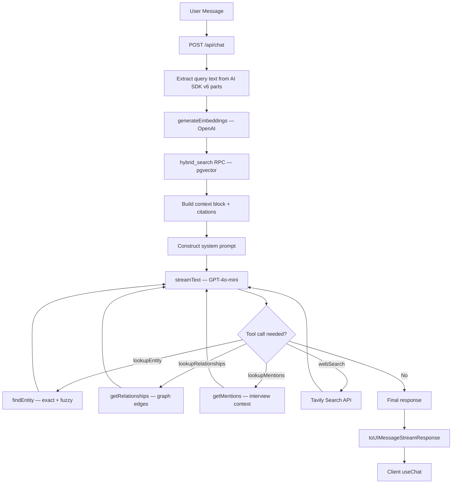

# Agentic RAG — Intelligence Chat

> Hybrid Search + Tool Calling + Grounded System Prompt

This document details Sovereign's Intelligence Chat architecture: a multi-step Agentic RAG system that combines pre-injected vector search context with on-demand tool calling (entity lookup, relationship traversal, web search).

---

## Architecture Overview



---

## Request Flow

**File**: `src/app/api/chat/route.ts`

### 1. Authentication & Parsing

The route requires an authenticated user via Supabase `getUser()`. It parses `messages` and an optional `projectId` from the request body, then extracts the last user message text from the AI SDK v6 `parts` format.

### 2. RAG Retrieval (Pre-Injection)

Before the LLM is invoked, the route always runs a vector similarity search:

```
queryText → generateEmbeddings([queryText]) → [queryEmbedding]
                                                      ↓
                                       admin.rpc("hybrid_search", {
                                         query_embedding,
                                         filter_project_ids: [projectId] or null,
                                         match_threshold: 0.25,
                                         match_count: 20
                                       })
```

| Parameter | Value | Source |
|-----------|-------|--------|
| Embedding model | `text-embedding-3-small` | `src/lib/ai/embeddings.ts` |
| Dimensions | 1536 | `AI_CONFIG.embeddingDimensions` |
| Similarity threshold | 0.25 | `AI_CONFIG.similarityThreshold` |
| Max results | 20 | Hardcoded in route |
| Project filter | Optional `projectId` | Client request body |

**Why 0.25?** `text-embedding-3-small` returns cosine similarities in the 0.3–0.6 range for related content. The default 0.7 threshold from most tutorials would return zero results.

### 3. Context Construction

Retrieved chunks are formatted into a numbered context block with speaker attribution and timestamps. A citations summary is built with interview URLs for source tracing.

### 4. System Prompt

The system prompt is injected with every request and consists of four sections:

#### Identity Block
Establishes the "Sovereign" persona as TBY's Business Intelligence Copilot. Includes team structure (Country Managers, Editors), product types (Full page, Half page, Logo, Interview, Barter), and domain jargon (pitch, drop-off, all-in-one, follow-up).

#### Grounding Rules (Non-Negotiable)
Five strict rules that prevent hallucination:

1. **Never invent facts** — every claim about people, companies, roles, or relationships must be backed by tool results or transcript citations.
2. **Always verify via tools** — call `lookupEntity` before making claims about any person or company.
3. **Graceful uncertainty** — if no evidence is found, respond with partial matches and ask for clarification.
4. **Mandatory response structure** — Section 1 (What Sovereign Knows), Section 2 (Recommended Approach), Sources.
5. **Second-Order Thinking** — 3-step lead generation cascade: Orbit (extract third-party entities) → Market Gap (deduce sectors from bottlenecks) → Ideal Target Profile (structured profile, never hallucinated company names).

#### Tool Use Priority
1. `lookupEntity` — use first when a query mentions a specific entity by name.
2. `lookupRelationships` — follow up after finding an entity.
3. `lookupMentions` — gather interview context for an entity.
4. `webSearch` — last resort, only when internal data is insufficient.

#### Retrieved Context
The pre-fetched `contextBlock` and `citationsSummary` are appended to the system prompt so the model has grounding data from the first token.

---

## Tool Definitions

### `lookupEntity`

**Purpose**: Find a person, company, or organization in the knowledge graph by name.

**Implementation**: `src/lib/ai/entity-lookup.ts` → `findEntity()`

| Step | Method |
|------|--------|
| 1 | Normalize name via `normalizeEntityName()` (lowercase, NFKD, strip diacritics/punctuation) |
| 2 | Exact match on `entities.normalized_name` (project-scoped, then global) |
| 3 | Exact match on `entity_aliases.alias_normalized` (project-scoped, then global) |
| 4 | Fuzzy search via Dice coefficient (bigram overlap) on up to 100 entities, threshold ≥ 0.6 |

**Returns**: `{ found, entity_id, name, type, description }` or `{ found: false, message }`.

### `lookupRelationships`

**Purpose**: Get all relationship edges for a given entity (by UUID).

**Implementation**: `src/lib/ai/entity-lookup.ts` → `getRelationships()`

- Queries `entity_relationships` for both outgoing (`source_entity_id`) and incoming (`target_entity_id`) edges.
- Optional project filter via `interviews.project_id`.
- Returns up to 30 edges per direction.

**Returns per edge**: `{ direction, relation_type, other_entity (name + type), confidence, evidence_text, interview_id }`.

### `lookupMentions`

**Purpose**: Get interview mentions for an entity with surrounding transcript context.

**Implementation**: `src/lib/ai/entity-lookup.ts` → `getMentions()`

- Queries `entity_mentions` joined with `interviews`.
- Batch-fetches chunk content from `interview_chunks`.
- Returns up to 30 mentions.

**Returns per mention**: `{ interview_title, interview_id, sentiment, chunk_content (first 500 chars) }`.

### `webSearch`

**Purpose**: Search the live internet for real-time information when internal data is insufficient.

**Implementation**: Raw `fetch` to `https://api.tavily.com/search` in the route file.

| Parameter | Value |
|-----------|-------|
| Search depth | `advanced` |
| Max results | 5 |
| Topics | `general` or `news` (model-selected) |
| Include answer | `false` |

**Graceful degradation**: If `TAVILY_API_KEY` is not set, the tool returns a structured "Web search is currently unavailable" message instead of throwing.

**Returns per result**: `{ title, url, content, score }`.

---

## Execution Control

```
streamText({
  model: openai("gpt-4o-mini"),
  system: systemPrompt,
  messages,
  tools: { lookupEntity, lookupRelationships, lookupMentions, webSearch },
  stopWhen: stepCountIs(5),
  onFinish: logGroundingMetrics
})
```

| Parameter | Value | Notes |
|-----------|-------|-------|
| Model | `gpt-4o-mini` | Cost-efficient for conversational RAG |
| Step limit | 5 | Allows: context → entity lookup → relationships → mentions → web search → answer |
| Response format | `toUIMessageStreamResponse()` | AI SDK v6 streaming format |

### Grounding Metrics

On `onFinish`, the route logs:
- Whether internal tools were used (`usedInternalTools`)
- Count of Tavily web search calls (`tavilyCallsCount`)

---

## Hybrid Search Function (SQL)

**File**: `supabase/migrations/00001_initial_schema.sql`

```sql
CREATE OR REPLACE FUNCTION hybrid_search(
  query_embedding vector(1536),
  filter_project_ids UUID[] DEFAULT NULL,
  filter_country TEXT DEFAULT NULL,
  filter_topics TEXT[] DEFAULT NULL,
  match_threshold FLOAT DEFAULT 0.7,
  match_count INT DEFAULT 10
) RETURNS TABLE (
  chunk_id UUID,
  interview_id UUID,
  content TEXT,
  speaker TEXT,
  start_time REAL,
  end_time REAL,
  metadata JSONB,
  similarity FLOAT
)
```

**Similarity**: `1 - (embedding <=> query_embedding)` (cosine distance via pgvector).

**Filters**: Project IDs, country (from interview metadata), topics (from interview metadata). All optional.

**Index**: HNSW with `vector_cosine_ops`, `m = 16`, `ef_construction = 64`.

> **Naming note**: Despite the name "hybrid_search", the function uses vector-only similarity. The `pg_trgm` extension is used for entity name fuzzy matching (trigram indexes on `entities.name`), not for RAG search.

---

## Client Integration

**File**: `src/app/(dashboard)/chat/page.tsx`

| SDK | Import |
|-----|--------|
| `@ai-sdk/react` | `useChat` |
| `ai` | `DefaultChatTransport` |

```
const transport = new DefaultChatTransport({
  api: "/api/chat",
  body: projectId ? { projectId } : undefined,
});

const { messages, sendMessage, status, error } = useChat({ transport });
```

Messages use the AI SDK v6 `.parts` format (not legacy `.content`). The client renders parts via `react-markdown`.

### Loading / activity UI (no chain-of-thought)

While a reply is in progress, the chat shows **`IntelligenceActivityStatus`** (`src/components/chat/intelligence-activity-status.tsx`): a short, user-facing checklist (e.g. searching interviews, entities, relationships, evidence, public sources, then drafting). The labels are **product copy**, not live step-by-step telemetry from the model or tools — they exist to make the wait feel intentional and premium without exposing internal reasoning.

The page keeps this panel visible if the last message is an **assistant** row with **empty text** (common right when streaming starts) so the UI does not flash blank between “send” and the first token. The chat parent remounts this component with `key={lastUserMessage.id}` so step progression resets on each send.

Assistant message bodies are rendered with **`IntelligenceBriefMarkdown`** (`src/components/chat/intelligence-brief-markdown.tsx`): editorial typography (headings, lists, blockquotes for evidence tone, horizontal rules, links) on the same **light** surface as the rest of the app (`background` / `foreground` tokens) — **not** wrapped in a card bubble; **UI only**; it does not change model output.

---

## Citation Format

| Source | Format | Example |
|--------|--------|---------|
| Transcript chunks | Numbered markers | `[1]`, `[2]` with speaker and timestamp |
| Entity tool results | Prose attribution | "According to our entity database: ..." |
| Web search results | Inline markdown links | `[Title](url)` + "Web Sources" section |

---

## File Reference

| Responsibility | File Path |
|----------------|-----------|
| Chat API route | `src/app/api/chat/route.ts` |
| Chat UI page | `src/app/(dashboard)/chat/page.tsx` |
| Chat loading / activity panel | `src/components/chat/intelligence-activity-status.tsx` |
| Assistant markdown (brief styling) | `src/components/chat/intelligence-brief-markdown.tsx` |
| Embedding generation | `src/lib/ai/embeddings.ts` |
| Entity lookup (tools) | `src/lib/ai/entity-lookup.ts` |
| Entity normalization | `src/lib/entities/normalize.ts` |
| AI config constants | `src/lib/constants.ts` |
| Hybrid search SQL | `supabase/migrations/00001_initial_schema.sql` |
| Entity trigram index | `supabase/migrations/00009_entity_normalization.sql` |
