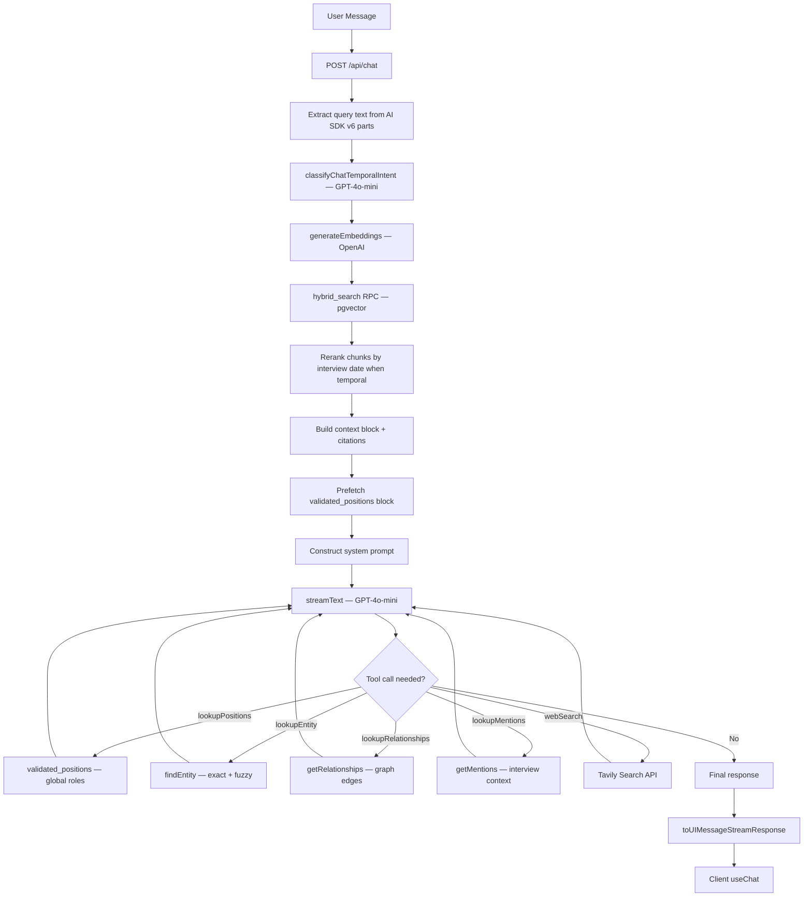

# Agentic RAG — Copilot

> Hybrid Search + Tool Calling + Grounded System Prompt

This document details Sovereign's Copilot architecture: a multi-step Agentic RAG system that combines pre-injected vector search context with on-demand tool calling (entity lookup, relationship traversal, web search).

---

## Architecture Overview



---

## Request Flow

**File**: `src/app/api/chat/route.ts`

### 1. Authentication & Parsing

The route requires an authenticated user via Supabase `getUser()`. It parses `messages` and an optional `projectId` from the request body, then extracts the last user message text from the AI SDK v6 `parts` format.

### 2. Temporal classification (pre-RAG)

`src/lib/ai/chat-temporal-classifier.ts` runs `generateObject` (GPT-4o-mini) on the latest user message to produce `temporal_intent` (`current_state` | `point_in_time` | `timeline` | `general_background`), `focus`, optional `person_name` / `organization_name`, and optional `target_date_iso`. That drives prefetch of `validated_positions`, chunk reranking by interview date, and mention ordering (recency + proximity to target date when applicable).

### 3. RAG Retrieval (Pre-Injection)

Before the LLM is invoked, the route always runs a vector similarity search:

```
queryText → generateEmbeddings([queryText]) → [queryEmbedding]
                                                      ↓
                                       admin.rpc("hybrid_search", {
                                         query_embedding,
                                         filter_project_ids: [projectId] or null,
                                         match_threshold: 0.25,
                                         match_count: 20
                                       })
```

| Parameter | Value | Source |
|-----------|-------|--------|
| Embedding model | `text-embedding-3-small` | `src/lib/ai/embeddings.ts` |
| Dimensions | 1536 | `AI_CONFIG.embeddingDimensions` |
| Similarity threshold | 0.25 | `AI_CONFIG.similarityThreshold` |
| Max results | 20 | Hardcoded in route |
| Project filter | Optional `projectId` | Client request body |

**Why 0.25?** `text-embedding-3-small` returns cosine similarities in the 0.3–0.6 range for related content. The default 0.7 threshold from most tutorials would return zero results.

### 4. Context Construction

Retrieved chunks are formatted into a numbered context block with speaker attribution and timestamps. A citations summary is built with interview URLs for source tracing.

### 5. System Prompt

The system prompt is assembled by `src/lib/chat/prompt-builder.ts` in five **modular layers** and injected on every request:

```
Layer 1 — Core identity        "Sovereign" persona, TBY context, jargon
Layer 2 — Mode overlay         general_context | sales (emphasis / framing)
Layer 3 — Grounding rules      non-negotiable, shared by all modes
Layer 4 — Scope / runtime      scopeBlock, dbIntelSection, validatedPositionsSection
Layer 5 — Retrieved context    RAG chunks + citations (or empty-context fallback)
```

#### Copilot Modes

The active mode is sent by the client as `copilotMode: "general_context" | "sales"`. The backend parses it via `parseCopilotMode()` — any invalid or missing value defaults to `"general_context"`. The client always sends the field explicitly.

| Mode | Key | Framing |
|------|-----|---------|
| **General Context** | `general_context` | Understanding, explanation, synthesis, clarity. Does not push every answer toward commercial recommendation. **Default.** |
| **Sales** | `sales` | Commercially actionable: account intelligence, stakeholder motivations, pitch angles, commercial signals. Same grounding discipline — never invents opportunities or stakeholders. |

To add a new mode: add its key to `COPILOT_MODES`, add a case to `buildModeOverlay`, and update the `CopilotMode` union in `src/lib/chat/prompt-builder.ts`.

#### Identity Block
Establishes the "Sovereign" persona as TBY's Business Intelligence Copilot. Includes team structure (Country Managers, Editors), product types (Full page, Half page, Logo, Interview, Barter), and domain jargon (pitch, drop-off, all-in-one, follow-up).

#### Grounding Rules (Non-Negotiable, all modes)
Five strict rules that prevent hallucination:

1. **Never invent facts** — every claim about people, companies, roles, or relationships must be backed by tool results or transcript citations.
2. **Always verify via tools** — call `lookupEntity` before making claims about any person or company.
3. **Graceful uncertainty** — if no evidence is found, respond with partial matches and ask for clarification.
4. **Mandatory response structure** — Section 1 (What Sovereign Knows), Section 2 (Recommended Approach), Sources.
5. **Second-Order Thinking** — 3-step lead generation cascade: Orbit (extract third-party entities) → Market Gap (deduce sectors from bottlenecks) → Ideal Target Profile (structured profile, never hallucinated company names).

#### Tool Use Priority
1. `lookupPositions` — validated global person–organization roles (current / as_of / timeline); strongest source for titles and reporting lines.
2. `lookupEntity` — use when a query mentions a specific entity by name.
3. `lookupRelationships` — graph edges (interview-sourced; ordered by recent interview when not `general_background`).
4. `lookupMentions` — interview context; ordered by recency and, for point-in-time queries, proximity to `target_date_iso`.
5. `webSearch` — last resort, only when internal data is insufficient.

#### Validated positions (data layer)

Table `validated_positions` (migration `00017_validated_positions.sql`): global rows linking `person_entity_id` → optional `organization_entity_id`, free-text `title`, `is_main` among `active` rows, `state`, date bounds with per-end `date_precision` (`exact` | `approximate` | `unknown`), and `validated_at` for internal freshness buckets. Populated outside this chat path (admin / SQL). Distinct titles for future admin UIs: `GET /api/positions/titles` or RPC `list_distinct_position_titles`.

**Active row ordering (implementation):**

| Query | Sort order |
|-------|------------|
| Current positions for a **person** | `is_main DESC`, then `validated_at DESC`. Postgres puts `true` before `false` on `is_main DESC`. If no row has `is_main = true`, ordering is by **most recent `validated_at` first**. |
| **As-of** (after filter) | In memory: `is_main` true first, then `validated_at` descending. |
| Active positions for an **organization** | `is_main DESC` only (no `validated_at` tie-break in code). |

The system prompt tells the model to prefer **MAIN** among actives when several exist, matching list order.

**Degradation signals (tool output + prompt):**

| Case | Code behavior | Expected model behavior |
|------|----------------|-------------------------|
| `point_in_time` intent + `valid_from_precision` or `valid_to_precision` is **`unknown`** | `confidence_degraded: true` + `confidence_note` on that position | Treat historical placement as **approximate**, not a pinpoint date. |
| Only **`approximate`** precision (no `unknown` on either end) | No `confidence_degraded` flag | Nuance using `valid_from` / `valid_to` precision fields in the tool JSON. |
| **Unknown organization** (`organization_entity_id` null) | Prefetch line uses `(organization unknown)`; tool returns `organization_name: null` | Do not invent an employer; title may still be validated. |
| **`freshness_bucket: old`** (≥12 calendar months since `validated_at`) | Always exposed in tool; prompt still treats validated rows as **authoritative vs transcripts** | Model *may* warn about staleness; code does **not** downgrade validated precedence automatically. |

**Temporal classifier latency (per user turn):**

- `classifyChatTemporalIntent` runs **one** `generateObject` (GPT-4o-mini) **before** embeddings and `hybrid_search`.
- Settings: `timeout: 10_000` ms, `maxRetries: 1`, `maxOutputTokens: 256` (`src/lib/ai/chat-temporal-classifier.ts`).
- Adds typical sub-second to a few seconds wall time; on failure/timeout → safe fallback (`general_background`), then the rest of the pipeline runs.

**Manual QA — no validated row:**

1. Use a **PERSON** with **no** `validated_positions` rows (or a question where prefetch returns empty).
2. Ask about **current role / employer / leadership**.
3. Expect **no** authoritative validated block for that fact; answers should use **interview-style attribution** (“mentioned as”, “referred to in an interview as”) per GROUNDING RULES §2 in `route.ts`, not as confirmed org-chart truth.

Full narrative (Spanish) and checklist: [`docs/features/done/time-aware-validated-positions-rag.md`](../features/done/time-aware-validated-positions-rag.md) § “Comportamiento operativo”.

#### Retrieved Context
The pre-fetched `contextBlock` and `citationsSummary` are appended to the system prompt so the model has grounding data from the first token.

---

## Tool Definitions

### `lookupPositions`

**Purpose**: Return human-validated positions for a **PERSON** `entity_id` (from `lookupEntity`).

**Implementation**: `src/lib/positions/query-validated-positions.ts` (modes: `current`, `as_of` + `YYYY-MM-DD`, `timeline`).

**Returns**: Positions with `freshness_bucket`, per-end date + `precision`, and `confidence_degraded` + `confidence_note` only when the **chat turn** was classified as `point_in_time` **and** `valid_from_precision` or `valid_to_precision` is `unknown` (not merely `approximate`).

### `lookupEntity`

**Purpose**: Find a person, company, or organization in the knowledge graph by name.

**Implementation**: `src/lib/ai/entity-lookup.ts` → `findEntity()`

| Step | Method |
|------|--------|
| 1 | Normalize name via `normalizeEntityName()` (lowercase, NFKD, strip diacritics/punctuation) |
| 2 | Exact match on `entities.normalized_name` (project-scoped, then global) |
| 3 | Exact match on `entity_aliases.alias_normalized` (project-scoped, then global) |
| 4 | Fuzzy search via Dice coefficient (bigram overlap) on up to 100 entities, threshold ≥ 0.6 |

**Returns**: `{ found, entity_id, name, type, description }` or `{ found: false, message }`.

### `lookupRelationships`

**Purpose**: Get all relationship edges for a given entity (by UUID).

**Implementation**: `src/lib/ai/entity-lookup.ts` → `getRelationships()`

- Queries `entity_relationships` for both outgoing (`source_entity_id`) and incoming (`target_entity_id`) edges.
- Optional project filter via `interviews.project_id`.
- Optional `sortByInterviewRecency` (chat enables when `temporal_intent !== general_background`).
- Returns up to 30 edges per direction.

**Returns per edge**: `{ direction, relation_type, other_entity (name + type), confidence, evidence_text, interview_id }`.

### `lookupMentions`

**Purpose**: Get interview mentions for an entity with surrounding transcript context.

**Implementation**: `src/lib/ai/entity-lookup.ts` → `getMentions()`

- Queries `entity_mentions` joined with `interviews` (`conducted_at`, `created_at`).
- Batch-fetches chunk content from `interview_chunks`.
- Optional reorder: recency and temporal proximity to classifier `target_date_iso` for point-in-time questions.
- Returns up to 30 mentions.

**Returns per mention**: `{ interview_title, interview_id, sentiment, chunk_content (first 500 chars) }`.

### `webSearch`

**Purpose**: Search the live internet for real-time information when internal data is insufficient.

**Implementation**: Raw `fetch` to `https://api.tavily.com/search` in the route file.

| Parameter | Value |
|-----------|-------|
| Search depth | `advanced` |
| Max results | 5 |
| Topics | `general` or `news` (model-selected) |
| Include answer | `false` |

**Graceful degradation**: If `TAVILY_API_KEY` is not set, the tool returns a structured "Web search is currently unavailable" message instead of throwing.

**Returns per result**: `{ title, url, content, score }`.

---

## Execution Control

```
streamText({
  model: openai("gpt-4o-mini"),
  system: systemPrompt,
  messages,
  tools: { lookupPositions, lookupEntity, lookupRelationships, lookupMentions, webSearch },
  stopWhen: stepCountIs(5),
  onFinish: logGroundingMetrics
})
```

| Parameter | Value | Notes |
|-----------|-------|-------|
| Model | `gpt-4o-mini` | Cost-efficient for conversational RAG |
| Step limit | 5 | Allows: context → entity lookup → relationships → mentions → web search → answer |
| Response format | `toUIMessageStreamResponse()` | AI SDK v6 streaming format |

### Grounding Metrics

On `onFinish`, the route logs:
- Whether internal tools were used (`usedInternalTools`)
- Count of Tavily web search calls (`tavilyCallsCount`)

---

## Hybrid Search Function (SQL)

**File**: `supabase/migrations/00001_initial_schema.sql`

```sql
CREATE OR REPLACE FUNCTION hybrid_search(
  query_embedding vector(1536),
  filter_project_ids UUID[] DEFAULT NULL,
  filter_country TEXT DEFAULT NULL,
  filter_topics TEXT[] DEFAULT NULL,
  match_threshold FLOAT DEFAULT 0.7,
  match_count INT DEFAULT 10
) RETURNS TABLE (
  chunk_id UUID,
  interview_id UUID,
  content TEXT,
  speaker TEXT,
  start_time REAL,
  end_time REAL,
  metadata JSONB,
  similarity FLOAT
)
```

**Similarity**: `1 - (embedding <=> query_embedding)` (cosine distance via pgvector).

**Filters**: Project IDs, country (from interview metadata), topics (from interview metadata). All optional.

**Index**: HNSW with `vector_cosine_ops`, `m = 16`, `ef_construction = 64`.

> **Naming note**: Despite the name "hybrid_search", the function uses vector-only similarity. The `pg_trgm` extension is used for entity name fuzzy matching (trigram indexes on `entities.name`), not for RAG search.

---

## Client Integration

**File**: `src/app/(dashboard)/chat/page.tsx`

| SDK | Import |
|-----|--------|
| `@ai-sdk/react` | `useChat` |
| `ai` | `DefaultChatTransport` |

```
const transport = new DefaultChatTransport({
  api: "/api/chat",
  body: projectId ? { projectId } : undefined,
});

const { messages, sendMessage, status, error } = useChat({ transport });
```

Messages use the AI SDK v6 `.parts` format (not legacy `.content`). The client renders parts via `react-markdown`.

### Loading / activity UI (no chain-of-thought)

While a reply is in progress, the chat shows **`IntelligenceActivityStatus`** (`src/components/chat/intelligence-activity-status.tsx`): a short, user-facing checklist (e.g. searching interviews, entities, relationships, evidence, public sources, then drafting). The labels are **product copy**, not live step-by-step telemetry from the model or tools — they exist to make the wait feel intentional and premium without exposing internal reasoning.

The page keeps this panel visible if the last message is an **assistant** row with **empty text** (common right when streaming starts) so the UI does not flash blank between “send” and the first token. The chat parent remounts this component with `key={lastUserMessage.id}` so step progression resets on each send.

Assistant message bodies are rendered with **`IntelligenceBriefMarkdown`** (`src/components/chat/intelligence-brief-markdown.tsx`): editorial typography (headings, lists, blockquotes for evidence tone, horizontal rules, links) on the same **light** surface as the rest of the app (`background` / `foreground` tokens) — **not** wrapped in a card bubble; **UI only**; it does not change model output.

---

## Citation Format

| Source | Format | Example |
|--------|--------|---------|
| Transcript chunks | Numbered markers | `[1]`, `[2]` with speaker and timestamp |
| Entity tool results | Prose attribution | "According to our entity database: ..." |
| Web search results | Inline markdown links | `[Title](url)` + "Web Sources" section |

---

## File Reference

| Responsibility | File Path |
|----------------|-----------|
| Chat API route | `src/app/api/chat/route.ts` |
| Modular prompt builder | `src/lib/chat/prompt-builder.ts` |
| Chat persistence (V1) | [chat-persistence.md](./chat-persistence.md) |
| Chat UI (list + thread) | `src/app/(dashboard)/chat/*`, `src/components/chat/intelligence-chat-view.tsx` |
| Chat loading / activity panel | `src/components/chat/intelligence-activity-status.tsx` |
| Assistant markdown (brief styling) | `src/components/chat/intelligence-brief-markdown.tsx` |
| Embedding generation | `src/lib/ai/embeddings.ts` |
| Entity lookup (tools) | `src/lib/ai/entity-lookup.ts` |
| Entity normalization | `src/lib/entities/normalize.ts` |
| AI config constants | `src/lib/constants.ts` |
| Hybrid search SQL | `supabase/migrations/00001_initial_schema.sql` |
| Entity trigram index | `supabase/migrations/00009_entity_normalization.sql` |

---

## See also

- [Chat persistence](./chat-persistence.md) — stored threads, 6+1 slice, `X-Conversation-Id`  
- [Ingestion pipeline](./ingestion-pipeline.md) — where chunks and entities originate  
- [Database schema](../infrastructure/database-schema.md)  
- [Intelligence commercial copilot roadmap](../roadmaps/intelligence-commercial-copilot.md) — *planning* for retrieval/evidence upgrades (align with code before execution)  
- [Active workstreams](../roadmaps/active-workstreams.md) — current team priorities  
- [HANDOVER.md](../../HANDOVER.md) — gotchas (AI SDK v6, similarity threshold, etc.)  
