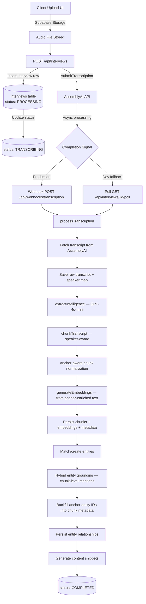
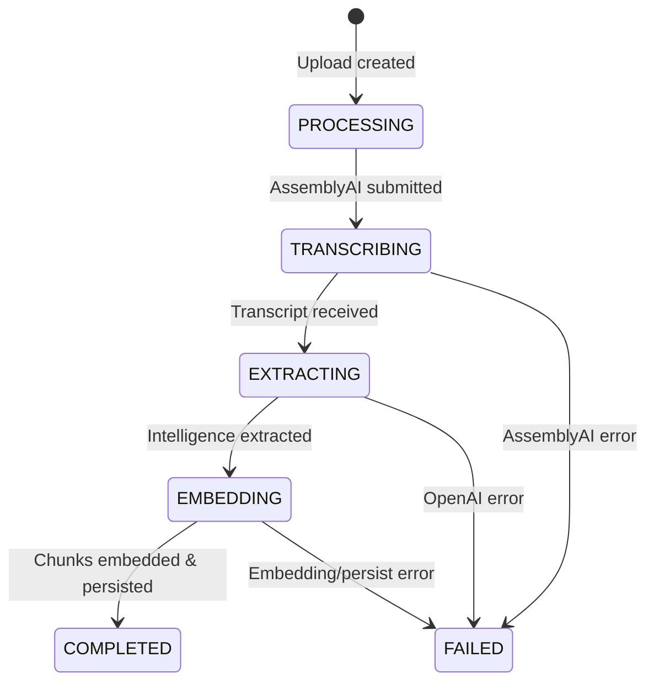
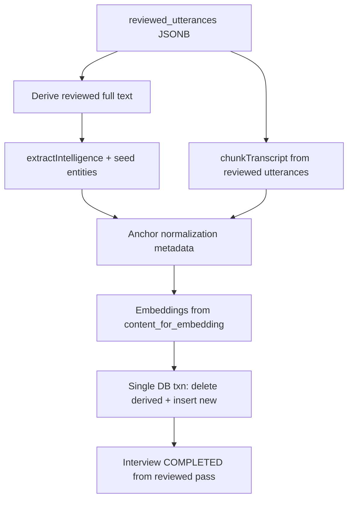

# Ingestion Pipeline

> Audio Upload → Transcription → AI Extraction → Chunking → Anchor Normalization → Embedding → Knowledge Graph

This document details Sovereign's ingestion pipeline that transforms raw audio interviews, PDF documents, and text sources into searchable, structured business intelligence.

> **PR1 (April 2026):** `processDocument` and `processTranscription` now both delegate to a single shared runner (`runIntelPipelineFromCanonicalSource` in `src/lib/ai/pipeline.ts`). The old `runIntelPipelineFromTranscriptInput` name has been retired — all references have been updated. `document-pipeline.ts` is now a thin wrapper (~80 lines) that handles PDF-specific setup before calling the shared runner.
> **PR4 (April 2026):** `extractIntelligence` now accepts `semanticSourceType` and `candidateEntities`. Source-type prompt overlays are applied based on the `source_type + semantic_source_type` combination (e.g., `document+report` gets a different extraction prompt than `audio+interview`). `fetchCandidateEntities` builds a shortlist of up to 30 known project entities (anchors first, then most-mentioned, then global fallback for new projects) and passes them to the extractor as a PROJECT ENTITIES context block. Prompt base for `audio+interview` is unchanged.

---

## High-Level Data Flow



---

## Step-by-Step Breakdown

### Step 1: Audio Upload (Client)

**File**: `src/app/(dashboard)/interviews/upload/page.tsx`

The upload page validates the file against `SUPPORTED_AUDIO_FORMATS` and `MAX_AUDIO_SIZE_BYTES`, then uploads to Supabase Storage.

| Parameter | Value |
|-----------|-------|
| Bucket | `interview-audio` |
| Path format | `{projectId}/{uuid}.{ext}` |
| Max file size | 500 MB |
| Allowed MIME types | `audio/mpeg`, `audio/mp4`, `audio/wav`, `audio/webm`, `audio/ogg`, `audio/x-m4a` |

Storage policies are defined in `supabase/setup-storage.sql`: public read access (required for AssemblyAI to fetch the file), authenticated upload, authenticated delete.

After upload, a public URL is obtained via `supabase.storage.from("interview-audio").getPublicUrl(filePath)` and sent to the API.

### Step 2: Interview Creation + Transcription Submission

**File**: `src/app/api/interviews/route.ts`

The `POST /api/interviews` handler performs three operations:

1. **Auth**: Verifies the user via `createClient().auth.getUser()`.
2. **Insert**: Creates an `interviews` row with `status: PROCESSING`, including `title`, `project_id`, `audio_url`, `language`, `expected_speakers`, `interviewee_name`, `interviewee_org`.
3. **Submit to AssemblyAI**: Calls `submitTranscription()` from `src/lib/ai/assemblyai.ts`.

**Keyterms Prompt (ASR accuracy)**:  
Before submitting, the route builds a `keyterms_prompt` array from two sources:
- `getKeytermsPrompt()` — queries `entity_aliases` for the project and globally to feed known names to the ASR engine.
- `buildAnchorKeyterms()` — generates variants of the interviewee name and organization (honorifics, role prefixes).

> **Note**: AssemblyAI deprecated `word_boost` in favour of `keyterms_prompt` (effective May 2026). The parameter name in the API request and all internal helpers have been updated accordingly. Behaviour is identical.

After successful submission, the interview is updated with the `assemblyai_id` and `status: TRANSCRIBING`.

### Step 3: Transcription (AssemblyAI)

**File**: `src/lib/ai/assemblyai.ts`

| Parameter | Value |
|-----------|-------|
| Endpoint | `https://api.assemblyai.com/v2/transcript` |
| Speech model | `universal-2` (via `speech_models: ["universal-2"]`) |
| Speaker diarization | `speaker_labels: true` |
| Language | Auto-detection enabled, or explicit code |
| Keyterms | `keyterms_prompt` array (entity aliases + anchor variants) |
| Callback | Webhook URL with `x-webhook-secret` header |

AssemblyAI processes the audio asynchronously and signals completion via webhook or direct polling.

### Step 4a: Webhook Handler (Production)

**File**: `src/app/api/webhooks/transcription/route.ts`

The webhook handler:
1. Authenticates via the `x-webhook-secret` header against `WEBHOOK_SECRET`.
2. Parses `transcript_id` and `status` from the request body.
3. Looks up the interview by `assemblyai_id`.
4. On error → sets interview status to `FAILED`.
5. On success → fires `processTranscription(interview.id, transcript_id)` as a fire-and-forget promise.

> **Production note**: The fire-and-forget pattern should be replaced with a job queue (e.g., Inngest, QStash) for reliability at scale.

### Step 4b: Poll Fallback (Development)

**File**: `src/app/api/interviews/[id]/poll/route.ts`

Since AssemblyAI webhooks cannot reach `localhost`, a polling fallback exists:
- The status tracker component polls this endpoint every 10 seconds.
- When the interview is in `TRANSCRIBING` status, the route calls `getTranscription(assemblyai_id)` directly.
- If completed → atomically updates status to `EXTRACTING` and triggers `processTranscription()`.
- If errored → sets status to `FAILED`.

### Step 5: ETL Pipeline Orchestrator

**File**: `src/lib/ai/pipeline.ts`

`processTranscription(interviewId, assemblyaiTranscriptId)` orchestrates the remaining steps for the audio path. Both audio and document sources converge into the shared `runIntelPipelineFromCanonicalSource` function, which handles all extraction, chunking, embedding, and persistence. It updates the interview status at each stage for real-time UI feedback via Supabase Realtime.

| Entry point | Caller | `lastIntelSource` |
|-------------|--------|-------------------|
| `processTranscription` | Webhook / poll | `assemblyai_auto` |
| `processDocument` | `POST /api/interviews/from-pdf` | `direct_ingest` |
| `reprocessInterviewFromReview` | `POST /api/interviews/[id]/reprocess-review` | `human_review` |



### Step 6: Fetch + Save Raw Transcript

**File**: `src/lib/ai/pipeline.ts` (lines 85–144)

1. Calls `getTranscription(assemblyaiId)` from AssemblyAI.
2. Builds a `speakerMap` and `formattedTranscript` from utterances.
3. Runs `normalizeTranscriptDisplay()` (`src/lib/transcript/normalizeDisplay.ts`) to create a cleaned display version — replaces speaker variants with canonical anchors using interviewee name/org.
4. Saves `transcript_full` (raw), `transcript_display` (cleaned), `speaker_map`, and `audio_duration` to the interview row.
5. Updates status to `EXTRACTING`.

### Step 7: AI Intelligence Extraction

**File**: `src/lib/ai/extraction.ts`

Uses Vercel AI SDK's `generateObject` with `openai("gpt-4o-mini")` and a Zod schema (`ExtractionSchema`) to extract structured intelligence:

| Field | Type | Description |
|-------|------|-------------|
| `summary` | `string` | Executive summary of the interview |
| `sentiment` | `object` | Overall sentiment, score (-1 to 1), positive/negative highlights |
| `topics` | `string[]` | Key topics discussed |
| `entities` | `array` | Name, type (`PERSON`, `COMPANY`, `GOVERNMENT`, `ORGANIZATION`, `LOCATION`, `EVENT`), description, sentiment |
| `relationships` | `array` | Source entity, target entity, relation type, confidence (0–1), evidence text |
| `risks` | `string[]` | Identified risks |
| `opportunities` | `string[]` | Identified opportunities |

**Relation types**: `business_partner`, `competitor`, `regulator`, `critic`, `ally`, `subsidiary`, `investor`, `advisor`, `supplier`, `acquirer`.

The extraction context includes the full transcript, interview title, country, speaker map, and primary person/organization anchors.

After extraction, the summary, sentiment, and topics are saved to the interview row. Status updates to `EMBEDDING`.

### Step 8: Speaker-Aware Chunking

**File**: `src/lib/ai/chunking.ts`

| Parameter | Value |
|-----------|-------|
| Target chunk size | ~500 tokens (`AI_CONFIG.chunkSize`) |
| Overlap | ~50 tokens |
| Strategy | Speaker-aware sentence boundary splitting |

`chunkTranscript(utterances)`:
- Groups consecutive utterances by the same speaker.
- Splits at sentence boundaries when a group exceeds the chunk size.
- Preserves speaker labels and timestamps per chunk.

`chunkPlainText(text)` is a fallback for non-diarized input, splitting by paragraphs.

### Step 8b: Anchor-Aware Chunk Normalization

**File**: `src/lib/chunks/anchor-normalization.ts`

**Architectural rule**: Prefer anchor enrichment over speculative text replacement.

After chunking, each chunk is run through anchor-aware normalization. Rather than aggressively rewriting ASR variants (which caused unsafe substitutions like "Buddha" → "Boudab"), the system now uses a two-layer approach:

1. **Conservative text normalization** — only replaces deterministic derivatives of the canonical anchor name (e.g. stripping an honorific period: "Dr Mohamed" → "Dr. Mohamed"). Proximity-based variant detection has been removed from the replacement path entirely.

2. **Anchor enrichment for embeddings** — builds `content_for_embedding` by appending structured anchor context to the chunk text:
   - `Primary interviewee: <name>`
   - `Primary institution: <org>`

This ensures chunks become retrievable for anchor-related queries (e.g. searching for "Mohamed Reda Boudab" finds chunks where ASR produced "Buddha") without corrupting the evidence.

| Concept | Detail |
|---------|--------|
| Raw evidence | Stored in `interview_chunks.content` — never mutated |
| Normalized text | Stored in `metadata.normalized_content` — only high-confidence deterministic replacements |
| Embedding source | `metadata.content_for_embedding` — anchor-enriched text (high-confidence normalized or raw + anchor context) |
| Confidence | `high` (both anchors present + safe replacements applied), `medium` (anchor present, no replacements), `low` (no anchors) |

If `interviewee_org` is null (e.g., ministers, presidents), no org normalization is attempted and only the person anchor is appended to the embedding context.

Additional metadata stored per chunk:
- `normalization_applied` — boolean flag
- `normalization_confidence` — `high` / `medium` / `low`
- `content_for_embedding` — the actual text sent to the embedding model
- `primary_person_name` / `primary_org_name` — interview-level anchors used
- `primary_person_entity_id` / `primary_org_entity_id` — backfilled after entity matching

### Step 9: Embedding Generation

**File**: `src/lib/ai/embeddings.ts`

| Parameter | Value |
|-----------|-------|
| Model | `text-embedding-3-small` |
| Dimensions | 1536 |
| Endpoint | `https://api.openai.com/v1/embeddings` |
| Batch limit | 2048 inputs per API call |

`generateEmbeddings(texts)` takes the chunk text array and returns ordered embedding vectors. The input texts are the `metadata.content_for_embedding` values — anchor-enriched text that combines the chunk content with structured anchor context (primary interviewee and institution). This replaces the previous approach of embedding from `normalized_content`, which risked encoding unsafe ASR variant substitutions.

### Step 10: Persist Chunks + Entities + Relationships

**File**: `src/lib/ai/pipeline.ts`

**Chunk persistence**:
- Inserts into `interview_chunks` in batches of 50.
- Each row includes: `content` (raw evidence), `embedding` (from anchor-enriched text), `interview_id`, `speaker`, `start_time`, `end_time`, `metadata` (country, topics, entities, plus anchor normalization fields including `content_for_embedding`).

**Entity persistence**:
- For each extracted entity, calls `matchOrCreateEntity()` from `src/lib/entities/match.ts`.
- Match algorithm (5-tier):
  1. Exact match on `normalized_name` (project-scoped)
  2. Exact match on `entity_aliases.alias_normalized` (project-scoped)
  3. Exact match on `normalized_name` (global)
  4. Exact match on `entity_aliases.alias_normalized` (global)
  5. Fuzzy match via trigram similarity (project then global)
- Auto-merge threshold: similarity ≥ 0.9
- Needs-review threshold: 0.8 ≤ similarity < 0.9
- Below 0.8: creates a new entity

**Hybrid entity grounding** (`src/lib/entities/ground-mentions.ts`):
- After entity matching, persisted chunks are fetched and each entity is grounded to specific chunks using a four-tier hybrid strategy:
  1. **Exact match** — canonical entity name found in chunk text (confidence: HIGH)
  2. **Alias match** — known alias from `entity_aliases` found in chunk (confidence: HIGH)
  3. **Anchor context** — primary interviewee/institution inferred from contextual clues (name tokens, honorific patterns, org token overlap) even when ASR misspells the name (confidence: MEDIUM)
  4. **Conservative fuzzy** — high-threshold trigram similarity (≥ 0.75) on capitalized word sequences (confidence: MEDIUM only if sharing a distinctive token)
- Grounded mentions are persisted with `chunk_id` + `context` (evidence excerpt).
- Entities that cannot be grounded to any chunk receive a fallback interview-level mention (null chunk_id).
- A backfill endpoint (`POST /api/interviews/[id]/backfill-mentions`) can re-ground existing ungrounded mentions.

**Relationship persistence**:
- Builds an `entityIdMap` (name → UUID) from matched/created entities.
- Upserts into `entity_relationships` with `source_entity_id`, `target_entity_id`, `relation_type`, `confidence`, `evidence_text`, `interview_id`.
- Unique constraint on `(source_entity_id, target_entity_id, relation_type, interview_id)`.

**Content snippets** (lines 281–297):
- Calls `generateContentSnippets()` from `src/lib/ai/content-generation.ts`.
- Generates 4 platform variants: LinkedIn, Twitter, Newsletter, Executive Summary.
- Uses GPT-4o-mini. This step is non-critical — failures are caught and do not affect interview status.

---

## Human review layer & reviewed reprocessing

Sovereign distinguishes three transcript layers for an interview:

| Layer | Storage (conceptual) | Mutable? | Role |
|-------|----------------------|----------|------|
| **Raw transcript** | `interviews.transcript_full` (+ AssemblyAI `assemblyai_id`) | **No** after ingest | Immutable ASR output with speaker labels; audit and diff baseline. |
| **Auto display transcript** | `interviews.transcript_display` | Overwritten only by automatic normalization | Deterministic anchor cleanup for reading (see `normalizeTranscriptDisplay`). Not a human review artifact. |
| **Reviewed working transcript** | `interviews.reviewed_utterances` (JSONB) | Yes (editors) | Human-corrected utterance list used **only** when running **reviewed reprocessing**. |

Feature detail and UX: [Interview transcript review](../features/done/interview-transcript-review.md).

### Reviewed pass: single source of truth

For **reviewed reprocessing** (Phase 3.6), **`reviewed_utterances` is the sole transcript source** for that run:

1. **Reviewed full text** for `extractIntelligence` is **derived** from `reviewed_utterances` (e.g. concatenation of utterance texts with the same speaker/timestamp conventions as the initial pipeline). **Do not** mix in `transcript_full`, AssemblyAI `text`, or `transcript_display` during that pass.
2. **Chunking** for embeddings and grounding uses **only** the utterance structures from `reviewed_utterances` (same shape as input to `chunkTranscript`: speaker, text, start, end).

This keeps mention recovery, embeddings, and evidence aligned with what the human approved.

### Human seed entities (strong inputs)

Human-confirmed entities live in a **relational** table, `interview_review_entities` (see [database schema](../infrastructure/database-schema.md)), not as passive UI-only notes.

On reviewed reprocessing they **must**:

- Be supplied to extraction as **mandatory context** (names, types, optional linked `entity_id`) so the model recovers mentions and infers relationships against the **reviewed** text.
- Flow through existing resolution (`matchOrCreateEntity` / `resolveExtractedEntities`) and grounding so **`entity_mentions`**, **`entity_relationships`**, and the wider graph reflect both model output and human seeds.

They are **not** optional annotations that the pipeline may ignore.

### Failure-safe rebuild (MVP)

Reviewed reprocessing replaces derived data for the interview: chunks, mentions, relationships, and snippets. To avoid a **partially deleted** state if OpenAI or embedding calls fail:

- **Compute first, swap second** — Run extraction, chunking, embedding generation, and build the full in-memory (or application-side) payload **before** deleting existing `interview_chunks` / dependent rows.
- **Transactional swap** — In one **database transaction**: delete interview-scoped `entity_relationships`, `entity_mentions`, `interview_chunks`, and `content_snippets`; insert the new rows; update interview summary/sentiment/topics and any review flags. If any step fails, **ROLLBACK** leaves the prior `COMPLETED` graph intact.

Long-running LLM work cannot run inside that transaction; the transaction should only wrap the **destructive replace** once new data is ready.

### High-level flow (reviewed reprocess)



---

## Vector Index

Defined in `supabase/migrations/00001_initial_schema.sql`:

```sql
CREATE INDEX idx_chunks_embedding ON interview_chunks
  USING hnsw (embedding vector_cosine_ops)
  WITH (m = 16, ef_construction = 64);
```

HNSW was chosen over IVFFlat for better recall at Sovereign's scale without periodic reindexing.

---

## File Reference

| Responsibility | File Path |
|----------------|-----------|
| Upload UI | `src/app/(dashboard)/interviews/upload/page.tsx` |
| Create interview API (audio) | `src/app/api/interviews/route.ts` |
| Create interview API (PDF) | `src/app/api/interviews/from-pdf/route.ts` |
| AssemblyAI client | `src/lib/ai/assemblyai.ts` |
| Transcription webhook | `src/app/api/webhooks/transcription/route.ts` |
| Poll fallback | `src/app/api/interviews/[id]/poll/route.ts` |
| **Shared ETL runner** | `src/lib/ai/pipeline.ts` → `runIntelPipelineFromCanonicalSource` |
| PDF pipeline (thin wrapper) | `src/lib/ai/document-pipeline.ts` → `processDocument` |
| Intelligence extraction | `src/lib/ai/extraction.ts` |
| Speaker-aware chunking | `src/lib/ai/chunking.ts` |
| Embedding generation | `src/lib/ai/embeddings.ts` |
| Anchor-aware chunk normalization | `src/lib/chunks/anchor-normalization.ts` |
| Entity matching | `src/lib/entities/match.ts` |
| Hybrid entity grounding | `src/lib/entities/ground-mentions.ts` |
| Entity normalization | `src/lib/entities/normalize.ts` |
| Backfill mentions API | `src/app/api/interviews/[id]/backfill-mentions/route.ts` |
| Transcript display | `src/lib/transcript/normalizeDisplay.ts` |
| Content snippet generation | `src/lib/ai/content-generation.ts` |
| Status tracker (UI) | `src/components/interviews/status-tracker.tsx` |
| AI config constants | `src/lib/constants.ts` |
| Storage setup | `supabase/setup-storage.sql` |
| Schema + hybrid_search | `supabase/migrations/00001_initial_schema.sql` |
| Graph schema | `supabase/migrations/00004_graph_and_content.sql` |
| Entity normalization schema | `supabase/migrations/00009_entity_normalization.sql` |
| Human review & reprocessing | `supabase/migrations/00013_interview_transcript_review.sql` (Phase 3.6), `src/lib/ai/pipeline.ts` |

---

## See also

- [Interview transcript review](../features/done/interview-transcript-review.md) — UX and data model for human review  
- [Database schema](../infrastructure/database-schema.md)  
- [Active workstreams](../roadmaps/active-workstreams.md) — current priorities (not legacy roadmaps)  
- [HANDOVER.md](../../HANDOVER.md) — operational gotchas  
