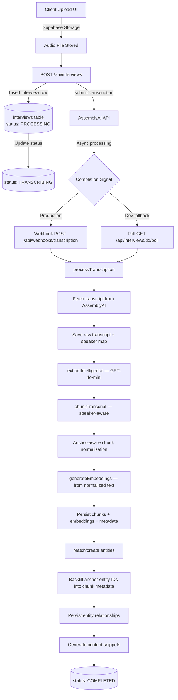
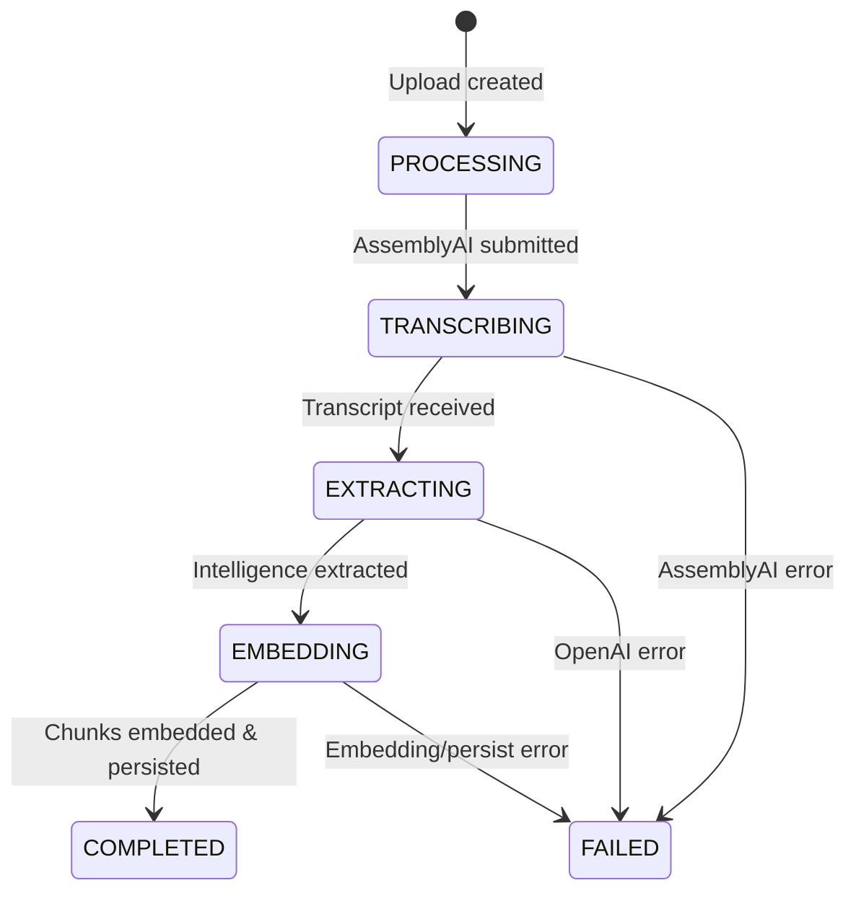

# Ingestion Pipeline

> Audio Upload → Transcription → AI Extraction → Chunking → Anchor Normalization → Embedding → Knowledge Graph

This document details Sovereign's ingestion pipeline that transforms raw audio interviews into searchable, structured business intelligence.

---

## High-Level Data Flow



---

## Step-by-Step Breakdown

### Step 1: Audio Upload (Client)

**File**: `src/app/(dashboard)/interviews/upload/page.tsx`

The upload page validates the file against `SUPPORTED_AUDIO_FORMATS` and `MAX_AUDIO_SIZE_BYTES`, then uploads to Supabase Storage.

| Parameter | Value |
|-----------|-------|
| Bucket | `interview-audio` |
| Path format | `{projectId}/{uuid}.{ext}` |
| Max file size | 500 MB |
| Allowed MIME types | `audio/mpeg`, `audio/mp4`, `audio/wav`, `audio/webm`, `audio/ogg`, `audio/x-m4a` |

Storage policies are defined in `supabase/setup-storage.sql`: public read access (required for AssemblyAI to fetch the file), authenticated upload, authenticated delete.

After upload, a public URL is obtained via `supabase.storage.from("interview-audio").getPublicUrl(filePath)` and sent to the API.

### Step 2: Interview Creation + Transcription Submission

**File**: `src/app/api/interviews/route.ts`

The `POST /api/interviews` handler performs three operations:

1. **Auth**: Verifies the user via `createClient().auth.getUser()`.
2. **Insert**: Creates an `interviews` row with `status: PROCESSING`, including `title`, `project_id`, `audio_url`, `language`, `expected_speakers`, `interviewee_name`, `interviewee_org`.
3. **Submit to AssemblyAI**: Calls `submitTranscription()` from `src/lib/ai/assemblyai.ts`.

**Word Boost (ASR accuracy)**:  
Before submitting, the route builds a `word_boost` array from two sources:
- `getWordBoostAliases()` — queries `entity_aliases` for the project and globally to feed known names to the ASR engine.
- `buildAnchorWordBoost()` — generates variants of the interviewee name and organization (honorifics, role prefixes).

After successful submission, the interview is updated with the `assemblyai_id` and `status: TRANSCRIBING`.

### Step 3: Transcription (AssemblyAI)

**File**: `src/lib/ai/assemblyai.ts`

| Parameter | Value |
|-----------|-------|
| Endpoint | `https://api.assemblyai.com/v2/transcript` |
| Speech model | `universal-2` (via `speech_models: ["universal-2"]`) |
| Speaker diarization | `speaker_labels: true` |
| Language | Auto-detection enabled, or explicit code |
| Callback | Webhook URL with `x-webhook-secret` header |

AssemblyAI processes the audio asynchronously and signals completion via webhook or direct polling.

### Step 4a: Webhook Handler (Production)

**File**: `src/app/api/webhooks/transcription/route.ts`

The webhook handler:
1. Authenticates via the `x-webhook-secret` header against `WEBHOOK_SECRET`.
2. Parses `transcript_id` and `status` from the request body.
3. Looks up the interview by `assemblyai_id`.
4. On error → sets interview status to `FAILED`.
5. On success → fires `processTranscription(interview.id, transcript_id)` as a fire-and-forget promise.

> **Production note**: The fire-and-forget pattern should be replaced with a job queue (e.g., Inngest, QStash) for reliability at scale.

### Step 4b: Poll Fallback (Development)

**File**: `src/app/api/interviews/[id]/poll/route.ts`

Since AssemblyAI webhooks cannot reach `localhost`, a polling fallback exists:
- The status tracker component polls this endpoint every 10 seconds.
- When the interview is in `TRANSCRIBING` status, the route calls `getTranscription(assemblyai_id)` directly.
- If completed → atomically updates status to `EXTRACTING` and triggers `processTranscription()`.
- If errored → sets status to `FAILED`.

### Step 5: ETL Pipeline Orchestrator

**File**: `src/lib/ai/pipeline.ts`

The `processTranscription(interviewId, assemblyaiTranscriptId)` function orchestrates the remaining steps. It updates the interview status at each stage for real-time UI feedback via Supabase Realtime.



### Step 6: Fetch + Save Raw Transcript

**File**: `src/lib/ai/pipeline.ts` (lines 85–144)

1. Calls `getTranscription(assemblyaiId)` from AssemblyAI.
2. Builds a `speakerMap` and `formattedTranscript` from utterances.
3. Runs `normalizeTranscriptDisplay()` (`src/lib/transcript/normalizeDisplay.ts`) to create a cleaned display version — replaces speaker variants with canonical anchors using interviewee name/org.
4. Saves `transcript_full` (raw), `transcript_display` (cleaned), `speaker_map`, and `audio_duration` to the interview row.
5. Updates status to `EXTRACTING`.

### Step 7: AI Intelligence Extraction

**File**: `src/lib/ai/extraction.ts`

Uses Vercel AI SDK's `generateObject` with `openai("gpt-4o-mini")` and a Zod schema (`ExtractionSchema`) to extract structured intelligence:

| Field | Type | Description |
|-------|------|-------------|
| `summary` | `string` | Executive summary of the interview |
| `sentiment` | `object` | Overall sentiment, score (-1 to 1), positive/negative highlights |
| `topics` | `string[]` | Key topics discussed |
| `entities` | `array` | Name, type (`PERSON`, `COMPANY`, `GOVERNMENT`, `ORGANIZATION`, `LOCATION`, `EVENT`), description, sentiment |
| `relationships` | `array` | Source entity, target entity, relation type, confidence (0–1), evidence text |
| `risks` | `string[]` | Identified risks |
| `opportunities` | `string[]` | Identified opportunities |

**Relation types**: `business_partner`, `competitor`, `regulator`, `critic`, `ally`, `subsidiary`, `investor`, `advisor`, `supplier`, `acquirer`.

The extraction context includes the full transcript, interview title, country, speaker map, and primary person/organization anchors.

After extraction, the summary, sentiment, and topics are saved to the interview row. Status updates to `EMBEDDING`.

### Step 8: Speaker-Aware Chunking

**File**: `src/lib/ai/chunking.ts`

| Parameter | Value |
|-----------|-------|
| Target chunk size | ~500 tokens (`AI_CONFIG.chunkSize`) |
| Overlap | ~50 tokens |
| Strategy | Speaker-aware sentence boundary splitting |

`chunkTranscript(utterances)`:
- Groups consecutive utterances by the same speaker.
- Splits at sentence boundaries when a group exceeds the chunk size.
- Preserves speaker labels and timestamps per chunk.

`chunkPlainText(text)` is a fallback for non-diarized input, splitting by paragraphs.

### Step 8b: Anchor-Aware Chunk Normalization

**File**: `src/lib/chunks/anchor-normalization.ts`

After chunking, each chunk is run through anchor-aware normalization. This produces a retrieval-grade version of the chunk text that replaces likely ASR variants of the primary person and organization anchors with their canonical names.

| Concept | Detail |
|---------|--------|
| Raw evidence | Stored in `interview_chunks.content` — never mutated |
| Normalized text | Stored in `interview_chunks.metadata.normalized_content` |
| Embedding source | Uses `normalized_content` when available, raw `content` as fallback |
| Confidence | `high` (both anchors + replacements), `medium` (one anchor or no replacements but anchor present), `low` (no anchors) |

The normalization is conservative: it detects variants using the same proximity/role-prefix/org-marker heuristics as the transcript display normalizer, but scoped per-chunk. If `interviewee_org` is null (e.g., ministers, presidents), no org normalization is attempted — no fake values are injected.

Additional metadata stored per chunk:
- `normalization_applied` — boolean flag
- `normalization_confidence` — `high` / `medium` / `low`
- `primary_person_name` / `primary_org_name` — interview-level anchors used
- `primary_person_entity_id` / `primary_org_entity_id` — backfilled after entity matching

### Step 9: Embedding Generation

**File**: `src/lib/ai/embeddings.ts`

| Parameter | Value |
|-----------|-------|
| Model | `text-embedding-3-small` |
| Dimensions | 1536 |
| Endpoint | `https://api.openai.com/v1/embeddings` |
| Batch limit | 2048 inputs per API call |

`generateEmbeddings(texts)` takes the chunk text array and returns ordered embedding vectors. As of the anchor normalization upgrade, the input texts are the `metadata.normalized_content` values (falling back to raw `content` when normalization was not applied).

### Step 10: Persist Chunks + Entities + Relationships

**File**: `src/lib/ai/pipeline.ts`

**Chunk persistence**:
- Inserts into `interview_chunks` in batches of 50.
- Each row includes: `content` (raw evidence), `embedding` (from normalized text), `interview_id`, `speaker`, `start_time`, `end_time`, `metadata` (country, topics, entities, plus anchor normalization fields).

**Entity persistence**:
- For each extracted entity, calls `matchOrCreateEntity()` from `src/lib/entities/match.ts`.
- Match algorithm (5-tier):
  1. Exact match on `normalized_name` (project-scoped)
  2. Exact match on `entity_aliases.alias_normalized` (project-scoped)
  3. Exact match on `normalized_name` (global)
  4. Exact match on `entity_aliases.alias_normalized` (global)
  5. Fuzzy match via trigram similarity (project then global)
- Auto-merge threshold: similarity ≥ 0.9
- Needs-review threshold: 0.8 ≤ similarity < 0.9
- Below 0.8: creates a new entity
- Inserts `entity_mentions` linking the entity to the interview with sentiment.

**Relationship persistence** (lines 242–273):
- Builds an `entityIdMap` (name → UUID) from matched/created entities.
- Upserts into `entity_relationships` with `source_entity_id`, `target_entity_id`, `relation_type`, `confidence`, `evidence_text`, `interview_id`.
- Unique constraint on `(source_entity_id, target_entity_id, relation_type, interview_id)`.

**Content snippets** (lines 281–297):
- Calls `generateContentSnippets()` from `src/lib/ai/content-generation.ts`.
- Generates 4 platform variants: LinkedIn, Twitter, Newsletter, Executive Summary.
- Uses GPT-4o-mini. This step is non-critical — failures are caught and do not affect interview status.

---

## Vector Index

Defined in `supabase/migrations/00001_initial_schema.sql`:

```sql
CREATE INDEX idx_chunks_embedding ON interview_chunks
  USING hnsw (embedding vector_cosine_ops)
  WITH (m = 16, ef_construction = 64);
```

HNSW was chosen over IVFFlat for better recall at Sovereign's scale without periodic reindexing.

---

## File Reference

| Responsibility | File Path |
|----------------|-----------|
| Upload UI | `src/app/(dashboard)/interviews/upload/page.tsx` |
| Create interview API | `src/app/api/interviews/route.ts` |
| AssemblyAI client | `src/lib/ai/assemblyai.ts` |
| Transcription webhook | `src/app/api/webhooks/transcription/route.ts` |
| Poll fallback | `src/app/api/interviews/[id]/poll/route.ts` |
| ETL pipeline | `src/lib/ai/pipeline.ts` |
| Intelligence extraction | `src/lib/ai/extraction.ts` |
| Speaker-aware chunking | `src/lib/ai/chunking.ts` |
| Embedding generation | `src/lib/ai/embeddings.ts` |
| Anchor-aware chunk normalization | `src/lib/chunks/anchor-normalization.ts` |
| Entity matching | `src/lib/entities/match.ts` |
| Entity normalization | `src/lib/entities/normalize.ts` |
| Transcript display | `src/lib/transcript/normalizeDisplay.ts` |
| Content snippet generation | `src/lib/ai/content-generation.ts` |
| Status tracker (UI) | `src/components/interviews/status-tracker.tsx` |
| AI config constants | `src/lib/constants.ts` |
| Storage setup | `supabase/setup-storage.sql` |
| Schema + hybrid_search | `supabase/migrations/00001_initial_schema.sql` |
| Graph schema | `supabase/migrations/00004_graph_and_content.sql` |
| Entity normalization schema | `supabase/migrations/00009_entity_normalization.sql` |
