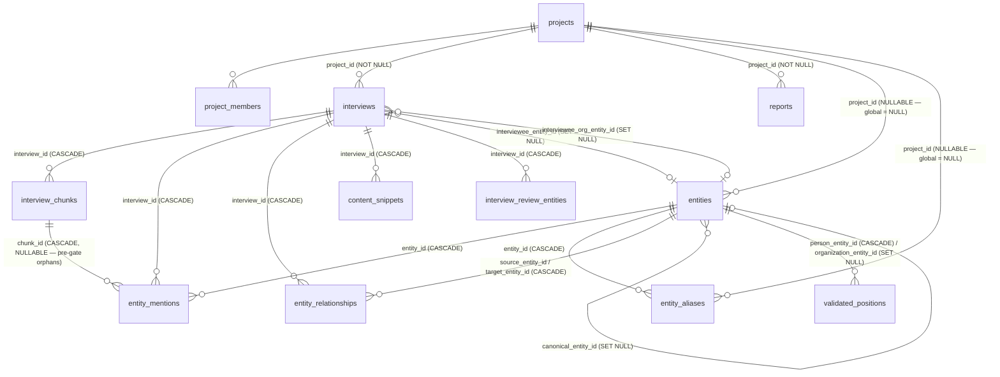

# Aksum — Database, Ingestion, Entity & Retrieval Audit

> Read-only audit. **No** schema, ingestion or retrieval code is changed by
> this report. Recommendations are prioritized at the bottom.

---

## 1. Executive summary

Aksum's persistence and retrieval system is internally coherent for the
"audio interview → chunks → graph → chat" loop it was originally built
for, but it now has **systemic source-traceability and retrieval gaps**
that block the product narrative around entity-centered, source-centered
and project-centered intelligence.

The most important findings:

1. **There is no canonical "source" abstraction.** `interviews` is being
   used simultaneously as the audio interview record, the document/PDF
   record, the plain-text record, the conversation transcript, and the
   anchor for *every* derived intelligence row (chunks, mentions,
   relationships, snippets, reports, chat threads). Every "document"
   today is forced through the interview shape (`interviewee_name`,
   `interviewee_org`, `transcript_full`, etc.), even when there is no
   interview at all. There is no `documents` table, no `sources` table,
   no `participants`/`speakers` table, no per-utterance table.

2. **Interview participants are anchor strings + optional FKs, not a
   structured participant model.** Apart from the two anchor columns
   (`interviewee_name`, `interviewee_org` and the matching
   `interviewee_entity_id` / `interviewee_org_entity_id` FKs added in
   `00015`), there is **no participants table**. Roles
   ("interviewee", "interviewer", "translator", "off-the-record source")
   do not exist. Multi-interviewee interviews are not modelable. Speaker
   labels live as opaque JSON in `interviews.speaker_map`.

3. **The persistence gate (April 2026, see
   [`fix-context-entity-ingestion.md`](../features/on-going/fix-context-entity-ingestion.md))
   intentionally drops anchor-only entities from `entity_mentions`.**
   Combined with the chat retrieval tools that *only* read
   `entity_mentions` and `entity_relationships`, this creates the exact
   symptom you're seeing: an entity that is the **interviewee** of an
   interview can have **zero** rows in `entity_mentions` for that
   interview, so `lookupMentions(entityId)` returns `[]` and the chat
   says "no interviews mention this person." The product accepted this
   trade-off in the feature spec ("callers querying 'who was
   interviewed' should continue to use `interviews.interviewee_entity_id`,
   not the mentions table"), but the chat tools never adopted that rule.

4. **Retrieval is single-channel** (vector search over chunks + four
   tools). There is no entity-centered, source-centered, topic-centered
   or project-centered retrieval *path*. The chat asks the LLM to call
   `lookupEntity` then `lookupMentions` / `lookupRelationships` /
   `lookupPositions`. Nothing forces the model to do that, nothing
   composes those tools into a single "what do we know about X" answer,
   and there is no tool that says "give me all interviews that
   feature/discuss this entity" (the closest, `lookupMentions`, is
   gate-incomplete by design — see point 3).

5. **The schema has multiple structural inconsistencies that are
   slowly corrupting the entity layer:**
   - `entities` keeps the `00001` constraint `UNIQUE(name, type)` even
     after `00009` introduced project-scoped entities. Two projects
     cannot independently have a "Ministry of Energy". `match.ts` works
     around the resulting `23505` errors silently by **falling back to
     whatever entity already owns the global name** — quietly merging
     entities across projects.
   - `entities` and `entity_aliases` have **no project-membership RLS**
     ("intentional for cross-project entity resolution"), so admins can
     read/write the entire entity graph with the anon key.
   - The persistence gate keeps **`anchor_context` and `fuzzy`
     grounding inside the runner** but drops them at write time. The
     resolver still creates new project entities for those anchors via
     `matchOrCreateEntity`. So the DB collects "anchor-only" entity
     rows that never have a matching `entity_mention` and never appear
     in the persisted graph — pure orphan node creation.
   - `entity_mentions.UNIQUE(entity_id, interview_id, chunk_id)` allows
     `chunk_id = NULL`, so historical pre-gate rows still exist
     alongside the new policy.

6. **There is no source-evidence link on summaries, sentiments, topics,
   risks, opportunities, content snippets, or reports.** Everything
   from `interviews.summary` to `reports.content` is
   model-generated text with no chunk-level provenance stored. Chat
   citations work only because the chunk number is computed at request
   time from `hybrid_search` results — they are not persisted anywhere.

7. **Reviewed reprocessing has a real failure window.** The pipeline
   "compute, then `clear_interview_derived_data`, then insert" is
   documented as not transactional. If the chunk insert batch fails
   after the clear, the interview ends up with `status: FAILED`,
   `transcript_review_status: ready`, and a fully wiped derived layer.
   Mentioned in the doc; no fix in code yet.

8. **Multi-tenancy on retrieval is partially policy-only.** Chat,
   graph, dashboard, and reports all use the **admin client** (RLS
   bypass). `lookupEntity` returns global entities and lets later
   tools "filter" by `projectId` in app code. `lookupRelationships`
   and `getMentions` apply that filter in JavaScript, not SQL. No
   regression on multi-tenant correctness yet (one customer, small
   team), but it would not survive a strict tenancy review.

9. **Active legacy migration debt.** The `00001` migration uses
   `interview_status: 'UPLOADING'` but `pipeline.ts` only ever uses
   `'PROCESSING'`. The `00004` enum lists `source_type` as
   `('audio','document','video')`; `00022` adds `'text'`; the TS type
   adds `'video'`. Three migrations (`00009`, `00013`, `00023`,
   `00025`) drift from the schema doc, and the doc still claims
   "12 tables, 15 migrations" (we are at 25). Migration `00018` is
   listed in the schema doc but `00016` is the table base — and no
   `00018_*.sql` exists in disk; the schema doc and migrations are
   visibly out of sync.

10. **The product narrative ("what do we know about X" /
    "what's been said about Y" / "before this meeting…") cannot be
    answered reliably today** because the only edge that exists between
    "person X" and "interview Y" is `entity_mentions`, and that table
    is now under-populated by design and over-populated historically.

The known symptom (entity recognized → no interview found) is an
**accurate, repeatable trace of issues #1, #2, #3 and #4 above**, not a
local bug. Fixing it cleanly requires a small refactor of the chat
retrieval tools **plus** the source/participant model.

---

## 2. Current architecture map

```mermaid
flowchart TD
  subgraph Upload
    UA[Upload audio /<br/>POST /api/interviews]
    UP[Upload PDF /<br/>POST /api/interviews/from-pdf]
    UT[Upload text /<br/>POST /api/interviews/from-text]
  end

  UA --> IROW[(interviews row<br/>source_type=audio<br/>status=PROCESSING)]
  UP --> IROW
  UT --> IROW

  IROW -->|audio only| AAI[AssemblyAI<br/>transcribe]
  AAI -->|webhook / poll| PT[processTranscription]
  UP --> PD[processDocument]
  UT --> PT2[processTextInterview]

  PT --> RUN[runIntelPipelineFromCanonicalSource]
  PD --> RUN
  PT2 --> RUN

  RUN --> EXT[extractIntelligence<br/>GPT-4o-mini → ExtractionResult]
  EXT --> CHK[chunkTranscript /<br/>chunkPlainText /<br/>chunkTextInterview]
  CHK --> NORM[anchor-aware<br/>chunk normalization]
  NORM --> EMB[generateEmbeddings<br/>text-embedding-3-small]
  EMB --> ICH[(interview_chunks<br/>+ embeddings)]

  EXT --> RES[resolveExtractedEntities]
  RES --> MOC[matchOrCreateEntity<br/>5-tier match]
  MOC --> ENT[(entities<br/>+ entity_aliases)]

  ICH --> GRD[groundEntityMentions<br/>exact|alias|anchor_context|fuzzy]
  RES --> GRD
  GRD --> GATE[applyPersistenceGate<br/>keep only exact|alias]
  GATE --> EM[(entity_mentions<br/>chunk_id NOT NULL after gate)]
  GATE --> ER[(entity_relationships<br/>both endpoints must survive)]
  RUN --> CS[(content_snippets)]
  RUN --> ISTAT[interviews status COMPLETED]

  subgraph Retrieval
    Q[POST /api/chat<br/>user query]
    Q --> CLS[classifyChatTemporalIntent]
    CLS --> EMBQ[embed query]
    EMBQ --> HS[(rpc.hybrid_search<br/>vector cos similarity)]
    Q --> BRF[buildProjectIntelBrief /<br/>buildWorkspaceIntelBriefForUser]
    Q --> POS[validated_positions<br/>prefetch + tool]
    HS --> CTX[contextBlock + citations]
    Q --> TOOLS[lookupEntity / lookupRelationships /<br/>lookupMentions / lookupPositions / webSearch]
    TOOLS --> ENT
    TOOLS --> ER
    TOOLS --> EM
    TOOLS --> POS
    BRF --> SP[system prompt]
    CTX --> SP
    POS --> SP
    SP --> LLM[streamText GPT-4o-mini]
  end

  subgraph UI
    DASH[Dashboard]
    NET[Network Explorer<br/>GET /api/graph/:projectId]
    INT[Interview detail<br/>RSC reads tables directly]
    REP[Reports<br/>intelligence-layer.ts]
    CHATUI[Chat]
  end

  DASH --> ENT
  DASH --> IROW
  DASH --> ER
  NET --> ENT
  NET --> EM
  NET --> ER
  INT --> EM
  INT --> ER
  INT --> IROW
  INT --> CS
  REP --> EM
  REP --> ER
  REP --> ENT
  CHATUI --> Q
```

Notes on the map:

- **All write paths (audio, document, text, reviewed reprocess)
  converge on `runIntelPipelineFromCanonicalSource` in
  `src/lib/ai/pipeline.ts`.** This is good — there is one entity
  resolution + grounding + persistence path.
- **All read paths bypass RLS** by using `createAdminClient()`. App
  code is the only thing scoping data to a project (or user, in the
  workspace brief). Strictly speaking, RLS is currently a **defense in
  depth** layer, not an enforcement layer for the product surfaces.
- **The "source" of any intel is always an `interviews.id`.** There is
  no separate `documents.id` or `sources.id`.

---

## 3. Current database model

> Authoritative file: `src/types/database.ts` (it is hand-written, not
> generated by `supabase gen types`). Schema doc
> [`docs/infrastructure/database-schema.md`](../infrastructure/database-schema.md)
> is partially out of date — see §3.5.

### 3.1 Tables grouped by role

| Group | Tables | Stores | Linked to source via |
|---|---|---|---|
| **Tenancy** | `profiles`, `projects`, `project_members`, `user_platform_roles` | Users, project membership, platform roles | n/a |
| **Source / canonical record** | `interviews` | All sources today (audio + PDF + text) — full transcript, anchors, semantic source type, review state | self |
| **Source raw + reviewed** | `interviews.transcript_full`, `interviews.source_utterances` (JSONB ms), `interviews.reviewed_utterances` (JSONB seconds), `interviews.transcript_display`, `interviews.speaker_map` | Three transcript layers + provider diarization seed + cleaned display | `interview_id` |
| **Reviewed seed entities** | `interview_review_entities` | Human-confirmed entities to bias reviewed reprocess extraction | `interview_id`, optional `entity_id` |
| **Retrieval substrate** | `interview_chunks` | Chunked text + embedding + JSONB metadata (country/topics/normalization/anchor IDs) | `interview_id` |
| **Knowledge graph** | `entities`, `entity_aliases`, `entity_mentions`, `entity_relationships` | Canonical entities, aliases (project + global), grounded mentions, typed edges with editorial state | `interview_id` (mentions/edges); none for entities |
| **Validated structure** | `validated_positions` | Human-validated person ↔ org titles with date precision | `entities` (person + org) |
| **Generated outputs** | `content_snippets`, `reports` | LLM-generated marketing text, LLM-generated reports markdown | `interview_id` (snippets); `interview_ids[]` (reports) |
| **Conversation memory** | `chat_conversations`, `chat_messages`, `chat_conversation_seq` | Chat history + atomic per-conversation sequence | `project_id?`, `interview_id?` |

### 3.2 Connections that exist (and where they break)



Issues visible from the diagram:

- **`entities` has no FK to its "project" via membership.** `project_id`
  is nullable for global entities; there is **no** join from a project
  to "entities currently used by this project's interviews" except
  through `entity_mentions → interviews → projects`. That join is what
  Network Explorer and the dashboard rebuild from scratch every time.
- **`entity_mentions.chunk_id` is nullable**, so orphan rows from before
  `applyPersistenceGate` (April 2026) still exist. The unique key
  `(entity_id, interview_id, chunk_id)` cannot deduplicate two NULLs in
  Postgres, so duplicate ungrounded mentions can exist for the same
  `(entity, interview)`.
- **`entities.UNIQUE(name, type)` from `00001` was never dropped** when
  `00009` introduced project-scoped entities. So the same canonical
  name+type cannot exist in two different projects. `match.ts`
  silently recovers from the resulting `23505` error by **returning
  whatever entity already owns the (name, type) pair** — i.e. cross-
  project merges that the resolver does not announce.
- **Chunks have no FK to entities.** Mentions are the only edge from a
  chunk to an entity. `chunks.metadata.entities` is a denormalized
  array of canonical names (strings, not IDs) used only for prompt
  context.

### 3.3 Per-table notes (the ones that matter for retrieval)

Selected only — full structural detail in
[`docs/infrastructure/database-schema.md`](../infrastructure/database-schema.md)
once it is updated.

#### `interviews`
- Holds 30+ columns spanning: source identity (`source_type`,
  `semantic_source_type`, `source_metadata`, `audio_url`,
  `assemblyai_id`), transcript layers (`transcript_full`,
  `transcript_display`, `source_utterances`, `reviewed_utterances`),
  participant anchors (`interviewee_name`, `interviewee_org`,
  `interviewee_title`, `interviewee_entity_id`,
  `interviewee_org_entity_id`), pipeline status, review state, and
  generated intel (`summary`, `sentiment`, `topics`).
- **No `participants` join table.** No way to model interviewer,
  translator, panel, off-record source. Two interviewees → impossible.
- **No "off-record / confidential / visibility" column.** Everything is
  treated as visible to all project members.
- `conducted_at` exists from `00001` but is rarely set by the upload
  routes — the schema is set up for it but the UI never asks for it.
  Chat reranks chunks by `conducted_at ?? created_at`, so date-aware
  retrieval drifts toward upload date.

#### `interview_chunks`
- Stores raw `content` (immutable, used as evidence text), embedding
  vector, speaker label, start/end seconds, JSONB `metadata`.
- Metadata holds anchor normalization fields (`normalized_content`,
  `content_for_embedding`, `normalization_confidence`,
  `primary_person_entity_id`, `primary_org_entity_id`) and
  denormalized `country`, `topics`, `entities` (string array).
- No FK to entities, no FK to project (transitive only).
- `embedding` is `vector(1536)` (OpenAI `text-embedding-3-small`).
- HNSW index `idx_chunks_embedding` on `vector_cosine_ops`,
  `m = 16`, `ef_construction = 64`.

#### `entities` and `entity_aliases`
- See §3.2 / §3.5 for the unique-constraint and RLS issues.
- `entity_aliases` is plain text → entity_id. No FK to chunks, no FK
  to interviews. Project scope is hybrid (NULL = global). Used at
  ingest, ASR keyterm prompt, and entity matching/grounding. Aliases
  are not used as **retrieval-time** synonyms in vector search — only
  during entity resolution and ASR prompting.

#### `entity_mentions`
- Schema is `(entity_id, interview_id, chunk_id?, context?, sentiment?)`.
- Persistence gate enforces `chunk_id NOT NULL` for new rows; legacy
  rows may have `chunk_id IS NULL`.
- **No `text_span` (offset start/end), no `speaker`, no
  `start_time`, no `match_method`/`match_confidence` persisted.**
  All grounding metadata stays in memory only.
- `context` stores a 500-char excerpt around the matched text — this
  is the only persisted retrieval evidence per mention.

#### `entity_relationships`
- Edges `(source, target, relation_type, interview_id)` with
  `confidence`, `evidence_text`, editorial state
  (`review_status`, `origin`, `reviewed_by`, `reviewed_at`).
- Unique key includes `interview_id`, so the same triple from two
  different interviews creates two rows. There is **no canonical
  cross-source relationship aggregator** — the graph view sums these
  on the fly.
- No FK to `chunk_id`. Evidence is a free-text quote chosen by the
  LLM, not a pointer.
- `evidence_text` is nullable; relationships with no quote exist.

#### `validated_positions`
- The cleanest "structured intelligence" table in the system. Person
  → optional org, title, date precision per end, `is_main`, `state`,
  `validated_at`. Read-only via SELECT for `authenticated`; populated
  out-of-band (admin / SQL).
- Lives outside any project — purely global.

#### `chat_conversations` / `chat_messages` / `chat_conversation_seq`
- Stores chat memory at message granularity with sequence numbers
  per conversation (atomic via `next_chat_message_sequence` SQL fn).
- No tool-call telemetry stored: the messages persist final text only.
  Retrieval evidence used for an answer is not saved.

### 3.4 Indexes (relevant ones)
- `idx_chunks_embedding` HNSW (cosine).
- `idx_chunks_metadata` GIN (`jsonb_path_ops`) — only useful when the
  query writes `@>` predicates, and the chat does **not** use it
  (it does pure vector search with `match_threshold = 0.25`).
- `idx_chunks_interview` btree.
- `idx_entities_normalized_name`, `idx_entities_canonical_entity_id`,
  `idx_entities_normalized_name_trgm` (GIN trgm).
- `idx_entity_aliases_alias_normalized_trgm` (GIN trgm),
  `idx_entity_aliases_project_id`.
- `idx_mentions_entity`, `idx_mentions_interview`. **No** index on
  `(entity_id, chunk_id)` or on `chunk_id` alone.
- `idx_entity_rel_source/target/interview/type`,
  `idx_entity_rel_review_status` (added in `00023`).
- `idx_validated_positions_*` for state, person, org.

### 3.5 Schema-doc drift (real, fixable)

The doc [`docs/infrastructure/database-schema.md`](../infrastructure/database-schema.md)
asserts:
- "12 tables, 15 migrations" — actually **17+ tables and 24
  migrations** (`00001`–`00025`, with `00018` referenced but
  not present on disk — `00018_platform_role_superuser.sql` is mentioned
  but only `00016`/`00017`/`00019`+ exist). **Verify and fix.**
- The `relation_type` enum is documented as the `00004` set; `00024`
  added `affiliated_with`, `operates_in`, `governs`, `customer_of`.
- `entity_type` is documented as the expanded V1 set, but the doc
  doesn't mention that `00001` started with only 6 values; the
  expansion via `00025` is referenced inline but worth restating.
- `interviews.semantic_source_type`, `source_metadata`,
  `interviewee_title`, `source_utterances`,
  `interviewee_entity_id`, `interviewee_org_entity_id` are all in TS
  types but only some are described in the doc.
- `chat_conversations.title_user_set`, `chat_conversation_seq`,
  `chat_messages` — fully missing from the doc.
- `validated_positions`, `user_platform_roles` — exist but doc claims
  10 core tables.
- `interview_status: 'UPLOADING'` exists in the enum but is dead
  code — no path writes it; uploads start at `'PROCESSING'`.

---

## 4. Source and traceability model

This is the area with the largest gap between the product story
("every claim must be sourced") and the actual schema.

### 4.1 What "source" means today

Today an intel record is "from" `interview_id`. There is no concept of:

| Product concept | DB representation today | Reality |
|---|---|---|
| Source object | `interviews.id` | Yes, even for PDFs and pasted text |
| Source type | `interviews.source_type` (`audio` / `document` / `text` / `video`) + `interviews.semantic_source_type` (free text) | Two coupled fields, second is free text not enum |
| Source visibility (off-record / confidential) | — | Not represented |
| Document file | `interviews.audio_url` (audio only) | PDFs are parsed and the bytes are not stored |
| Document metadata | `interviews.source_metadata JSONB` | Free-form; no schema enforced |
| Citation target | "interview chunk N" via `interview_chunks.id` | Persisted only as `entity_mentions.context` (excerpt) and `entity_mentions.chunk_id` |
| Run / extraction version | `interviews.last_intel_source` (string: `assemblyai_auto` / `human_review` / `direct_ingest`) | Single column; no per-row run id, no model version, no prompt version |
| Speaker → real person | `interviews.speaker_map JSONB` (string → string) | Opaque label map. No FK to entities. |

### 4.2 Provenance per intel layer

| Intel layer | Source-traceable? | Where the link lives |
|---|---|---|
| Raw transcript | Yes (audio: AssemblyAI id; reviewed: human user) | `interviews.assemblyai_id`, `interviews.last_intel_source`, `interviews.transcript_review_status` |
| Display transcript | Yes, derived deterministically | `interviews.transcript_display` (overwritten by normalize) |
| Reviewed transcript | Yes | `interviews.reviewed_utterances`, but only one version |
| Chunks | Yes — chunk → `interview_id` | `interview_chunks.interview_id`, `chunk_index`, `start_time`/`end_time` |
| Embeddings | Yes — embedding lives on the chunk row | Same as above |
| Entities | **Partial** — entity is reachable from a project only through `entity_mentions` | Floating row in `entities` if all mentions are dropped by the gate |
| Aliases | **No source link** | `entity_aliases` has `source` (e.g. `system`, `extraction`, `user_correction`) but **not** `interview_id` or `chunk_id` |
| Mentions | Yes after April 2026 (`chunk_id` enforced); historical rows may have NULL chunk | `entity_mentions.(interview_id, chunk_id, context)` |
| Relationships | Partial — `interview_id` + `evidence_text` quote, but **no `chunk_id`** and the quote is LLM-generated, not extracted | `entity_relationships.(interview_id, evidence_text)` |
| Summary / sentiment / topics / risks / opportunities | **No** — text fields on the interview row, no chunk pointers | `interviews.summary` etc. |
| Content snippets | **Source = entire interview** | `content_snippets.interview_id`. No chunk citations. |
| Reports | **Source = list of interview ids** | `reports.interview_ids[]`. No chunk citations stored. |
| Chat answers | **Source = nothing persisted** | Chat tool calls + RAG context exist only at request time. The final stored message text does not carry citation pointers. |
| Validated positions | Per-row `validated_at` (timestamp), but **no link to the interview / chunk that motivated the validation** | `validated_positions` |

### 4.3 Source-traceability questions and answers

| Question | Answer |
|---|---|
| Is there one canonical source abstraction? | **No.** `interviews` is reused for everything. |
| Can a Copilot citation reliably point to the exact source? | **Only at the chunk level**, and only because chunks carry `interview_id`. Citations are not persisted. |
| Are summaries traceable to the sources that generated them? | **No.** `interviews.summary` is one string with no chunk pointers. |
| Are relationships traceable to evidence? | **Partial.** `interview_id` + free-text quote. **No `chunk_id`.** |
| Are entity mentions traceable to text spans? | **Partial.** Excerpt is stored (`context`), but no offsets, no speaker, no timestamp persisted. |
| Can we distinguish raw / reviewed / processed text? | **Yes.** Three columns on `interviews` (`transcript_full`, `transcript_display`, `reviewed_utterances`) + `last_intel_source`. |
| Are off-the-record / visibility concepts represented? | **No.** |
| Are there orphan records without source links? | **Yes.** Entities with zero mentions exist (anchor-created). Pre-gate `entity_mentions` rows with `chunk_id IS NULL` exist. Aliases without project_id and without entity-row visibility exist. |

---

## 5. Ingestion pipeline

### 5.1 Audio interview path

`POST /api/interviews` (`src/app/api/interviews/route.ts`):
1. Auth via `getUser()`.
2. Sanitizes anchors (`sanitizeOptionalAnchor`) and validates anchor
   FKs (`validateInterviewAnchorEntityId`).
3. Inserts interview row with `status: PROCESSING`,
   `semantic_source_type: 'interview'`, `source_type: 'audio'` (default).
4. Builds `keyterms_prompt` from project + global aliases (200 each)
   and submits to AssemblyAI with `speaker_labels`, `universal-2`,
   webhook URL.
5. Updates row with `assemblyai_id`, `status: TRANSCRIBING`.

Then either `POST /api/webhooks/transcription` or
`GET /api/interviews/[id]/poll` triggers
`processTranscription(interviewId, assemblyaiId)` in
`src/lib/ai/pipeline.ts`:
1. `getTranscription(assemblyaiId)`.
2. Build `speakerMap` with auto-labels (`Speaker A` etc.) — **never
   writes real speaker names**, even if the user filled
   `interviewee_name`.
3. `normalizeTranscriptDisplay()` → conservative honorific cleanup.
4. Save `transcript_full`, `transcript_display`, `speaker_map`,
   `audio_duration`, `source_utterances`. Status →
   `EXTRACTING`.
5. Call `runIntelPipelineFromCanonicalSource` (shared runner).

### 5.2 PDF / text path

`POST /api/interviews/from-pdf` and `POST /api/interviews/from-text`:
- Same shape, but `source_type: 'document'` or `'text'`,
  `semantic_source_type` taken from form (defaults to `'interview'`).
- PDF: parses bytes via `pdf-parse`, validates `MIN_PDF_TEXT_LENGTH`
  (no scanned PDFs supported).
- Inserts interview row, then fires `processDocument(...)` or
  `processTextInterview(...)` (both in
  `src/lib/ai/document-pipeline.ts`) — fire-and-forget.
- Both delegate to `runIntelPipelineFromCanonicalSource` with
  `chunkUtterances: []` so chunking falls back to `chunkPlainText` or
  `chunkTextInterview`.

### 5.3 Shared runner

`runIntelPipelineFromCanonicalSource` in `src/lib/ai/pipeline.ts`:
1. `fetchCandidateEntities(...)` builds a 28-entry shortlist from
   anchors → most-mentioned project entities → global fallback if
   project has < 5 entities. Aliases are pulled per entity (top 2) for
   the prompt.
2. `extractIntelligence(...)` — GPT-4o-mini, structured output (Zod).
   Returns `{summary, sentiment, topics, entities[], relationships[],
   risks[], opportunities[]}`. Each entity has `raw_name +
   canonical_name`. Each relationship has `source_name + target_name +
   relation_type + confidence + evidence_text`.
3. Update interview with `summary, sentiment, topics`, status →
   `EMBEDDING`.
4. Chunk: `chunkTranscript(utterances)` for audio, otherwise
   `chunkTextInterview` or `chunkPlainText`.
5. `normalizeChunkWithAnchors` per chunk + `buildNormalizedChunkMetadata`.
   Chunk metadata gets `country, topics, entities (canonical names),
   normalized_content, content_for_embedding, primary_person_name,
   primary_org_name, normalization_confidence`.
6. `generateEmbeddings(...)` using `metadata.content_for_embedding` (or
   `chunk.content` fallback).
7. **If reviewed reprocess**: call `clear_interview_derived_data(rpc)`
   to wipe chunks/mentions/non-editorial relationships/snippets.
8. Insert chunks in batches of 50.
9. `resolveExtractedEntities(...)` (`src/lib/entities/resolve.ts`):
   - For each raw extracted entity, run `matchOrCreateEntity` against
     anchors + project + global + fuzzy.
   - If `forcedEntityId` (from human reviewer seed) → use it.
   - Honorific stripping, surname matching, token-level fuzzy matching
     to the anchor with deliberately low thresholds.
   - Dedup by `entityId`, accumulate descriptions.
   - `enrichEntityDescriptions` — updates DB descriptions where the new
     text is longer (cap 100 chars current).
10. `groundEntityMentions(...)` — four strategies per entity per chunk:
    `exact`, `alias`, `anchor_context`, `fuzzy`. Returns map
    `entityId → mentions[]`.
11. `applyPersistenceGate(...)`:
    - Mentions kept only if `matchMethod ∈ {exact, alias}`.
    - Entities with zero kept mentions → dropped from persisted output.
    - Relationships kept only if **both** endpoints survive the gate
      AND not in `rejectedRelationshipKeys` (editorial veto).
12. Upsert mentions in batches; upsert relationships with
    `ignoreDuplicates` to protect editorial state.
13. **Backfill chunk metadata** (`primary_person_entity_id`,
    `primary_org_entity_id`) per chunk row (one update per chunk —
    inefficient, but correct).
14. Update interview status → `COMPLETED`, set `last_intel_source`.
15. Best-effort `generateContentSnippets()` (failures non-critical).

### 5.4 Reviewed reprocessing

`reprocessInterviewFromReview(interviewId)`:
- Requires `transcript_review_status = ready`.
- Builds extraction transcript from `reviewed_utterances` (text join,
  no speaker prefixes — the prompt loses speaker context for reviewed
  text).
- Loads `interview_review_entities` as **forced seeds**.
- Sets status `EXTRACTING`, `transcript_review_status = reprocessing`.
- Calls runner with `clearDerivedBeforeInsert: true` and
  `lastIntelSource: human_review`.
- On COMPLETED, sets `transcript_review_status = draft`.
- **No DB transaction wraps "clear → insert".** Doc explicitly admits
  this; failure mid-flight leaves the interview without derived rows.

### 5.5 Issues & gaps

| # | Issue | Where | Why it matters |
|---|---|---|---|
| 5.1 | Speaker map is auto-generated (`Speaker A`, `Speaker B`) and never reconciled with `interviewee_name` | `pipeline.ts:processTranscription` | Chat shows speaker labels that don't carry person identity; chunks have no FK from speaker → entity |
| 5.2 | Reviewed extraction transcript drops speaker labels | `pipeline.ts:reprocessInterviewFromReview` | Extractor + grounder lose attribution per utterance |
| 5.3 | Anchor entities can be created without ever having a persisted mention | `resolve.ts → matchOrCreateEntity` then gate drops them | Orphan entities accumulate; chat tools find them via `lookupEntity` but find no mentions/relationships |
| 5.4 | "Compute → clear → insert" is non-transactional for reviewed reprocess | `pipeline.ts` (line 449 area) | Failure window leaves interview with no chunks/mentions/relationships |
| 5.5 | Chunk metadata backfill is N updates (one per chunk) for `primary_*_entity_id` | `pipeline.ts` (line ~615) | Slow on long interviews; should be a single UPDATE |
| 5.6 | `generateContentSnippets` is best-effort; failures swallowed | `pipeline.ts` (line 672) | OK for snippets, but the same pattern is used for non-critical work without telemetry |
| 5.7 | `fetchCandidateEntities` runs an extra round-trip per project to fetch interview ids, then again per entity to fetch aliases | `pipeline.ts` (line 250+) | N+1; can balloon for large projects |
| 5.8 | Topics, risks, opportunities are not stored as discrete rows | `pipeline.ts`; `extraction.ts` | Cannot answer "show me all interviews flagging the same risk" without a topic-level table |
| 5.9 | Document/PDF path uses an empty `speaker_map: {}` and `chunkUtterances: []`, so no speaker model exists for documents | `document-pipeline.ts` | Document chunks lose speaker → entity attribution entirely |
| 5.10 | PDF bytes are not stored; only the parsed text is persisted | `from-pdf/route.ts` | If parsing improves later, we cannot reprocess from the original |
| 5.11 | `interviewee_title` is metadata-only; never feeds extraction or validated positions | `interviews.interviewee_title` | Loses a structured signal we could write to `validated_positions` |
| 5.12 | `last_intel_source` is a free-text TEXT column instead of an enum | `interviews.last_intel_source` | Drift and typos possible |
| 5.13 | `extractIntelligence` model = GPT-4o-mini; no temperature/seed/output-version stored anywhere | `extraction.ts` | Cannot replay or compare extractions |

### 5.6 Pipeline questions and answers

| Question | Answer |
|---|---|
| Are interview participants represented structurally? | **No** — only two anchor strings + two FK columns on the interview row. |
| Is the interviewee stored only as metadata or also as an entity? | **Both, but inconsistently.** `interviewee_name` (string) is the source of truth for the upload; the FK `interviewee_entity_id` is set only when the user picks from autocomplete; even when set, the persistence gate may drop the resulting mentions. |
| Are interviewer/interviewee roles modeled? | **No.** |
| Are uploaded transcript-only interviews handled differently from audio? | **Mostly the same** (shared runner). Speaker map is empty, chunking falls back to plain text. |
| Are reviewed transcripts re-indexed after editing? | **Yes** — `reprocess-review` rebuilds chunks/embeddings/mentions/relationships, but non-transactionally. |
| Are chunks regenerated after transcript review? | **Yes.** |
| Are embeddings tied to the latest reviewed text? | **Yes** (rebuilt from `reviewed_utterances` during reprocess). |
| Are extraction results versioned? | **No.** Single overwrite. |
| Are failed/partial states handled safely? | **Partially.** `FAILED` status is set with `error_message`; reprocess can leave the interview with no chunks. |

---

## 6. Document ingestion (current and gaps)

The document path is **already live for PDFs** (`POST
/api/interviews/from-pdf`) and reuses the interview shape. Outstanding
gaps for "documents as a first-class concept":

- **There is no `documents` table.** Every PDF lives as a row in
  `interviews` with `source_type='document'` and (optionally)
  `semantic_source_type='report'`. The Interview Detail page silently
  re-skins itself when `source_type === 'document'` (no audio player,
  no speakers), but the data model is identical to an interview.
- **Interview-only fields leak into documents:** `interviewee_name`,
  `interviewee_org`, `interviewee_title`, `audio_url`,
  `audio_duration`, `speaker_map`, `expected_speakers`,
  `transcript_full` (used for the document text). Schema is misleading
  for document-only sources.
- **Document chunks live in `interview_chunks`.** Naming aside, this
  works — but the chat citation format claims "Speaker / Time" which
  is meaningless for documents.
- **Document metadata is `interviews.source_metadata JSONB` only.** No
  enforced fields for: original file name, page count, author,
  publication date, publisher, URL, language confidence.
- **Original bytes are not stored.** Re-extraction with a better PDF
  parser is impossible.
- **Citations cannot point to "page N" of a document.** The
  `start_time` / `end_time` fields on chunks are NULL for documents
  and the chat citation format always renders a time stamp like `0:00`.
- **OCR / scanned PDFs are explicitly rejected** at upload via
  `MIN_PDF_TEXT_LENGTH`. No fallback.
- **Document-derived entities and mentions are handled identically to
  interview-derived ones** (good for graph consistency, but it means
  the Network Explorer cannot show "interview-sourced" vs "document-
  sourced" edges).

---

## 7. Entity, mention and relationship model

### 7.1 Entity creation and matching

`matchOrCreateEntity` (`src/lib/entities/match.ts`) does:

1. Project-scoped exact entity match on `normalized_name` + `type`
   (only canonical rows).
2. Project-scoped exact alias match (joined with entity, type-checked).
3. Global exact entity match.
4. Global exact alias match.
5. Fuzzy entity match (project, then global) — character trigram
   similarity computed in JS over up to 200 fetched rows; thresholds
   `≥ 0.9` auto-merge, `[0.8, 0.9)` create + flag `needs_review`,
   `< 0.8` create new.
6. On `INSERT` of new entity, recover from `23505` (unique violation)
   by returning whatever existing entity owns the same `(name, type)`.
7. After every successful match/create, `ensureAlias` writes the raw
   name as an alias for the canonical entity (project-scoped).

### 7.2 Resolution + anchor matching

`resolveExtractedEntities` (`src/lib/entities/resolve.ts`):
- Honorific-stripped surname match against the upload anchor
  (`PRIMARY_PERSON_FULL_THRESHOLD = 0.35` — very permissive on purpose
  because "we know this person was interviewed").
- For each resolved entity, also writes `raw_name` and `canonical_name`
  as aliases when they differ (`ensureAliasQuiet`).
- Calls `enrichEntityDescriptions` to update `entities.description` if
  the new text is longer / the existing one is shorter than 100 chars.

### 7.3 Grounding

`groundEntityMentions` (`src/lib/entities/ground-mentions.ts`) is the
chunk-level matcher. Strategies in order:

| # | Method | Persistable? | Notes |
|---|---|---|---|
| 1 | `exact` | Yes | Word-bounded match of canonical name |
| 2 | `alias` | Yes | Word-bounded match of any known alias |
| 3 | `anchor_context` | **No** | Inferred from name token / honorific+surname / org-token overlap; only for the upload anchor person/org |
| 4 | `fuzzy` | **No** | Capitalized-name patterns + trigram similarity ≥ 0.85, or ≥ 0.75 with a shared distinctive token |

`PERSISTABLE_MATCH_METHODS = {exact, alias}` enforces the rule.

`applyPersistenceGate` then keeps only those mentions, drops any entity
with zero kept mentions, and drops any relationship whose endpoint did
not survive.

### 7.4 Issues in the entity model

| # | Issue | Where | Why it matters |
|---|---|---|---|
| 7.1 | `entities.UNIQUE(name, type)` not dropped after introducing `project_id` | `00001` + `00009` | Cannot have the same `(name, type)` in two projects. `match.ts` silently merges across projects via the `23505` recovery path. |
| 7.2 | Anchor-only entities are created but never persisted into mentions/relationships | `resolve.ts → matchOrCreateEntity` + gate | Floating entity rows, classic source of "lookupEntity finds it but no interviews / no relationships". |
| 7.3 | No FK from `entities` to project membership | `entities.project_id` | Project deletion CASCADEs but cross-project entities are not associated with all projects that use them; the only path is through `entity_mentions`. |
| 7.4 | `entities` and `entity_aliases` have **no project-membership RLS** | `00002` + `00009` | Any authenticated user can read all entities, including from projects they cannot see. |
| 7.5 | Aliases have no source provenance link | `entity_aliases` | Cannot answer "where did this alias come from?". `source` is a free-text label (`system`, `extraction`, `user_correction`, `admin_governance`). |
| 7.6 | Normalization is not unicode-canonical for some scripts | `normalize.ts` | Likely fine for Latin + accents (NFKD + diacritic strip), but Arabic / CJK / Cyrillic edge cases not asserted by tests. |
| 7.7 | Roles / positions are split between `entities.metadata` (rare), `interviewee_title` (TEXT on interview), and `validated_positions` (the only structured store) | three places | Validated positions are great but only populated by humans; nothing in the pipeline auto-suggests them or links them back to a chunk. |
| 7.8 | A person can have multiple validated positions over time, but the LLM's relationship `affiliated_with` is duplicated per interview without any temporal field | `entity_relationships` | Cannot answer "who was at SNEL in 2023" from the relationship table; only from `validated_positions`. |
| 7.9 | `entities.canonical_entity_id` chain has loop protection (`MAX_DEPTH = 10`) but no DB constraint preventing cycles | `match.ts:resolveCanonicalEntityId` | A bad merge could create a cycle silently. |
| 7.10 | Fuzzy entity search runs in JS over up to 200 rows fetched from PostgREST | `match.ts` + `entity-lookup.ts` | Already slow for global lookups; will not scale past ~5k entities per type. The DB has trigram indexes that PostgREST/RPC could exploit, but no RPC uses them. |
| 7.11 | Entity mentions store no `match_method`, `match_confidence`, `text_span (start/end)`, `speaker`, `start_time`, or chunk-relative offset | `entity_mentions` | Cannot tell after the fact whether a mention was high-confidence; cannot deep-link to the exact phrase. |
| 7.12 | No `entity_type` for "TOPIC" / "RISK" / "OPPORTUNITY" / "EVIDENCE_QUOTE" / "ROLE_TITLE" | `entity_type` enum | Topics, risks, opportunities are extracted but stored as plain strings on `interviews`, not entities. They cannot be searched, deduped, related, or counted across interviews. |

### 7.5 Mention & relationship questions

| Question | Answer |
|---|---|
| What counts as a mention? | A grounded chunk-level reference whose `matchMethod ∈ {exact, alias}`. |
| Are mentions extracted from chunks, full transcripts, summaries, or metadata? | **Chunks only** (after the gate). Pre-gate rows may have NULL chunk. |
| Do mentions link to entity_id / project_id / interview_id / chunk_id? | entity_id, interview_id, chunk_id (after gate) — yes. project_id is transitive only. |
| Are text spans stored? | **No**, only an excerpt (`context`). |
| Is speaker / timestamp stored? | **No** on the mention row. Available via `chunk_id → interview_chunks.(speaker, start_time, end_time)`. |
| Are mentions canonicalized? | Yes, by `entity_id`. `canonical_entity_id` is followed during matching. |
| Are there mentions without entities? | No (FK CASCADE). |
| Are there entities without mentions? | **Yes** — anchor-only entities (post-gate) and any entity whose mentions were dropped. |
| Are interview participants created as mentions? | **Only if their name appears literally in a chunk.** This is the root of the known symptom. |
| Are mentions used by retrieval? | **By `lookupMentions` in chat, by Network Explorer, by reports, by Interview Detail.** Not by vector search. |
| How are relationships extracted? | LLM during `extractIntelligence`, with `evidence_text` quote. |
| Do relationships link to source evidence? | `interview_id` + `evidence_text` (free text). **No `chunk_id`.** |
| Do they link to chunks? | **No.** |
| Are types normalized? | Yes via enum. v2 taxonomy preferred (`affiliated_with`, etc.); legacy `business_partner`, `ally` kept. |
| Confidence stored? | Yes (`confidence float`). |
| Duplicates merged? | `UNIQUE(source, target, relation_type, interview_id)` prevents per-interview duplicates; cross-interview duplicates are kept (graph aggregator sums them). |
| Directional? | Yes — `source_entity_id` and `target_entity_id` are distinct. |
| Used by Copilot retrieval? | Yes (`lookupRelationships`). |
| Are graph edges in Network Explorer based on real source-grounded relationships? | **Yes** — `entity_relationships` filtered by `review_status != 'rejected'`. Mentions count is computed from `entity_mentions`. |
| Are contextual / visual edges separated from real relationships? | **No.** All edges in the network come from `entity_relationships`. |

---

## 8. Chunks and embeddings

### 8.1 What is chunked

Audio: `chunkTranscript(utterances)` — speaker-aware grouping, ~500
tokens per chunk, ~50-token overlap, sentence boundaries.

Document/Text: `chunkPlainText(text)` (paragraph-based) or
`chunkTextInterview(text, structureHint)` for written interviews
(Q/A or name-prefix).

### 8.2 What metadata is stored on each chunk

`interview_chunks.metadata` JSONB:
- `country`, `topics` (denormalized from interview / extraction).
- `entities`: array of canonical entity **names** (not IDs).
- Anchor-aware normalization fields: `normalized_content`,
  `content_for_embedding`, `normalization_applied`,
  `normalization_confidence`, `primary_person_name`,
  `primary_org_name`, `primary_person_entity_id`,
  `primary_org_entity_id`.
- `chunk_index`, `token_count`.

### 8.3 Embedding source

OpenAI `text-embedding-3-small` (1536d). Embedding **input** is
`metadata.content_for_embedding` (raw chunk text + `Primary
interviewee:` / `Primary institution:` lines), not raw `content`.
Persisted on the chunk row as `embedding vector(1536)`.

### 8.4 Issues

| # | Issue | Why it matters |
|---|---|---|
| 8.1 | Chunks have no FK to entities (only `metadata.entities[]` strings) | Cannot SQL-filter chunks by entity ID without joining `entity_mentions`. |
| 8.2 | Chunks have no FK to project (transitive only) | Vector search must JOIN `interviews` to apply `project_id` filter (`hybrid_search` does this). |
| 8.3 | Document chunks store `start_time = NULL`, `end_time = NULL`, but chat formats them as `0:00` | UI clutter and misleading citation. |
| 8.4 | `interview_chunks.metadata.entities` is a denormalized **string** array — drift from `entity_mentions` is possible | Reports and dashboard counts can disagree depending on which source they read. |
| 8.5 | No "section" / "page" / "paragraph" abstraction for documents | Document chunks are flat paragraph slices; no chapter/section context. |
| 8.6 | No utterance / transcript-segment table | `source_utterances` and `reviewed_utterances` are JSON blobs on the interview row; you cannot query "all utterances by speaker X across all interviews" except by parsing JSON in app code. |
| 8.7 | No re-embed-on-model-change marker | If we change embedding models, we cannot identify which chunks need re-embedding without re-embedding all. |
| 8.8 | The `idx_chunks_metadata` GIN index is unused at query time | It exists but no SQL path uses `metadata @>` filters. Wasted maintenance cost. |
| 8.9 | Anchor enrichment for embeddings appends two structured lines unconditionally — even for non-interview documents where "Primary interviewee" is meaningless | Bias risk in vector retrieval for non-interview sources. |
| 8.10 | `normalization_confidence: 'low'` chunks still get embedded with anchor enrichment | A chunk with no anchor confidence gets the same embedding shape as a high-anchor chunk. |

---

## 9. Retrieval / Copilot pipeline

### 9.1 Flow (per request)

`POST /api/chat` (`src/app/api/chat/route.ts`):
1. Auth via `getUser()`.
2. Parse body: `messages`, `projectId?`, `interviewId?`,
   `conversationId?`, `copilotMode?` (`general_context | sales`).
3. `resolveChatConversation` — find or create conversation,
   verify project membership.
4. `persistUserTurn` — write user message to `chat_messages`.
5. `classifyChatTemporalIntent` — GPT-4o-mini classifier returns
   `{temporal_intent, focus, person_name, organization_name,
   target_date_iso}`.
6. Detect `scopeIntent` from regex on the query
   (`this interview`, `this project`, `across all interviews`).
7. Optional anchor-resolved person/org via `findEntity`.
8. `resolvePrefetchPositions` → loads validated positions block (when
   the temporal intent calls for it).
9. `buildProjectIntelBrief` (project) or
   `buildWorkspaceIntelBriefForUser` (no project): SQL summary of
   project + completed interviews to embed in the system prompt.
10. `generateEmbeddings([queryText])` then
    `admin.rpc("hybrid_search", ...)` with `match_threshold = 0.25`,
    `match_count = 20` (or 30 if scoped to a single interview).
11. `loadInterviewTimesForChunks` then
    `rerankRagChunksForTemporal` (`current_state` → newest first;
    `point_in_time` → closest to target date; `timeline` → ascending).
12. Build `contextBlock` ("[1] [Speaker A] [3:21]\n…") and
    `citationsSummary` ("[1] Speaker: A, Time: 3:21, Relevance: 53% —
    [View Interview](/interviews/UUID)").
13. Build modular system prompt with `buildSystemPrompt(...)`:
    identity → mode overlay (general/sales) → grounding rules →
    scope/runtime sections → retrieved context.
14. Send last 6 messages + tools to `streamText` with
    `stopWhen: stepCountIs(5)`. Tools: `lookupPositions`,
    `lookupEntity`, `lookupRelationships`, `lookupMentions`,
    `webSearch`.
15. On `onFinish`: log grounding metrics, `persistAssistantTurn`.
16. Stream response with `X-Conversation-Id` header.

### 9.2 Tool semantics (key gaps)

| Tool | Reads | Project filter | Notes |
|---|---|---|---|
| `lookupEntity` | `entities` + `entity_aliases`, then JS dice-coefficient fuzzy over up to 100 entities | Project-first then global; both via PostgREST | Always returns at most one entity. Cannot return "found 3 candidates, please disambiguate." |
| `lookupRelationships` | `entity_relationships` (incl. join to other entity), filtered to `review_status != 'rejected'` | App-code filter (fetches interview ids in `projectId`) | Up to 30 outgoing + 30 incoming. Returns `interview_id` but **not interview title** to the model. |
| `lookupMentions` | `entity_mentions` joined to `interviews`, then chunk content for context | App-code filter on `interview.project_id` | Up to 30 mentions. **Reads `entity_mentions` only**, not `interviews.interviewee_entity_id`. |
| `lookupPositions` | `validated_positions` for a person | Global (no project filter) | Strong source of truth for titles. Not linked to interviews. |
| `webSearch` | Tavily | n/a | Last resort. |

### 9.3 Issues with retrieval

| # | Issue | Why it matters |
|---|---|---|
| 9.1 | `lookupMentions` reads `entity_mentions` only and never falls back to `interviews.interviewee_entity_id` / `interviewee_org_entity_id` | This is **the root cause of the known symptom**. |
| 9.2 | `lookupEntity` returns at most one match | The model has no way to disambiguate "John Doe at Ministry X" vs "John Doe at Company Y" in the same project. |
| 9.3 | `findEntity` filters `canonical_entity_id IS NULL`, so a non-canonical alias-row entity returns null even if a canonical one exists | Edge case but real after merges. |
| 9.4 | The model is **not required** to call `lookupEntity` first. Prompt says "should", `stopWhen: stepCountIs(5)` allows skipping all tools | Hallucination risk. |
| 9.5 | There is no entity-centered retrieval mode (e.g. "vector search restricted to chunks with `primary_person_entity_id = X` or chunks tagged with that entity in `entity_mentions`") | Question "what do we know about person X" cannot use vector search to find related-but-not-named chunks. |
| 9.6 | There is no source/document-centered retrieval mode | Cannot answer "summarize document Y" via the chat reliably without scoping by interview id. |
| 9.7 | Topic / sector / project-centered retrieval is implicit through the project brief only | "Show me all sectoral signals across this project" returns whatever vector search picks up. |
| 9.8 | RAG chunks do not include `interview_title` when injected — only chunk number, speaker, time | Citations carry `[View Interview]` URLs, but the model only knows interview UUIDs from tool results. |
| 9.9 | Citation pointers are not persisted with the answer | Re-displaying a thread shows the answer text but not which chunks supported it. |
| 9.10 | The system prompt always carries `dbIntelSection` (full project / workspace brief) — can be 14 KB | Cost on long conversations and prompt-injection risk. |
| 9.11 | The temporal classifier runs on every turn (extra GPT-4o-mini call) | Latency; on failure falls back to `general_background`. |
| 9.12 | Web search is allowed even in `single-interview` scope mode (the prompt warns the model not to use it, but the tool is still wired in) | Soft guarantee. |
| 9.13 | "this project" / "this interview" / "global" scope detection is regex-based | Misses paraphrases ("in this conversation" works, "in our chat" doesn't). |
| 9.14 | The chat history slice sent to the model is a hard `slice(-6)` plus the latest message — no semantic compression, no chunk-aware summary | Long conversations lose context. |
| 9.15 | `onFinish` logs grounding metrics but never persists them | Cannot run "answer hallucination rate" analytics offline. |

### 9.4 Retrieval-question matrix

| Question type | Path today | Reliable? |
|---|---|---|
| "What do we know about person X?" | RAG + (model may call) `lookupEntity → lookupMentions/Relationships/Positions` | **Unreliable**: anchor-only interviewees return zero mentions; vector search may miss chunks where the name was never typed. |
| "What interviews mention person X?" | `lookupMentions(entityId)` | **Unreliable** for the same reason. |
| "What did stakeholder Y say about topic Z?" | RAG (cross of topic + name in vector space) + `lookupMentions` | **Sometimes** — vector search recall depends on whether topic vocabulary appears in chunks. |
| "Which documents support this answer?" | The model echoes `[1]…[20]` markers in its reply | **Yes** at request time, **not persisted**. |
| "What relationships exist between X and Y?" | `lookupRelationships(X)` then filter for Y in model output | **Partial** — depends on extraction; relationship may not have been extracted if both endpoints were ungrounded. |
| "Which sources mention sector S across projects?" | RAG with no project filter | **Weak** — sector terms rarely exact in transcripts; no `entity_type=SECTOR` join. |
| "What should I know before meeting account A?" | RAG + entity tools + project brief | **Variable** — depends on the model. |
| "Which insights come from interviews vs documents vs metadata?" | Not represented anywhere — `last_intel_source` is on the interview but the tool outputs do not carry it | **No.** |
| "What evidence supports this generated brief?" | Brief = `interviews.summary` (no chunk pointers) | **No.** |
| "What has changed across time on topic T?" | Temporal classifier + chunk rerank by interview date | **Approximate.** |

---

## 10. SQL/RPC functions (active)

| Function | File | Inputs | Returns | Notes |
|---|---|---|---|---|
| `hybrid_search` | `00012_interview_scoped_search.sql` | `query_embedding (vector 1536)`, `filter_project_ids[]?`, `filter_interview_ids[]?`, `filter_country?`, `filter_topics[]?`, `match_threshold (default 0.7)`, `match_count (default 10)` | `chunk_id, interview_id, content, speaker, start_time, end_time, metadata, similarity` | Despite the name, **vector-only**. Cosine similarity via pgvector `<=>`. |
| `clear_interview_derived_data` | `00013` then redefined in `00023` | `p_interview_id` | void | Wipes chunks, mentions, content snippets; deletes only `pending + llm` relationships (preserves editorial state). SECURITY DEFINER. service_role only. |
| `next_chat_message_sequence` | `00019` | `p_conversation_id` | bigint | Atomic per-conversation sequence allocation. service_role only. |
| `touch_chat_conversation_on_message` | `00019` | trigger | trigger | Bumps `chat_conversations.updated_at` on message insert. |
| `list_distinct_position_titles` | `00017` | `p_limit` | rows of `title` | Future admin UI. |
| `is_superuser`, `has_entity_governance_access` | `00018` | none | boolean | Platform role helpers. |
| `is_project_member`, `is_project_owner`, `is_project_editor`, `get_interview_project` | `00002` | varies | boolean / uuid | RLS helpers. |
| `add_project_owner` | `00001` | trigger | trigger | Inserts the creator as owner on project insert. |
| `handle_new_user` | `00001` (+ `00016`) | trigger | trigger | Creates profile + `member` platform role on signup. |

### 10.1 Issues

| # | Issue | Why it matters |
|---|---|---|
| 10.1 | `hybrid_search` is the only RAG function. There is no `entity_centered_search`, no `mention_lookup_with_chunk_text`, no `topic_search`, no `relationship_evidence_lookup` | All entity/mention/relationship reads are PostgREST round-trips with JS-side joins. |
| 10.2 | `hybrid_search` filter signature mixes optional UUID arrays and TEXT — but **does not** include filter_entity_ids or filter_speaker, so vector search cannot be entity- or speaker-aware at the SQL layer | Forces app code to post-filter or to use entity tools as a separate hop. |
| 10.3 | `match_threshold` default in SQL is `0.7`, but **every caller overrides to `0.25`** | Footgun if a new caller forgets to pass it. |
| 10.4 | `clear_interview_derived_data` deletes content_snippets and chunks but does **not** delete `interview_review_entities` or update `interviews.last_intel_source` | OK by design (those are inputs, not outputs), but worth noting in the doc. |
| 10.5 | No SQL function for the Network Explorer; the API route does the join in app code | Fine for small projects, will not scale. |
| 10.6 | No SQL function to look up "interviews where entity X is the interviewee or appears in a mention" | This is exactly what would fix the known symptom cleanly. |
| 10.7 | No SQL function for "all chunks for this entity across the project" | Reports build this via app-side joins. |
| 10.8 | RPCs are not versioned (no migration that drops/recreates `hybrid_search` in a backward-compatible way) | Migration `00012` overrode `00001`'s `hybrid_search`, the schema doc still mentions only the original signature. |

---

## 11. UI data dependencies

| Page | Reads (unique to that page) | Notes |
|---|---|---|
| **Dashboard** (`src/app/(dashboard)/dashboard/page.tsx`) | `projects`, `interviews` (status counts), `entities` (count), `entity_relationships` (count where `review_status != 'rejected'`) — all via `admin` client, **not user-scoped** | Counts span the whole DB, not the user's projects. Acceptable for single-tenant team but not multi-tenant. |
| **Interviews list** | `interviews` joined to `projects` | Standard. |
| **Interview detail** (`/interviews/[id]/page.tsx`) | `interviews.*`, `entity_mentions` joined to `entities`, `entity_relationships` (with editorial state), `content_snippets` (gated by feature flag) | Uses RSC + cookie-based supabase client (RLS-enforced). Shows entities deduped by entity_id with a count of mentions; shows relationships with editorial controls. |
| **Transcript review** (`/interviews/[id]/review`) | `interviews` (transcript layers), `interview_review_entities` | Editor surface. |
| **Network Explorer** (`/network/page.tsx` + `/api/graph/[projectId]`) | `interviews` (id only), `entity_mentions` (count per entity), `entities`, `entity_relationships` (excluding rejected) | Uses admin client; project-scoped at the route layer. **Builds graph from real source-grounded mentions and relationships** — no synthetic "visual" edges. |
| **Copilot** (`/chat/page.tsx`) | `chat_conversations`, `chat_messages`; chat API does the rest | Persists conversation + messages only; no tool telemetry stored. |
| **Project pages** | `projects` + memberships | Standard. |
| **Admin/entities** (`/admin/entities`) | `entities`, `entity_aliases`, `entity_mentions` (counts) | Governance surface. Uses admin client gated by `has_entity_governance_access`. |

### 11.1 Cross-page data consistency questions

| Question | Answer |
|---|---|
| Are pages using the same source of truth? | **Mostly yes** for entities/mentions/relationships (single tables). **No** for entity counts: dashboard counts entire DB, project page counts via `entity_mentions`, Network Explorer counts mentions per entity per project. |
| Are entities shown in UI the same entities used by retrieval? | **Yes**, same `entities` table. |
| Is Network Explorer using source-grounded relationships? | **Yes** — `entity_relationships` filtered to non-rejected. |
| Does Interview Detail show entities that retrieval can also use? | **Yes** but the inverse fails: chat may "know" the interviewee entity via `interviewee_entity_id` while Interview Detail shows zero or fewer entity rows than expected because the gate has dropped them. |
| Are counts consistent? | **No**. Dashboard relationship count is global; project page would be project-scoped; Interview Detail is interview-scoped. The "entities mentioned" count on Interview Detail is post-gate; cross-interview total of mentions ≠ rows on Interview Detail. |
| Are UI filters aligned with backend filters? | Partially — chat scope detection is regex-based and lives only in the chat API; UI does not filter the same way. |
| Are there duplicated data fetch patterns that can drift? | **Yes** — every page that lists entities for a project rebuilds the join. There is no `project_entities_view` or RPC. |

---

## 12. Data integrity risks (read-only checks)

> All queries below are SELECT-only. Run them via the Supabase SQL
> editor (service role) or `psql` against the same DB. Do not run any
> DELETE/UPDATE without explicit human approval.

### 12.1 Anchor-only interviewees (the known-symptom probe)

```sql
-- Interviews whose interviewee_entity_id is set but where that entity
-- has zero entity_mentions for that interview. These are exactly the
-- "person is the interviewee but chat finds no interviews" cases.
SELECT i.id AS interview_id,
       i.title,
       i.interviewee_entity_id,
       e.name AS interviewee_name
FROM interviews i
LEFT JOIN entities e ON e.id = i.interviewee_entity_id
LEFT JOIN entity_mentions em
       ON em.interview_id = i.id
      AND em.entity_id = i.interviewee_entity_id
WHERE i.interviewee_entity_id IS NOT NULL
  AND i.status = 'COMPLETED'
  AND em.id IS NULL
ORDER BY i.created_at DESC;
```

### 12.2 Anchor-only orgs

```sql
SELECT i.id, i.title, i.interviewee_org_entity_id, e.name
FROM interviews i
LEFT JOIN entities e ON e.id = i.interviewee_org_entity_id
LEFT JOIN entity_mentions em
       ON em.interview_id = i.id
      AND em.entity_id = i.interviewee_org_entity_id
WHERE i.interviewee_org_entity_id IS NOT NULL
  AND i.status = 'COMPLETED'
  AND em.id IS NULL;
```

### 12.3 Entities without any mentions (orphans)

```sql
SELECT e.id, e.name, e.type, e.project_id
FROM entities e
LEFT JOIN entity_mentions em ON em.entity_id = e.id
WHERE em.id IS NULL
  AND e.canonical_entity_id IS NULL;
```

### 12.4 Mentions without source links (legacy pre-gate rows)

```sql
-- Pre-gate rows. Run before any cleanup decision.
SELECT em.id, em.entity_id, em.interview_id, em.created_at, e.name
FROM entity_mentions em
JOIN entities e ON e.id = em.entity_id
WHERE em.chunk_id IS NULL
ORDER BY em.created_at;
```

### 12.5 Relationships whose endpoint entity is missing

```sql
SELECT er.id
FROM entity_relationships er
LEFT JOIN entities s ON s.id = er.source_entity_id
LEFT JOIN entities t ON t.id = er.target_entity_id
WHERE s.id IS NULL OR t.id IS NULL;
```

### 12.6 Relationships with no evidence quote

```sql
SELECT id, interview_id, source_entity_id, target_entity_id, relation_type
FROM entity_relationships
WHERE evidence_text IS NULL
   OR length(btrim(evidence_text)) = 0;
```

### 12.7 Chunks with no embedding

```sql
SELECT id, interview_id, chunk_index, length(content) AS chars
FROM interview_chunks
WHERE embedding IS NULL;
```

### 12.8 Interviews stuck mid-pipeline

```sql
SELECT id, title, status, transcript_review_status, last_intel_source,
       error_message, updated_at
FROM interviews
WHERE status NOT IN ('COMPLETED','FAILED','UPLOADING','PROCESSING','TRANSCRIBING')
  AND updated_at < now() - interval '1 hour';
```

### 12.9 Reviewed interviews left without derived data

```sql
SELECT i.id, i.title, i.status, i.transcript_review_status, i.last_intel_source,
       (SELECT count(*) FROM interview_chunks c WHERE c.interview_id = i.id) AS chunks,
       (SELECT count(*) FROM entity_mentions m WHERE m.interview_id = i.id) AS mentions,
       (SELECT count(*) FROM entity_relationships r WHERE r.interview_id = i.id) AS rels
FROM interviews i
WHERE i.transcript_review_status IN ('reprocessing','ready')
ORDER BY i.updated_at DESC;
```

### 12.10 Duplicate canonical entities (same normalized_name + type, different rows)

```sql
SELECT normalized_name, type, count(*) AS dupes,
       array_agg(id ORDER BY created_at) AS ids
FROM entities
WHERE canonical_entity_id IS NULL
GROUP BY normalized_name, type
HAVING count(*) > 1
ORDER BY count(*) DESC, normalized_name;
```

### 12.11 Aliases pointing to non-canonical entities

```sql
SELECT a.id, a.alias, a.entity_id, e.canonical_entity_id
FROM entity_aliases a
JOIN entities e ON e.id = a.entity_id
WHERE e.canonical_entity_id IS NOT NULL;
```

### 12.12 Project-scope vs global collisions on the same name

```sql
SELECT normalized_name, type,
       array_agg(DISTINCT project_id::text) AS scopes,
       count(*) AS rows
FROM entities
GROUP BY normalized_name, type
HAVING count(DISTINCT COALESCE(project_id::text, 'GLOBAL')) > 1
ORDER BY rows DESC;
```

### 12.13 Reviewed transcripts that did NOT update chunks/embeddings

```sql
SELECT i.id, i.title, i.last_intel_source,
       max(c.created_at) AS last_chunk_at,
       jsonb_array_length(i.reviewed_utterances) AS reviewed_count
FROM interviews i
LEFT JOIN interview_chunks c ON c.interview_id = i.id
WHERE i.last_intel_source = 'human_review'
GROUP BY i.id;
```

### 12.14 Cycle detection in canonical chain

```sql
WITH RECURSIVE chain AS (
  SELECT id, canonical_entity_id, ARRAY[id] AS path
  FROM entities
  WHERE canonical_entity_id IS NOT NULL
  UNION ALL
  SELECT c.id, e.canonical_entity_id, path || e.id
  FROM chain c
  JOIN entities e ON e.id = c.canonical_entity_id
  WHERE NOT (e.id = ANY(path))
    AND array_length(path, 1) < 12
)
SELECT id, path FROM chain
WHERE canonical_entity_id = ANY(path);
```

### 12.15 Interviews whose interviewee_entity_id points at a different `type` than expected

```sql
SELECT i.id, i.title, e.id AS entity_id, e.type
FROM interviews i
JOIN entities e ON e.id = i.interviewee_entity_id
WHERE e.type <> 'PERSON';
```

### 12.16 Validated positions referencing missing entities

```sql
SELECT vp.id, vp.person_entity_id, vp.organization_entity_id
FROM validated_positions vp
LEFT JOIN entities ep ON ep.id = vp.person_entity_id
LEFT JOIN entities eo ON eo.id = vp.organization_entity_id
WHERE ep.id IS NULL
   OR (vp.organization_entity_id IS NOT NULL AND eo.id IS NULL);
```

---

## 13. Known symptom analysis

> "User asks about a person. Aksum recognizes the person and returns
> some entity context. Then the user asks whether there are interviews
> about that person. Aksum says no, even though an associated interview
> exists."

### 13.1 Trace through the code

1. **Recognition step** — chat sends the question, the temporal
   classifier returns `person_name`. The chat route calls
   `findEntity(admin, person_name, projectId)` which:
   - normalizes the name,
   - tries project-scoped exact `normalized_name`,
   - then global exact,
   - then alias exact (project then global),
   - then fuzzy.
   This succeeds because the entity exists (created by the pipeline
   from the upload anchor or extraction).

2. **"Are there interviews about X?" step** — the model is supposed to
   call `lookupMentions(entityId)`. That tool calls `getMentions`
   which queries:
   ```ts
   admin.from("entity_mentions")
     .select("interview_id, sentiment, chunk_id, interviews!...(...)")
     .eq("entity_id", entityId)
   ```
   If the user-recognized entity is the **interviewee** of an
   interview but their name never appears literally in any chunk
   (e.g., transcript uses only honorific + first name, ASR-mangled
   surname, "I", etc.), then under the April 2026 persistence gate
   the only grounding hits would be `anchor_context` or `fuzzy` —
   both **non-persistable**. The interviewee entity ends up with
   **zero** rows in `entity_mentions` for that interview.
   `getMentions(entityId)` returns `[]`.

3. The model then truthfully reports "no interviews mention this
   person" because the tool's return shape says `found: false`.

### 13.2 Why this is a structural problem, not a local bug

- The known root cause is **explicitly accepted** in
  [`fix-context-entity-ingestion.md`](../features/on-going/fix-context-entity-ingestion.md):
  > "Anchor-only interviews. If a PDF/audio is so short that the
  > interviewee name never appears literally (e.g. a memo that only
  > says 'the Minister'), the anchor entity will no longer land in
  > `entity_mentions`. The upload anchor remains as
  > `interview.interviewee_entity_id`; **callers querying 'who was
  > interviewed' should continue to use that column, not the mentions
  > table**. Existing UI already does this."
- The **chat tools never adopted that rule**. `lookupMentions` does
  not consult `interviews.interviewee_entity_id` /
  `interviewee_org_entity_id`. Neither does `lookupRelationships`
  (the same risk applies to relationships involving an anchor-only
  endpoint — both endpoints must "survive the gate").
- Any product surface that asks "what do we know about / which
  interviews discuss / which interviews are by this person" through
  the chat will under-report.

### 13.3 Generalization (broader pattern)

The same shape of failure exists for:
- **Documents whose subject person is not named in body text** (e.g. a
  policy memo cited as "the Minister announced…"): the anchor is set
  on the interview row, the chunks have no exact matches, the
  persistence gate drops everything, the chat finds the entity but no
  evidence.
- **Relationships whose endpoint is the interviewee** (e.g. "the
  interviewee is affiliated with the Ministry"). Because the
  interviewee anchor entity often does not survive the gate, any
  relationship rooted at them is dropped too.
- **Document-only sources where the author/subject is not literally
  named** (e.g. a Reuters article about Ghana's energy sector that
  never mentions specific officials but the upload metadata claims
  someone). Same failure mode.
- **All "second-order" entities** the LLM extracts but that are never
  literally re-mentioned in any chunk (e.g., the LLM infers "Ministry
  of Finance" from context). Gate drops them; chat finds them via
  `lookupEntity` (because the resolver creates the entity row before
  the gate runs) but reports zero mentions/relationships.

So the symptom is part of a **broader pattern of "entity exists,
graph is empty"**, not just an interviewee bug.

---

## 14. Recommended refactor direction (prioritized)

> P0 = blocks the product story. P1 = fixes major risk soon. P2 =
> cleanup/structural improvement. P3 = future work.

### P0 — must fix before next product narrative push

1. **Make chat tools authoritative for "interviews involving an
   entity"**, by composing:
   - `entity_mentions` (already)
   - `interviews.interviewee_entity_id` / `interviews.interviewee_org_entity_id`
   - any `entity_relationships` where the entity is source/target
   - chunks where `metadata.primary_person_entity_id` /
     `primary_org_entity_id` matches.
   Implement as a **new SQL RPC**
   (`interviews_involving_entity(entity_id, project_id?)`) that UNIONs
   these sources. Have `lookupMentions` fall back to (or be replaced
   by) this RPC. Resolves the known symptom and the broader pattern in
   one place.

2. **Stop creating orphan entity rows for anchor-only entities.** Two
   cheap options:
   - Either the resolver should not create new entity rows for
     anchors that get dropped by the gate (pre-flight grounding); or
   - Always insert an `entity_mention` row for the upload anchor with
     `match_method = anchor_only` and a flag column on
     `entity_mentions` so the gate can keep it for participant
     attribution while still excluding it from "evidence in text".

   Option 2 is closer to the product intent: "this person was
   interviewed, even if their name does not appear in the
   transcript".

3. **Move from `interviewee_*` columns to a `interview_participants`
   table.** Minimal columns: `id, interview_id, entity_id (NOT NULL),
   role enum (interviewee | interviewer | translator | other),
   speaker_label text?, is_primary bool, off_record bool,
   created_at`. Migrate existing anchor FKs into one row per existing
   interview.
   - Removes the "two-anchor" ceiling.
   - Provides the join chat needs: "interviews where entity X is a
     participant".
   - Lets the schema drop `interviewee_name`, `interviewee_org`,
     `interviewee_title`, `interviewee_entity_id`,
     `interviewee_org_entity_id` over time (keep TEXT shadows for
     legacy reads during migration).

### P1 — fix structural drift

4. **Drop `entities.UNIQUE(name, type)` from `00001`.** Replace with
   `UNIQUE(normalized_name, type, COALESCE(project_id,
   '00000000-0000-0000-0000-000000000000'::uuid))` (mirroring the
   `entity_aliases` pattern). Audit current rows for clashes before
   migration. Removes the silent cross-project merge.

5. **Add RLS to `entities` and `entity_aliases`** that enforces the
   "global OR same project as caller's membership" rule. Authenticated
   reads of all entities are not safe long-term.

6. **Persist citation pointers with chat answers.** Add
   `chat_message_evidence (message_id, chunk_id, similarity,
   used_in_text bool)`. Lets us answer "what evidence supported this
   answer" later.

7. **Schema doc + types refresh.** Either run `supabase gen types
   typescript` and replace `src/types/database.ts` with the generated
   version, or update the hand-written file to include new columns
   and tables (`source_metadata`, `interviewee_title`,
   `source_utterances`, `interviewee_entity_id`,
   `interviewee_org_entity_id`, `validated_positions`,
   `chat_*`, `user_platform_roles`) and update
   `docs/infrastructure/database-schema.md` to match the actual
   migrations on disk.

8. **Mention metadata expansion.** Add nullable columns to
   `entity_mentions`: `match_method TEXT`, `match_confidence TEXT`,
   `text_span int4range NULL`. No migration of historical rows
   required; new pipeline writes them. Lets the chat distinguish
   "exact in text" from "anchor-only participant".

9. **Add `entity_id` columns to `entity_relationships.evidence_chunk_id`
   (nullable FK to `interview_chunks`).** Remove the all-text-quote
   approach by also remembering the chunk that the LLM cited. Backfill
   via best-match against `evidence_text` substring is plausible.

### P2 — source/document model

10. **Introduce a `sources` table** (or keep `interviews` and add
    `documents` alongside, with a polymorphic `source_id + source_type`
    on chunks/mentions/relationships). The cleanest version:
    - `sources(id, project_id, kind enum(audio_interview, document,
      published_article, text), title, original_filename?, page_count?,
      author?, publisher?, published_at?, conducted_at?, language,
      visibility enum(internal, off_record, confidential),
      semantic_source_type enum(interview, report, article, memo, other),
      created_by, created_at, updated_at)`,
    - `interviews(source_id PK FK, audio_url, audio_duration,
      assemblyai_id, transcript_full, transcript_display,
      reviewed_utterances, source_utterances, speaker_map, expected_speakers,
      transcript_review_status, last_intel_source)`,
    - `documents(source_id PK FK, file_path, page_count,
      extraction_metadata)`.
    - Migrate `interview_chunks` → `source_chunks(source_id, ...)`.
    - Migrate `entity_mentions.interview_id` →
      `entity_mentions.source_id`, etc.
    - Keep `interviews` views or aliases for backward compatibility for
      one release.

11. **Discrete topic / sector / risk / opportunity model.** Today they
    are TEXT[] on the interview row. Promote to entities with
    `type IN ('SECTOR', 'COMMODITY', 'TOPIC', 'RISK', 'OPPORTUNITY')`
    and use `entity_mentions` as the join. Lets the chat answer
    "which sources mention sector S across all projects" via standard
    tools.

12. **Entity-aware vector search.** Add an `entity_id[]` column on
    `interview_chunks` (or a `chunk_entities(chunk_id, entity_id,
    confidence)` table) and extend `hybrid_search` with
    `filter_entity_ids[]`. Lets the chat say "vector search **for the
    chunks that mention or are about** entity X." Resolves the
    "no entity-centered retrieval mode" gap.

13. **Transactional reviewed reprocess.** Wrap "delete + insert" in a
    DB transaction (move both into a single SECURITY DEFINER
    function, or run them inside a `BEGIN`/`COMMIT` from the runner).
    Prevents the partial-state failure window.

### P3 — long-term

14. **Per-utterance table** (`source_utterances` rows promoted to a
    real table) so chunks become an aggregation, speaker analytics
    becomes easy, and per-utterance entity mentions become possible.

15. **Persist run metadata** (`extraction_runs(id, source_id, model,
    prompt_version, started_at, finished_at, status, stats jsonb)`)
    and tag mentions/relationships/chunks with `extraction_run_id`.
    Lets us re-run extraction without losing prior runs and compare
    quality across versions.

16. **Search service abstraction**: a `searchSources` server-side
    function that returns `(source_id, score, evidence_chunks[],
    entity_hits[])` with a single API. Today every page rebuilds
    custom queries.

17. **Semantic caching for chat memory** (compress past turns once
    they fall out of the 6-message window).

18. **Move `lookupEntity` to a multi-result tool** (top N candidates
    with ambiguity flag) so the model can ask the user to
    disambiguate.

---

## 15. Open questions (need human confirmation)

1. **Visibility model.** Are off-the-record / confidential / "do not
   include in chat answers" sources a near-term need? If yes, the
   `sources` table refactor needs to happen before adding more retrieval
   surfaces.

2. **Multi-tenancy posture.** Today everything important reads via
   `admin` client and filters in app code. Is hardening RLS on
   `entities`, `entity_aliases`, and dashboard counts a priority before
   onboarding a second customer?

3. **Anchor entities as participants.** Confirm the product intent: an
   "interviewee" entity should always show up when the chat is asked
   about that person, even if their name was never literally typed in
   the transcript. Yes/no decides whether we patch
   `lookupMentions` (P0 #1) or also change ingestion to write a
   participant mention (P0 #2).

4. **Document model.** Are PDFs and pasted text already
   "documents"-class for the product, or are they expected to behave
   exactly as interviews? The current code says interviews; the
   product story says sources. The refactor is the same effort either
   way; the question is whether to do it now (P2 #10) or defer.

5. **Topics / sectors / risks as entities.** The same question
   applies: do we want the chat to be able to say "show me all
   sources mentioning lithium" via the entity tools, or is that
   strictly a vector-search question?

6. **Validated positions feedback loop.** Should reviewed reprocess
   write back into `validated_positions` (or at least suggest), or do
   we want positions to remain a fully manual signal?

7. **Chat answer evidence persistence.** Are we OK shipping a
   separate `chat_message_evidence` table now (low risk, additive),
   or do we wait until the source/document model lands?

8. **Reviewed transcript transactional safety.** Acceptable to add a
   single transactional SQL function that does compute-then-swap,
   even though LLM/embedding work cannot be inside the transaction?
   (My read: yes, with an in-memory staging step for chunks +
   embeddings, then a single SECURITY DEFINER call.)

---

## 16. Suggested next steps (practical sequence)

> Each step is a small, self-contained branch. Each step also updates
> the relevant docs in the same change.

### Step A (1 PR) — **read-only** instrumentation
- Add a new feature spec under `docs/features/to-do/` for "fix
  entity↔interview retrieval".
- Run the SQL audits in §12 against the live DB. Capture counts in the
  feature spec ("X anchor-only interviews; Y orphan entities; Z
  ungrounded mentions").
- No code changes yet.

### Step B (1 PR) — **chat retrieval patch (P0 #1)**
- Add new SQL RPC `interviews_involving_entity(entity_id uuid,
  project_id uuid DEFAULT NULL)` returning
  `(interview_id, title, role text, source text, chunk_id uuid?,
  context text?)`. UNION of:
  - rows from `entity_mentions` with chunk excerpt,
  - rows from `interviews` where entity is `interviewee_entity_id`
    or `interviewee_org_entity_id` (role = `'interviewee'` or
    `'interviewee_org'`, no chunk),
  - rows from `entity_relationships` (role = `'related_via_relationship'`).
- Update `lookupMentions` (in `src/lib/ai/entity-lookup.ts`) to call
  this RPC instead of the current direct query.
- Update prompt copy: "lookupMentions returns interviews where this
  entity is mentioned, was the interviewee, or has a relationship".
- Update tests for `getMentions`.
- Update `docs/architecture/agentic-rag.md` to reflect the new tool
  semantics.

### Step C (1 PR) — **participant-mention guarantee (P0 #2 / #3)**
Choose one of:
- (Light) Have `runIntelPipelineFromCanonicalSource` always upsert an
  `entity_mention` row for the interviewee anchor entity (and the org
  anchor) **before** the persistence gate, with a sentinel
  `context = '[upload anchor]'` and `chunk_id = first chunk where
  speaker is the interviewee, else first chunk`. Persisted regardless
  of textual evidence.
- (Right) Add migration `0002X_interview_participants.sql` for the
  `interview_participants` table, write the pipeline to populate it,
  and have the new RPC in Step B read from it.

Step C is the larger refactor; Step B alone fixes the symptom. They
compose well: Step B keeps working after Step C without code changes.

### Step D (1 PR) — **schema-doc + TS types refresh (P1 #7)**
- Regenerate or hand-update `src/types/database.ts` and
  `docs/infrastructure/database-schema.md` for: `validated_positions`,
  `chat_*`, `user_platform_roles`, anchor FKs, `source_utterances`,
  `interviewee_title`, `source_metadata`, `semantic_source_type`,
  `clear_interview_derived_data` v2, the actual migration list.
- No code changes; doc-only PR.

### Step E (1 PR) — **drop and re-add the entity unique constraint (P1 #4)**
- Migration to:
  - run audit query §12.10/§12.12,
  - if no destructive collisions, `ALTER TABLE entities DROP
    CONSTRAINT entities_name_type_key`,
  - `CREATE UNIQUE INDEX entities_name_type_scope_unique ON entities
    (normalized_name, type, COALESCE(project_id, '<sentinel>'))`.
- Update `match.ts` to remove the `23505` recovery hack.

### Step F — RLS hardening on entity tables (P1 #5)
- Self-contained PR. Define `is_project_member_for_entity(entity_id)`
  helper and enable per-project SELECT/INSERT/UPDATE policies
  (preserve global rows as readable to all authenticated users).

### Step G — source/document refactor (P2 #10)
Larger; should follow Steps A–C and have its own feature spec under
`docs/features/to-do/source-and-document-model.md` before any code is
touched.

---

## 17. File reference (audit reading list)

| Topic | Files |
|---|---|
| DB schema (active) | `supabase/migrations/00001`–`00025_*.sql` |
| Ingestion runner | `src/lib/ai/pipeline.ts`, `src/lib/ai/document-pipeline.ts` |
| Extraction (LLM) | `src/lib/ai/extraction.ts` |
| Chunking | `src/lib/ai/chunking.ts`, `src/lib/ai/chunking-text-interview.ts`, `src/lib/chunks/anchor-normalization.ts` |
| Embeddings | `src/lib/ai/embeddings.ts` |
| Entity match / resolve / ground / gate | `src/lib/entities/match.ts`, `src/lib/entities/resolve.ts`, `src/lib/entities/ground-mentions.ts`, `src/lib/ai/persistence-gate.ts` |
| Chat API | `src/app/api/chat/route.ts`, `src/lib/chat/*`, `src/lib/ai/entity-lookup.ts`, `src/lib/ai/chat-temporal-classifier.ts` |
| Validated positions | `supabase/migrations/00017_validated_positions.sql`, `src/lib/positions/*` |
| Network Explorer | `src/app/api/graph/[projectId]/route.ts`, `src/components/network/*` |
| Reports | `src/lib/reports/intelligence-layer.ts`, `src/app/api/reports/*` |
| Interview pages | `src/app/(dashboard)/interviews/[id]/page.tsx`, `src/app/(dashboard)/interviews/[id]/review` |
| Dashboard | `src/app/(dashboard)/dashboard/page.tsx` |
| Admin entities | `src/app/(dashboard)/admin/entities/*` |
| Type contract | `src/types/database.ts` |
| Schema doc | `docs/infrastructure/database-schema.md` |
| Architecture | `docs/architecture/ingestion-pipeline.md`, `docs/architecture/agentic-rag.md`, `docs/architecture/chat-persistence.md` |
| Active workstreams | `docs/features/on-going/fix-context-entity-ingestion.md`, `docs/features/on-going/admin-entity-governance-dashboard.md`, `docs/features/on-going/editable-relationship-governance.md`, `docs/features/on-going/entity-type-expansion-v1.md` |

---

## Top 5 architectural risks

1. **No structural participant model** (only two anchor strings + two
   FK columns). The chat cannot answer "who was interviewed about X"
   by joining a participants table because the table doesn't exist.

2. **Persistence gate + chat tools = silent under-reporting.** The
   gate deliberately drops anchor-only mentions; the chat tools never
   compensate by reading `interviews.interviewee_entity_id`. Direct
   cause of the known symptom and a broader pattern of "entity exists,
   graph is empty".

3. **`entities.UNIQUE(name, type)` legacy constraint silently merges
   entities across projects** through a `23505` recovery path in
   `matchOrCreateEntity`. Plus `entities`/`entity_aliases` have no
   project-scoped RLS. Multi-tenant correctness is policy-only.

4. **No source abstraction.** PDFs, pasted text and audio interviews
   all use the `interviews` table and inherit interview-only fields
   (`interviewee_*`, `audio_*`, `speaker_map`). Citations claim
   speaker/timestamp for documents that have neither. There is no
   `documents`/`sources` table and no path to add visibility,
   off-record, or document metadata cleanly.

5. **No source-grounded provenance for derived intelligence.**
   Summaries, sentiments, topics, risks, opportunities, content
   snippets, reports, and chat answers carry **no chunk pointers**.
   Even relationships only carry `interview_id` + free-text quote, not
   `chunk_id`. The product story ("every claim must be sourceable")
   is not yet supported by the schema.

---

## Recommended first refactor task

Start with **Steps A → B → C(light) → D**, in that order, in
**separate** branches:

- **A** is read-only diagnosis (no code).
- **B** is the smallest behavioural fix that resolves the known
  symptom and the broader pattern, with a single new RPC and one tool
  swap. Backwards-compatible for every existing reader.
- **C(light)** persists anchor mentions so even non-chat surfaces
  (Network Explorer, reports) start showing the interviewee.
- **D** is doc + types refresh; cheap, prevents future misreads.

This keeps each change explainable and reviewable, leaves room for the
larger source/document refactor (G) to happen on its own track once
the team confirms the questions in §15.
