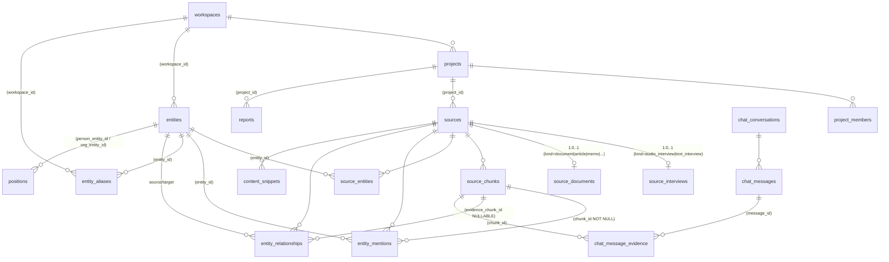

# Architecture clarification — database, retrieval, sources & tenancy

> **Purpose.** This is the bridge document between the
> [database/retrieval audit](./database-retrieval-architecture-audit.md)
> and the eventual implementation plan. The audit catalogued findings;
> the product answers committed direction. This file converts both into
> a single technical framing so any subsequent refactor plan is built
> on shared assumptions.
>
> **Not in scope here:** code changes, migrations, ticket-level scope,
> per-file diffs.

---

## 1. What we are actually solving

The audit lists ~60 issues. Re-read against the product answers,
those collapse into **six structural problems**, each driven by a
product-level requirement, not by individual bugs.

| # | Problem | Product requirement that exposes it |
|---|---|---|
| **P1** | The chat cannot reliably answer "what do we know about X / which sources involve X / what has been said about X" because the only edge between an entity and a source is `entity_mentions` — a chunk-level table — and there is **no source-level association table**. So an entity that is the interviewee, the author, the primary subject, the linked CRM account, or the source owner has no structural home unless its name happens to be matched in chunk text. `entity_mentions` is also **deliberately sparse by design** (post-April-2026 persistence gate) and **historically dirty** (pre-gate NULL chunks). | "If a person is the interviewee, the system must be able to find that person's interviews — even when their name never appears literally in the transcript." Generalises to authors of documents, accounts on CRM records, and any future source kind. |
| **P2** | Multi-tenancy is **policy-only**. Chat / dashboard / Network Explorer / reports all read via the admin client and apply `project_id` in JavaScript. `entities` and `entity_aliases` have no project- or workspace-scoped RLS at all. There is no entity above `projects` to express "customer / workspace / company." | "One customer must never access another customer's data. Cross-project intelligence works **inside** the company; cross-company never." |
| **P3** | The schema is **interview-shaped** for every source. PDFs, pasted text and (in future) audio recordings, magazine articles, emails, meeting transcripts, notes and CRM records all collapse into `interviews` rows with `interviewee_*`, `audio_*`, `speaker_map`, etc. Citations claim "Speaker / Time" for documents that have neither. There is no path to add new source types without making this worse. | "The platform must scale to many source types, not only audio interviews." |
| **P4** | Derived intelligence (summaries, sentiments, topics, risks, opportunities, content snippets, reports, **chat answers**) carries **no chunk-level provenance**. Even `entity_relationships` only carry `interview_id` + a free-text LLM quote, not a chunk pointer. Chat citations exist only at request time and disappear when the response is persisted. | "Important answers must be source-grounded; evidence must persist." |
| **P5** | Topics, sectors, risks and opportunities are stored as `TEXT[]` on the interview row. There is no entity, no mention edge, no relationship edge for them. Cross-source aggregation ("all sources mentioning lithium", "interviews flagging infrastructure risk") relies on full-text search inside JSONB and on vector recall — neither is reliable for thematic recall. | "Show me all sources mentioning lithium / what people are saying about energy transition / which interviews discuss infrastructure risk — must work." |
| **P6** | The reviewed-reprocess pipeline runs **compute → clear → insert** without a transaction. A failure after `clear_interview_derived_data()` leaves the interview with `status = FAILED`, `transcript_review_status = ready`, and no chunks/mentions/relationships at all. Anchor-only entities are also created in `entities` and then dropped by the persistence gate, accumulating orphan rows. | "Old derived data must not be wiped before the new one is ready. Avoid partial failed states." |

A seventh, smaller problem (P7) is **schema/doc drift** —
`docs/infrastructure/database-schema.md` claims "12 tables, 15
migrations" while we have 17+ tables and 24 migrations. This is not a
runtime risk but it is a substantial reasoning risk for any future
agent or engineer.

### Urgency split

- **Urgent (block product narrative + onboarding next customer):**
  P1, P2, P5, P6.
- **Urgent because it shapes everything else (do early or all later
  work pays the cost):** P3 (the source-first move) — even if the full
  refactor lands in stages, every new feature should already be written
  *as if* sources existed.
- **Urgent for trust but lower risk:** P4 (chat evidence
  persistence) — additive, low-risk, high product value.
- **Important, not urgent:** P7 (doc/types refresh).

Everything else from the audit (per-utterance table, extraction-run
versioning, semantic chat-history compression, multi-result
disambiguation, search-service abstraction, PDF byte storage,
off-record visibility) is real but **deferrable**.

---

## 2. Direction in one line

> **Source-first, association-aware, tenant-isolated,
> evidence-grounded.**

Each word maps to one of the urgent problems:

| Direction | Solves |
|---|---|
| **Source-first** | P3 — interviews are one source kind among many |
| **Association-aware** | P1 — entity↔source association is a first-class fact, separate from "the entity's name appeared in a chunk." Generalises beyond interview vocabulary (interviewee/interviewer) to author, primary subject, account, source owner, attendee, etc. |
| **Tenant-isolated** | P2 — workspace/company is the real boundary, projects sit inside it |
| **Evidence-grounded** | P4 — every persisted derived layer points back to chunks |

Topics-as-entities (P5) and transactional reprocess (P6) sit on top of
this base.

> **Vocabulary note.** This document uses **association** (not
> "participant") for the source-level entity↔source link. "Participant"
> is interview-/event-flavored and does not fit a PDF's author, a CRM
> record's account, or a report's subject organization. The structural
> table is `source_entities`, with an explicit `link_type` column whose
> values include `interviewee`, `interviewer`, `author`, `participant`,
> `primary_subject`, `subject_organization`, `account`, `source_owner`,
> `mentioned_at_source_level`, `related_entity`, … The exact enum is a
> migration-plan decision; the **structural commitment** is a single
> typed association table per source.

The audit's recommendation list (§14) is consistent with this; this
clarification just **commits to the direction explicitly** so the
implementation plan can sequence work without re-litigating it.

---

## 3. Target model (conceptual)

The diagram below is the **target shape**, not the current one. Names
are illustrative; exact column names will be decided in the migration
plan.

### 3.1 Core tables (target)

| Table | Role | Notes vs today |
|---|---|---|
| `workspaces` | Top-level tenant. One per customer/company. | **New.** Today implicit (single team). Required for P2. |
| `projects` | Project inside a workspace. | Adds `workspace_id NOT NULL`. Membership stays project-level. |
| `project_members` / `workspace_members` | Access control. | Workspace-level membership is the new outer ring; project-level membership is the inner ring. |
| `entities` | Canonical entity. | Re-scoped from project to **workspace** (or kept project + global, with workspace-aware uniqueness). Drops `UNIQUE(name, type)` from `00001`. RLS by workspace membership. |
| `entity_aliases` | Alias → entity. | Same scope rule as entities. RLS by workspace. |
| `sources` | **Canonical source row.** All derived intel hangs off `source_id`. | **New / renamed from `interviews`.** Holds `workspace_id`, `project_id`, `kind`, `title`, `language`, `conducted_at?`, `published_at?`, `pipeline status`, `last_intel_source`, `visibility?` (deferred enum). |
| `source_interviews` | Audio / text interview-specific extension. | Holds `audio_url`, `assemblyai_id`, `audio_duration`, `speaker_map`, `transcript_full`, `transcript_display`, `source_utterances`, `reviewed_utterances`, `transcript_review_status`. **`source_id` is PK + FK.** |
| `source_documents` | PDF / article / memo / report extension. | Holds `original_file_path?`, `page_count?`, `author?`, `publisher?`, `source_url?`, parsing metadata. **`source_id` is PK + FK.** |
| (future) `source_emails`, `source_meeting_transcripts`, `source_notes`, `source_crm_records`, … | One extension table per kind, all keyed by `source_id`. | Deferred — not implemented now, but the base model accommodates them. |
| `source_chunks` | Chunked content + embedding. | **Rename from `interview_chunks`.** Adds optional location pointers that match the source kind: `start_time`/`end_time` (audio), `page`/`paragraph_index` (document), `utterance_index` (text). |
| `source_entities` | **Source-level entity↔source association.** Any entity (person, org, topic, account, …) that is associated with a source, *whether or not* it appears literally in a chunk. | **New.** `(source_id, entity_id, link_type enum, is_primary bool, speaker_label?, off_record? — deferred, source_metadata? jsonb, created_at)`. Replaces the two interview-only anchor columns (`interviewee_entity_id`, `interviewee_org_entity_id`) and generalises them. Multi-interviewee, panels, authors, primary-subject orgs, CRM-account links and source-owner attribution all become representable. See §3.4 for `link_type` values and the precise distinction from `entity_mentions`. |
| `entity_mentions` | Chunk-level **textual** evidence — "the entity's name (or an alias) literally appears in this chunk." | Stays. `source_id` replaces `interview_id`. `chunk_id NOT NULL`. New nullable columns `match_method`, `match_confidence`, `text_span`. **No longer the proof of association — only the proof of textual occurrence.** Source-level association lives in `source_entities`; mentions live here. |
| `entity_relationships` | Typed edges. | `source_id` replaces `interview_id`. Adds `evidence_chunk_id` (nullable FK to `source_chunks`). Editorial state stays. |
| `positions` | Person ↔ org titles. | **Renamed/extended `validated_positions`.** Adds `state enum (extracted, suggested, validated, rejected)`. Validated remains the trust source; suggestions are visibly distinct. |
| `chat_conversations` / `chat_messages` | Chat memory. | Unchanged shape. |
| `chat_message_evidence` | **Persisted citation pointers.** | **New.** `(message_id, chunk_id, similarity, used_in_text)`. Closes P4 for chat. |
| `content_snippets`, `reports` | Generated outputs. | Long-term: each gets a *_evidence join (`snippet_evidence`, `report_evidence`) pointing to chunks. Short-term: at least migrate to `source_id`. |
| (future) `extraction_runs` | Run + model + prompt version, joined to mentions/relationships/chunks. | Deferred. |

### 3.2 How the parts relate

- **A "source" is the unit of provenance.** Every chunk, mention,
  relationship, snippet, report, chat citation eventually traces back
  to a `source_id`. Today this is true *de facto* (everything points
  to `interview_id`); the refactor makes it true *by name*.
- **An "interview" is a source kind, not a synonym for source.** Audio
  interview rows live in `source_interviews`; document rows live in
  `source_documents`. `sources` is the only place where "what is this
  thing and who can see it" is decided. Pipelines and APIs that do not
  care about audio specifics (chunk reads, vector search, dashboards,
  chat tools) read `sources` only.
- **Chunks are sourced, not "interviewed."** A chunk knows its source
  and its location-within-source. The location format depends on
  `sources.kind` and is interpreted at render time, so document chunks
  stop pretending they have a `0:00` timestamp.
- **Source-level associations are structural, not textual.** An entity
  is associated with a source for many possible reasons — being the
  interviewee, the interviewer, the author, the primary subject, the
  organization being reported on, the CRM account, the record's
  owner, an attendee, an off-record source, etc. The system records
  these facts directly via `source_entities`, **regardless of whether
  the entity's name ever appears in any chunk**. The association type
  is carried explicitly in `source_entities.link_type`, so retrieval
  can ask "who was the *interviewee*" or "who is the *primary
  subject*" without inspecting role-specific columns. This keeps the
  model uniform across interviews, documents, CRM records, emails and
  any future source kind.
- **Mentions are evidence of *textual occurrence*, not evidence of
  *association*.** This separation removes the contradiction that the
  audit calls out (gate drops anchor-only mentions, but anchor =
  participant; the chat then says "no interviews mention this
  person"). After the refactor, the chat answers "which sources
  involve X" by joining `source_entities` ∪ `entity_mentions` ∪
  `entity_relationships` ∪ `positions` — never just one of them. See
  §3.4 for the explicit boundary.
- **Relationships carry one chunk-level pointer.** `evidence_chunk_id`
  is nullable but populated whenever the LLM's quote can be matched to
  a chunk during ingestion. This keeps the editorial layer working
  exactly as it is today, without breaking pre-existing rows.
- **Positions are graded.** The pipeline can write `state =
  'suggested'` rows automatically; humans promote to `'validated'`.
  Retrieval prefers validated, but suggested is visible and
  distinguishable. This satisfies the product answer for #6 without
  freezing the validation feedback loop.
- **Topics, sectors, risks and opportunities are entities** of new
  types (`SECTOR`, `TOPIC`, `COMMODITY`, `RISK`, `OPPORTUNITY`). They
  use the same `entity_mentions` and `entity_relationships`
  primitives. This avoids a parallel tagging system and reuses every
  existing tool (`lookupEntity`, `lookupMentions`, Network Explorer,
  reports). It also makes "infrastructure risk → governs → Ministry
  of Finance" a real, queryable graph edge rather than a string.
- **Cross-source aggregation lives in views/RPCs**, not in the schema.
  We do not add canonical "merged" relationship rows; the graph view
  sums per-source rows on read (today's behaviour). The audit's #7.8
  point about temporal validity is solved by `positions`, not by
  changing the relationship model.

### 3.3 Tenancy model (concrete)

Three concentric rings:

1. **Workspace** — customer/company isolation. Every row that
   represents customer data carries `workspace_id` (directly or
   through a transitive FK that is enforceable in RLS). RLS denies
   any cross-workspace read.
2. **Project** — sub-tenant inside a workspace. `project_members`
   continues to gate access. `entities` and `entity_aliases` are
   workspace-scoped (not project-scoped) so cross-project intelligence
   can work inside the workspace; mentions/relationships remain
   project-traceable through `sources.project_id`.
3. **Global** — only true platform-wide rows (admin platform roles,
   shared lookup tables) live without `workspace_id`. The current
   "global entity" notion (NULL `project_id`) becomes either
   workspace-global or platform-global on a case-by-case basis. The
   default for entity rows is **workspace-scoped**, not global.

RLS hardening becomes possible once `workspace_id` is on the right
tables. The admin client pattern stays for mutations (sacred per
`HANDOVER.md`), but reads can stop relying on JS-side filtering for
tenancy.

### 3.4 Source-level association vs chunk-level mention

This is the **single most important distinction** in the target
model, and the one most likely to be misread during implementation.
Stating it explicitly:

| Concern | `source_entities` | `entity_mentions` |
|---|---|---|
| **What it records** | "Entity X is associated with source Y at the source level." | "Entity X's name (or a known alias) literally appears in chunk C of source Y." |
| **Granularity** | Source. One row per (entity, source, link_type). | Chunk. One row per (entity, chunk). |
| **Requires textual evidence?** | **No.** A person can be the interviewee even if their name never appears in any chunk. A CRM account can be linked even if no chunk text exists at all. | **Yes.** A row only exists when the canonical name or an alias was matched inside chunk text. |
| **Carries `chunk_id`?** | No. | **NOT NULL** (post-gate). |
| **Carries an association type?** | Yes — `link_type` enum (e.g. `interviewee`, `author`, `primary_subject`, `account`, `mentioned_at_source_level`, `source_owner`, …). | No "association type" — match precision lives in `match_method` / `match_confidence` instead. |
| **Survives the persistence gate?** | Always — the gate is a chunk-level concern. | Only for `match_method ∈ {exact, alias}`. |
| **Populated by** | Upload anchors, extraction (with conservative confidence), human review, future CRM/import flows. | Grounded matching against chunk text only. |
| **Used for** | "Which sources involve X?" • "Who was interviewed in source S?" • "Who authored this report?" • "Which sources is this account linked to?" | "Where in the text does X appear?" • Citation/quote retrieval • Vector-search complement. |
| **Does the chat read it?** | **Yes**, primary read for entity↔source questions. | **Yes**, for textual evidence and quote selection. |
| **Cardinality per (entity, source)** | Multiple rows allowed (e.g. interviewee **and** primary_subject). | Multiple rows allowed (one per chunk hit), constrained by `UNIQUE(entity_id, source_id, chunk_id)`. |

**Examples (illustrative, not implementation):**

- *Audio interview with the Minister of Energy.*
  - `source_entities`: `(entity=Minister X, link_type=interviewee, is_primary=true)`,
    `(entity=Ministry of Energy, link_type=interviewee_org)`.
  - `entity_mentions`: zero or many rows depending on whether
    "Minister X" or "Ministry of Energy" actually appears in chunk
    text. Independent of the rows above.

- *PDF policy memo about lithium reserves, no named author.*
  - `source_entities`: `(entity=Lithium, link_type=primary_subject)`,
    `(entity=Government of Country Z, link_type=subject_organization)`.
  - `entity_mentions`: rows for every chunk where "lithium" or
    "Country Z" textually appears.

- *CRM record: deal with Account A, owned by SalesRep B.*
  - `source_entities`: `(entity=Account A, link_type=account)`,
    `(entity=SalesRep B, link_type=source_owner)`.
  - `entity_mentions`: probably empty (the CRM record may have no
    chunked free text at all, or only minimal description chunks).

**Why the duplication is intentional.** The two tables answer two
different questions and must not be conflated. Today's bug exists
*because* they are conflated — `entity_mentions` is asked to do both
jobs and fails one of them. The refactor splits the responsibility
cleanly. Surfaces that need both (chat, Network Explorer, reports)
read from the unified entity-centered RPC (§4) which UNIONs the two
tables behind one interface.

---

## 4. Retrieval paths (conceptual)

The chat orchestrator should compose retrieval from a small, named
set of paths. Every product question maps to one or more of them. The
chat stops being "vector search + four entity tools the model may or
may not call" and becomes "a planner that picks paths, then runs
them."

| Path | What it answers | Reads | Composition |
|---|---|---|---|
| **Entity-centered** | "What do we know about X?", "Which sources involve X?", "What has been said about X?", "Who interviewed X / who interviewed for source S?" | `source_entities` (with `link_type`) ∪ `entity_mentions` ∪ `entity_relationships` ∪ `positions`, plus vector search restricted to chunks tagged with X. | Single SQL/RPC `entity_intel(entity_id, scope)` returning sources + association types + chunk evidence + relationships + positions. Replaces today's lone `lookupMentions`. |
| **Source-centered** | "Summarize source S", "What did source S say about Z?" | `source_chunks` filtered by `source_id`, plus `entity_mentions` / `entity_relationships` for that source. | Vector search scoped to one source + a per-source brief. |
| **Topic / theme-centered** | "What are people saying about energy transition?", "Show me all sources mentioning lithium", "Which interviews flag infrastructure risk?" | Topic entity → entity-centered path, restricted to `mention` evidence (topics rarely appear as participants). Combined with vector search using topic vocabulary to catch indirect discussion. | Topics as entities is the unlock. |
| **Project-centered** | "Recurring themes across this project", "Who's been mentioned most this quarter?" | Aggregations over `entity_mentions` / `entity_relationships` filtered by `project_id`. | The project brief today is a precursor; this path makes it a real query. |
| **Workspace-centered** | "Across our portfolio, what's emerging?", "Which sources touch both lithium and Ghana?" | Same as project-centered but scoped to `workspace_id`. **Never** crosses workspaces. | Required for cross-project intelligence within a customer. |
| **Time-aware overlay** | "What's changed about T over time?", "What did we know about X before this meeting?" | Re-rank by `sources.conducted_at` / `published_at`. | Already partially implemented (temporal classifier + chunk rerank). Generalises to source-time, not interview-time. |
| **Open / fallback** | "Free chit-chat", "Drafting help", "Web search needed" | Vector search + Tavily. | Last resort; the orchestrator should mark when this is the only path used so we can detect under-grounding. |

**Two important constraints on retrieval design:**

- The orchestrator should **decide the path**, not the model. The
  model can still call entity tools, but the system prompt is built
  from the path that the orchestrator already executed. This makes
  grounding explainable and replayable.
- Every retrieval path returns **chunk-level evidence** alongside its
  results, and the chat persists the chunks it actually used (P4).
  Citations stop being request-time-only.

---

## 5. Now, soon, defer

### Now (next refactor wave — required to unblock product narrative + onboarding)

| Item | Why now | Touches |
|---|---|---|
| **N1. Source rename + extension split.** Introduce `sources` as the canonical row (initially as a view/alias over `interviews`, then as a real table with `source_interviews` / `source_documents` extensions). Rename `interview_chunks` → `source_chunks` with a backwards-compatible view. | Every later step depends on this. Doing it first prevents deepening the interview-shaped debt for participants, evidence, and topics. | Migrations, all read paths, all type definitions, schema doc. |
| **N2. `source_entities` table** (source-level entity↔source association with explicit `link_type`). Populate it from existing anchors (`interviewee_entity_id` → `link_type='interviewee'`, `interviewee_org_entity_id` → `link_type='interviewee_org'`) for all current rows; populate it from extraction going forward (e.g. extracted authors → `link_type='author'`, primary-subject orgs → `link_type='subject_organization'`). Stop creating orphan entity rows for anchors that will not survive grounding. | This **is** the structural fix to P1 and the source-first generalisation that lets future source kinds (CRM records, emails, reports) participate in retrieval without inheriting interview vocabulary. Makes "what entities is this source about / by / linked to" a first-class fact. | Migrations, ingestion pipeline, anchor handling, Interview Detail page (to show sourced entities by `link_type`), Network Explorer. |
| **N3. Unified entity-centered RPC + `lookupMentions` rewrite.** UNION `source_entities` + `entity_mentions` + `entity_relationships` + `positions` behind one read. Chat tool reads from this RPC instead of `entity_mentions` alone. | Resolves the visible symptom and the broader "entity exists, graph is empty" pattern. The RPC is small, pure-read, easy to test. | One new SQL function, one chat tool file, one prompt copy update. |
| **N4. Workspace tenant boundary + RLS on entities/aliases.** Add `workspaces`, `workspace_id` to `projects`, `entities`, `entity_aliases` (and transitively to sources/chunks/mentions/relationships via existing FKs). Enable RLS that denies cross-workspace reads. | P2. Required before another customer is onboarded. | New migration, RLS helpers, dashboard / Network Explorer / chat reads. |
| **N5. Drop `entities.UNIQUE(name, type)` and replace with workspace-scoped uniqueness.** | Removes the silent cross-tenant entity merge in `match.ts`. | Single migration + delete the `23505` recovery path. |
| **N6. Reviewed-reprocess transactional swap.** Compute new derived layer in memory (or staging), then a single SECURITY DEFINER call replaces the old derived layer atomically. | P6. Closes the partial-failure window. | One SQL function, two pipeline call sites. |
| **N7. `chat_message_evidence` table.** Persist `(message_id, chunk_id, similarity, used_in_text)` after every assistant turn. | P4 for chat. Additive, low-risk, very high product value. | Single migration + one persistence call in the chat route. |
| **N8. Topics / sectors / risks / opportunities as entities.** Extend `entity_type` enum, write extraction output to `entity_mentions` and `entity_relationships` instead of `interviews.topics[]`. Keep the column for one release as a denormalized fallback. | P5. Single coherent retrieval primitive instead of three. | Extraction prompt + persistence; no new tables. |
| **N9. Schema doc + types refresh.** Bring `docs/infrastructure/database-schema.md` and `src/types/database.ts` in sync with the actual DB and the new tables. | P7. Cheap, prevents future agent confusion. | Doc-only PR + generated/edited types. |

### Soon (next slice after the wave above)

| Item | Why next, not now |
|---|---|
| **S1. `evidence_chunk_id` on `entity_relationships`.** Backfill via best-match against `evidence_text`. | Improves traceability but the chat still works without it once `source_entities`-based retrieval is in place. |
| **S2. `state` enum on `positions` + pipeline writes `suggested` rows.** | Useful but the validated table works today; can ship right after the entity refactor settles. |
| **S3. Document-side metadata (page count, author, URL, file path).** | Becomes meaningful once `source_documents` exists; not urgent until we ingest more PDFs. |
| **S4. Snippet/report evidence joins (`snippet_evidence`, `report_evidence`).** | Same shape as `chat_message_evidence`; ship after that pattern stabilises. |
| **S5. Entity-aware `hybrid_search`** (`filter_entity_ids`, optionally `filter_speaker_entity_id`). | Vector + entity becomes much more powerful, but only after `source_entities` and topics-as-entities are landed. |
| **S6. Chunk metadata cleanup.** Drop the `metadata.entities[]` string array in favour of a `chunk_entities` join (or the new entity-aware filters); remove the unused GIN index. | Currently silent, costs little; can wait. |
| **S7. Aliases gain a source/origin link** (`source_id?`, `extraction_run_id?`). | Improves alias auditability; not blocking. |
| **S8. Network Explorer / dashboards rewritten on top of new RPCs.** | Pure read-side cleanup; the data shape is what matters now. |

### Defer (real, not now)

- **D1. Per-utterance table** (promote `source_utterances` from JSONB
  to a real table). Useful long-term for speaker analytics; not
  urgent.
- **D2. Extraction run versioning** (`extraction_runs` joined to
  mentions / relationships / chunks).
- **D3. Off-record / confidential / visibility model.** Product
  answers say not near-term. The `sources.visibility` column is
  nullable now and can be populated later.
- **D4. Original PDF byte storage** for re-extraction.
- **D5. Multi-result `lookupEntity`** (disambiguation UX).
- **D6. Long-conversation semantic compression.**
- **D7. Search-service abstraction** (a single `searchSources` API).
  Worth doing after a couple more retrieval surfaces have shipped on
  the new model so we have evidence of the right interface.
- **D8. OCR fallback for scanned PDFs.**

---

## 6. Tradeoffs: small patch vs deeper refactor

The audit closes with two visible options. They are commonly framed
as a fork. They are not.

### Pure patch (chat tool only — audit Step B)

- **Pros.** Shippable in a single PR; fixes the exact known symptom;
  near-zero risk to current schema; no migration; no impact on
  Interview Detail / Network Explorer / reports.
- **Cons.** Does not solve the broader pattern at the data layer.
  Future surfaces (Network Explorer, reports, dashboards, exports)
  keep needing similar one-off fixes. Multi-tenancy stays
  policy-only. Topics stay unsolved. Source-shape debt grows.
  Reviewed-reprocess failure window stays open. Chat citations stay
  ephemeral.

### Deeper refactor only (sources + source_entities + workspaces + topics-as-entities + evidence)

- **Pros.** Solves the structural root causes once. All retrieval
  surfaces benefit without rewrites. Multi-tenant becomes a real
  boundary. Future source types fit cleanly. Chat citations persist.
- **Cons.** Larger scope — multi-PR, multi-week. Touches several
  pages, types, migrations. Risk of regressions if not staged
  carefully. Harder to review in one shot.

### Recommended: **layered, not forked**

Ship the chat-tool patch as **the first slice of the refactor**,
not as a substitute for it. Concretely:

1. **Slice 1 (small, low-risk).** Land N3 (the unified entity-centered
   RPC + `lookupMentions` rewrite) on top of today's schema. The RPC
   already reads `interviews.interviewee_*_entity_id` and
   `entity_relationships` and `entity_mentions` — it does **not**
   require the source/`source_entities` refactor to ship. The known
   symptom stops being visible. **No schema change required.**

2. **Slice 2 (structural fix to P1).** Land N1 + N2 + N5 + N9 — the
   `sources` rename, `source_entities` table, entity unique-key fix,
   and doc/types refresh. The RPC from Slice 1 keeps working (now it
   reads from `source_entities` with `link_type` instead of the
   legacy two-column anchor pattern) and Network Explorer / reports
   / dashboards immediately benefit because the data shape is
   correct.

3. **Slice 3 (tenancy + safety).** Land N4 (workspaces + RLS) and N6
   (reviewed-reprocess transactional swap). These are independent of
   each other and of Slices 1–2; they can land in parallel.

4. **Slice 4 (intelligence breadth).** Land N7 (chat evidence) and
   N8 (topics as entities). Small, additive, high product value.

5. **Soon items (S1–S8).** Sequence as the team has bandwidth.

This sequence gives the team an early, **visible** win (Slice 1 is the
patch the user wanted), avoids "patch then forget," and keeps each
slice independently shippable and reviewable. Crucially, no slice
forces the next one — if priorities change after Slice 2, Slices 3
and 4 can land in any order.

The only thing this clarification asks the team to commit to **now**
is the **direction**: source-first, association-aware, tenant-isolated,
evidence-grounded. With that direction agreed, every slice (and any
future emergency patch) lands in the right place by default.

---

## 7. What this clarification deliberately does **not** decide

The implementation plan will need to make these choices, but they are
not architectural in the structural sense and they should not block
agreement on §1–§6 above:

1. **Whether to rename `interviews` → `sources` in the same migration
   or introduce `sources` as a view first and rename later.** Both
   are valid; tradeoff is migration risk vs cleanliness. Either is
   compatible with this direction.
2. **Whether `entities` becomes workspace-scoped or stays
   project-scoped with workspace-level visibility.** Both can satisfy
   P2; the trigram lookup performance of the two options should be
   measured before committing.
3. **Whether `entity_relationships` keeps a per-source row plus a
   read-time aggregator, or gains a canonical aggregated row.** Today
   it is the former; this clarification keeps the former unless
   measurement says otherwise.
4. **Where the retrieval orchestrator lives** (a separate service
   layer in `src/lib/chat/` vs inlined in `route.ts`). Implementation
   detail; does not change the path taxonomy in §4.
5. **Exact column names and enum values** for `sources.kind`,
   `source_entities.link_type`, `positions.state`, etc. Will be fixed
   in the migration plan. For `source_entities.link_type` the
   working set is `interviewee`, `interviewer`, `translator`,
   `participant`, `author`, `primary_subject`,
   `subject_organization`, `account`, `source_owner`,
   `mentioned_at_source_level`, `related_entity` — additions and
   renames are expected.
6. **Migration ordering for legacy `entity_mentions.chunk_id IS NULL`
   rows.** They can be re-grounded opportunistically (current
   behaviour) or purged in a one-shot maintenance migration; not
   architectural.
7. **Whether the `interview_*` types in TypeScript are kept as
   aliases for one release or removed in the same change.** Backwards
   compatibility vs single-cutover; either is fine.

---

## 8. Outcome

Once §1–§6 are agreed, the next deliverable is an **implementation
plan** that:

- Maps each "Now" item to a feature spec under
  `docs/features/to-do/` (per `AGENTS.md` lifecycle).
- Sequences them into the four slices above, each with its own
  feature spec, migration plan, test plan, and doc updates.
- Identifies risk to sacred patterns (admin client, `token_hash`
  auth, SECURITY DEFINER RLS helpers) — none of the items above
  break those, but the plan should confirm that explicitly.
- Calls out which pages will visibly change behaviour vs which are
  pure data-shape changes (this clarification expects the latter for
  most surfaces).

The implementation plan is **not** part of this document. This
document only commits the team to the direction and the splits.
