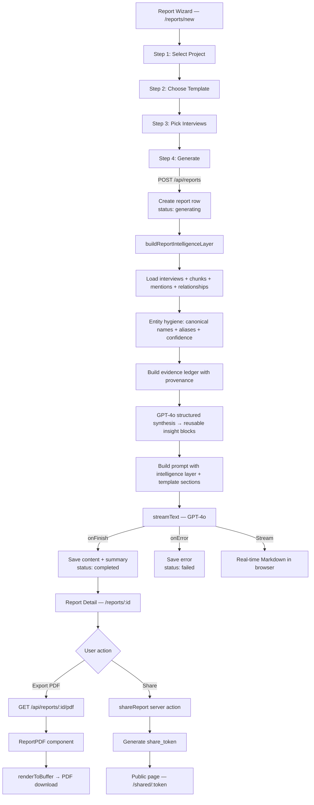

# Report Generation & PDF Export

> GPT-4o streaming reports with professional PDF export and password-protected sharing

This document details Sovereign's report generation system: a 4-step wizard that feeds interview intelligence to GPT-4o, streams Markdown output in real-time, exports to PDF via `@react-pdf/renderer`, and supports public sharing with optional password protection.

---

## Architecture Overview

---

## Report Templates

**File**: `src/lib/constants.ts` (lines 221–284)

| Template | Key | Sections |
|----------|-----|----------|
| Country Risk Assessment | `country_risk` | Executive Summary, Political Risk, Economic Risk, Operational Risk, Key Actors, Outlook |
| Sector Analysis | `sector_analysis` | Market Overview, Key Players, Trends, Competitive Landscape, Opportunities |
| Entity Profile | `entity_profile` | Profile Overview, Relationships, Sentiment, Quotes, Risk Flags |
| Executive Briefing | `executive_briefing` | Key Findings, Strategic Implications, Market Intelligence, Relationship Map |
| Custom Report | `custom` | Free-form with user-defined focus |

Each template defines a `label`, `description`, and `sections` array that structures the GPT-4o system prompt.

---

## Report Generation API

**File**: `src/app/api/reports/route.ts`

### POST `/api/reports`

1. **Auth**: Verifies user, checks editor/owner role on the project.
2. **Insert**: Creates a `reports` row with `status: "generating"`, template, title, and `interview_ids`.
3. **Build intelligence layer**: Calls `buildReportIntelligenceLayer()` which loads interviews, chunks, mentions, aliases, and relationships, resolves entity hygiene, builds an evidence ledger with provenance, and runs a GPT-4o structured synthesis to produce reusable insight blocks.
4. **Stream**: Calls `generateReport()` with the intelligence layer, which returns a streaming response to the client.

### Report Intelligence Layer

**File**: `src/lib/reports/intelligence-layer.ts`

The shared intelligence foundation consumed by all five report templates. Produces:

| Component | Description |
|-----------|-------------|
| **Entity hygiene registry** | Canonical names, alias rollups, hygiene confidence (`high`/`medium`/`low`), `needs_review` flags |
| **Evidence ledger** | Up to 30 provenance-traced evidence records with interview ID, speaker, timestamp, chunk excerpt |
| **Reusable insight blocks** | Typed blocks (`key_finding`, `evidence_backed_claim`, `contradiction`, `actor_relationship`, `recommendation`, `watch_item`) with confidence, support metadata, and uncertainty flags |
| **Executive brief** | What we know, why it matters, what to do, overall confidence |
| **Reporting warnings** | Data quality or coverage issues to surface in the report |

Each insight block carries:
- `supportingEvidenceIds` — references into the evidence ledger
- `support.evidenceCount`, `support.interviewIds`, `support.entityNames`
- `flaggedUncertainty` — explicit note when entity hygiene is low or evidence is thin

### AI Module

**File**: `src/lib/ai/report-generation.ts`

| Parameter | Value |
|-----------|-------|
| Model | `gpt-4o` (not mini) |
| SDK | Vercel AI SDK `streamText` |
| Target length | 1,500–3,000 words |
| Output format | Markdown |

The `buildReportPrompt()` function constructs a system prompt that includes:
- The intelligence layer's executive brief, entity hygiene registry, insight blocks, and evidence ledger
- The selected template's section structure
- Non-negotiable writing rules requiring every substantive subsection to include support metadata (confidence, evidence count, interview references, evidence excerpts)
- Instructions to surface contradictions and flag low-confidence entities as provisional
- A required `## Source Trace` section at the end listing evidence references

**Lifecycle callbacks**:
- `onFinish`: Updates the report row with `content`, `summary` (first paragraph), and `status: "completed"`.
- `onError`: Updates with `error_message` and `status: "failed"`.

---

## Report Creation Wizard (UI)

**File**: `src/app/(dashboard)/reports/new/page.tsx`

A 4-step client-side wizard:

| Step | UI | Data |
|------|------|------|
| 1 | Project dropdown | Selects project scope |
| 2 | Template cards | Picks from 5 template types |
| 3 | Interview checkboxes | Selects source interviews (multi-select) |
| 4 | Generate button + live stream | Shows GPT-4o output in real-time as Markdown |

The streaming output is displayed immediately as it arrives, giving users a live preview of the report being written.

---

## Report Detail Page

**File**: `src/app/(dashboard)/reports/[id]/page.tsx`

Displays the completed report with:
- Rendered Markdown content (via `react-markdown`)
- Source interview badges (linked to interview detail pages)
- Generation status indicator
- **Export PDF** button (for completed reports)
- **Share** button (for editors/owners)

---

## PDF Export

### PDF Document Component

**File**: `src/lib/pdf/report-pdf.tsx`

Uses `@react-pdf/renderer` v4.3.2 to generate a professional PDF:

| Section | Content |
|---------|---------|
| Header | Report title, subtitle (project name + country), template label, generation date |
| Source Interviews | Box listing all interviews used as input |
| Body | Parsed Markdown → PDF elements (headings, paragraphs, bullet lists) |
| Footer | "CONFIDENTIAL" notice + page numbers |

**Markdown parsing**: `parseMarkdownBlocks()` converts the Markdown string into PDF-renderable blocks:
- `##` → section headings (bold, larger font)
- `###` → subsection headings
- `-` → bullet list items
- Paragraphs → body text
- `stripMarkdownFormatting()` removes bold/italic markers for clean PDF text

### PDF API Endpoint

**File**: `src/app/api/reports/[id]/pdf/route.ts`

`GET /api/reports/[id]/pdf`:

1. **Auth**: Verifies user via `getUser()`.
2. **Membership**: Checks project membership.
3. **Render**: Creates a React element `createElement(ReportPDF, { ...reportData })`.
4. **Buffer**: Calls `renderToBuffer(pdfElement)` from `@react-pdf/renderer`.
5. **Response**: Returns with `Content-Type: application/pdf` and `Content-Disposition: attachment; filename="{title}.pdf"`.

---

## Report Sharing

### Share/Unshare Actions

**File**: `src/app/(dashboard)/reports/[id]/actions.ts`

| Action | Behavior |
|--------|----------|
| `shareReport(reportId, password?)` | Generates a random base64url `share_token`, optionally hashes `password` with SHA-256, updates the report row |
| `unshareReport(reportId)` | Sets `share_token` and `share_password` to NULL, revoking access |

Both actions require editor or owner role.

### Share UI

**File**: `src/components/reports/share-report-button.tsx`

A dialog component on the report detail page:
- Displays the shareable link (`/shared/{token}`)
- Copy-to-clipboard button
- Optional password input
- Revoke access button

### Public Shared Report

**File**: `src/app/shared/[token]/page.tsx`

An unauthenticated page that:
1. Fetches the report via `GET /api/shared/[token]`.
2. If password-protected, shows a password prompt.
3. On success, renders the full Markdown report with Sovereign branding.

**API**: `src/app/api/shared/[token]/route.ts`
- Validates the token against the `reports.share_token` column.
- If `share_password` is set, compares the provided password's SHA-256 hash.
- Returns the report JSON on success.

**Middleware**: `/shared` and `/api/shared` paths are excluded from the auth redirect in `src/middleware.ts`.

### Schema

**File**: `supabase/migrations/00007_report_sharing.sql`

| Column | Type | Notes |
|--------|------|-------|
| `reports.share_token` | `TEXT` | UNIQUE, nullable, random base64url |
| `reports.share_password` | `TEXT` | Nullable, SHA-256 hash |
| `idx_reports_share_token` | Partial index | Fast lookups on non-null tokens |

---

## Reports List Page

**File**: `src/app/(dashboard)/reports/page.tsx`

Displays all reports with:
- Template labels and status badges (`generating`, `completed`, `failed`)
- Role-gated "Generate Report" button (editors/owners only)
- Links to report detail pages

---

## File Reference

| Responsibility | File Path |
|----------------|-----------|
| Report intelligence layer | `src/lib/reports/intelligence-layer.ts` |
| Report generation AI | `src/lib/ai/report-generation.ts` |
| Report templates/constants | `src/lib/constants.ts` |
| Reports API (create + stream) | `src/app/api/reports/route.ts` |
| PDF API endpoint | `src/app/api/reports/[id]/pdf/route.ts` |
| PDF document component | `src/lib/pdf/report-pdf.tsx` |
| Report creation wizard | `src/app/(dashboard)/reports/new/page.tsx` |
| Report detail page | `src/app/(dashboard)/reports/[id]/page.tsx` |
| Reports list page | `src/app/(dashboard)/reports/page.tsx` |
| Share/unshare actions | `src/app/(dashboard)/reports/[id]/actions.ts` |
| Share button component | `src/components/reports/share-report-button.tsx` |
| Public shared report page | `src/app/shared/[token]/page.tsx` |
| Public shared report API | `src/app/api/shared/[token]/route.ts` |
| Middleware (auth bypass) | `src/middleware.ts` |
| Sharing schema | `supabase/migrations/00007_report_sharing.sql` |
| Reports schema | `supabase/migrations/00006_reports.sql` |
