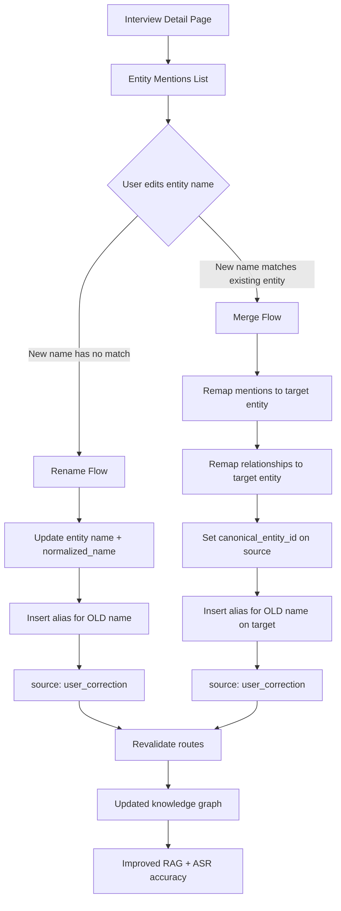
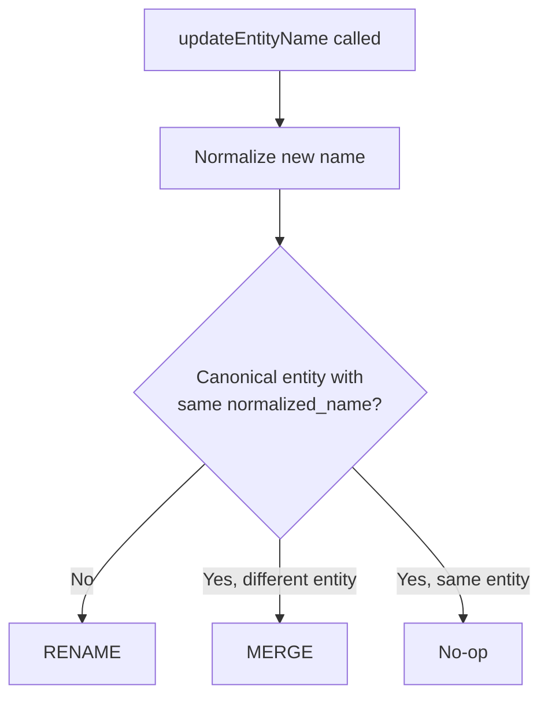

# Human-in-the-Loop: Entity Editor

> Rename, merge, and teach the system — every correction improves future accuracy

This document details Sovereign's Entity Editor, the human-in-the-loop system that allows users to correct entity names extracted by the AI pipeline. Corrections feed back into the knowledge graph as aliases, improving both future entity matching and ASR word boost accuracy.

---

## Architecture Overview



---

## UI Component

### Entity Mentions List

**File**: `src/components/interviews/entity-mentions-list.tsx`

Located on the interview detail page (`/interviews/[id]`) inside the "Entities Mentioned" card. Displays all entities extracted from the interview with type icons.

**Interaction flow**:
1. User clicks the pencil icon next to an entity name.
2. An inline text input appears, pre-filled with the current name.
3. User edits the name and clicks the checkmark (save) or X (cancel).
4. On save, the `updateEntityName` server action is called.
5. A toast notification confirms: "Entity renamed and correction learned" or "Entity merged and correction learned".

**Permissions**: Only users with `editor` or `owner` role on the project see the edit controls (`canEdit` prop).

---

## Server Action: `updateEntityName`

**File**: `src/app/actions/entities.ts`

### Signature

```typescript
updateEntityName(entityId: string, newNameRaw: string, projectId: string)
```

### Authorization

Calls `requireProjectEditor(projectId)` — rejects if the user is not an editor or owner.

### Decision Logic

The action normalizes the new name via `normalizeEntityName()` and then checks if a canonical entity already exists with that normalized name:



### Rename Flow (No Match Found)

When no existing entity matches the new name:

1. **Update entity**: Set `name` and `normalized_name` to the new values.
2. **Create alias**: Insert into `entity_aliases` with:
   - `entity_id`: the entity being renamed
   - `alias`: the old name
   - `alias_normalized`: normalized old name
   - `source`: `"user_correction"`
   - `project_id`: from the request

This teaches the system that the old name is an alias for this entity, so future pipeline runs will auto-resolve it.

### Merge Flow (Match Found)

When an existing entity matches the new name:

1. **Remap mentions**: Update all `entity_mentions` rows where `entity_id` = source entity → set to target entity.
2. **Remap relationships**: Update `entity_relationships` where source entity is either `source_entity_id` or `target_entity_id` → point to target entity.
3. **Set canonical**: Update the source entity's `canonical_entity_id` to point to the target entity.
4. **Create alias**: Insert into `entity_aliases` on the target entity with the source entity's old name, `source: "user_correction"`.

After merge, the source entity still exists in the database but is effectively deprecated — `canonical_entity_id` marks it as a variant. The `resolveCanonicalEntityId()` function in `src/lib/entities/match.ts` follows this chain during future entity resolution.

### Revalidation

After either flow, the action calls `revalidatePath` on:
- `/interviews` — refreshes interview list
- `/network` — refreshes the Network Explorer
- `/projects/[id]` — refreshes the project detail page

---

## Downstream Effects

### 1. Entity Resolution (Pipeline)

**File**: `src/lib/entities/match.ts` → `matchOrCreateEntity()`

When a future interview is processed:
- The alias created by the user correction is now in `entity_aliases`.
- The 5-tier matching algorithm checks aliases at steps 2 and 4 (project-scoped and global).
- This means the corrected name will be automatically resolved to the canonical entity.

### 2. ASR Word Boost

**File**: `src/app/api/interviews/route.ts` → `getWordBoostAliases()`

When a new interview is submitted for transcription:
- The route queries `entity_aliases` for the project and globally.
- User-corrected aliases are included in the `word_boost` array sent to AssemblyAI.
- This improves ASR accuracy for names that were previously mis-transcribed.

### 3. RAG Entity Lookup

**File**: `src/lib/ai/entity-lookup.ts` → `findEntity()`

When the chat system looks up an entity:
- Exact alias match is checked at step 3 (after direct name match).
- User corrections expand the alias pool, making entity lookup more robust.

---

## Entity Normalization

**File**: `src/lib/entities/normalize.ts`

The `normalizeEntityName(name)` function produces a canonical form for comparison:

1. Trim whitespace
2. Convert to lowercase
3. NFKD Unicode normalization
4. Strip diacritical marks (e.g., `é` → `e`)
5. Remove punctuation (`.`, `,`, `'`, `"`, etc.)
6. Collapse multiple spaces to single space

Example: `"Mr. José García-López"` → `"mr jose garcialopez"`

---

## Network Explorer (Read-Only View)

**File**: `src/components/network/network-explorer.tsx`

The Network Explorer at `/network` provides a read-only view of the entity graph:

- **Search**: Filter entities by name.
- **Type filter**: Filter by `PERSON`, `COMPANY`, `GOVERNMENT`, etc.
- **Entity list**: Browse all entities with type icons.
- **Relationship view**: Select an entity to see its outgoing and incoming relationships with confidence scores and evidence text.

The Network Explorer does not support editing — all corrections are done on the interview detail page via the Entity Mentions List.

---

## File Reference

| Responsibility | File Path |
|----------------|-----------|
| Entity Mentions List (UI) | `src/components/interviews/entity-mentions-list.tsx` |
| Entity update server action | `src/app/actions/entities.ts` |
| Entity matching (pipeline) | `src/lib/entities/match.ts` |
| Entity normalization | `src/lib/entities/normalize.ts` |
| Entity lookup (RAG tools) | `src/lib/ai/entity-lookup.ts` |
| Network Explorer (UI) | `src/components/network/network-explorer.tsx` |
| ASR word boost | `src/app/api/interviews/route.ts` |
| Entity aliases schema | `supabase/migrations/00009_entity_normalization.sql` |
