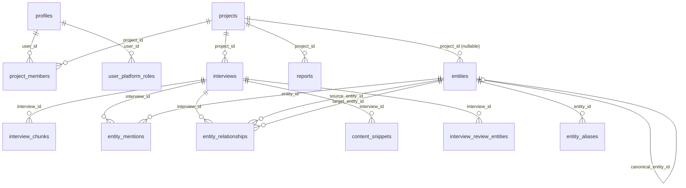
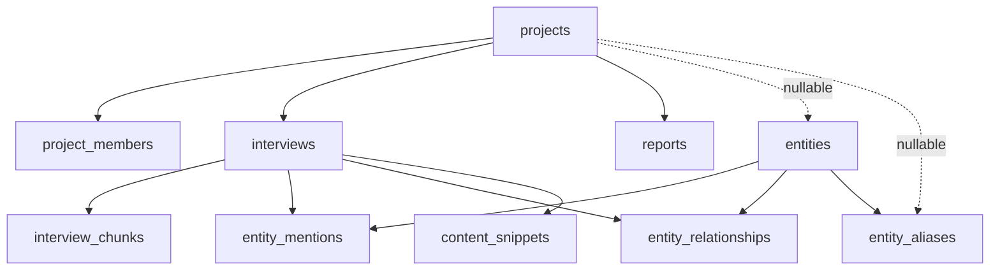
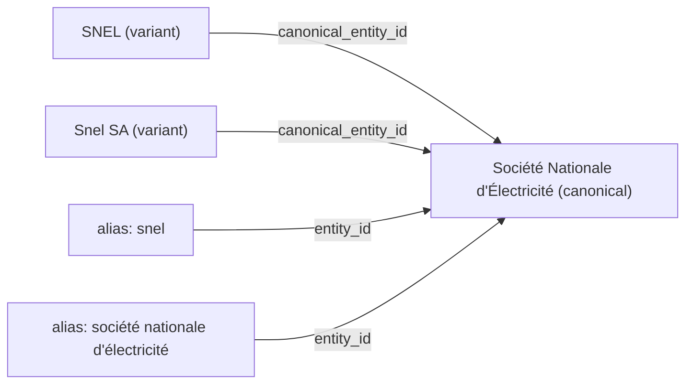

# Database Schema

> Multi-tenant PostgreSQL with pgvector, RLS, and Knowledge Graph

This document details Sovereign's database design: multi-tenant isolation via `project_id`, Row Level Security with SECURITY DEFINER helpers, and the entity/alias canonical merge system. **Table count**: 10 core tables in migrations `00001`–`00012`; **Phase 3.6** adds `interview_review_entities` and interview review columns (migration `00013_interview_transcript_review.sql`). **`user_platform_roles`** (platform-level roles, distinct from `project_members.role`) is added in `00016_platform_user_roles.sql`.

---

## Extensions

Defined in `supabase/migrations/00001_initial_schema.sql`:

| Extension | Schema | Purpose |
|-----------|--------|---------|
| `vector` | `extensions` | pgvector for 1536-dim embeddings + HNSW index |
| `uuid-ossp` | `extensions` | `uuid_generate_v4()` for primary keys |
| `pg_trgm` | `extensions` | Trigram similarity for fuzzy entity name matching |

> **Naming**: Supabase names the extension `vector`, not `pgvector`. Using `CREATE EXTENSION "pgvector"` will fail.

---

## Schema Overview



---

## Tables

### `profiles`

Extends `auth.users`. Auto-created via the `handle_new_user` trigger on `auth.users`.

| Column | Type | Notes |
|--------|------|-------|
| `id` | `UUID` | PK, references `auth.users(id)` |
| `email` | `TEXT` | |
| `full_name` | `TEXT` | Nullable |
| `avatar_url` | `TEXT` | Nullable |
| `created_at` | `TIMESTAMPTZ` | |
| `updated_at` | `TIMESTAMPTZ` | Auto-updated via trigger |

**Migration**: `00001`

### `projects`

Tenant root. All data access flows through project membership.

| Column | Type | Notes |
|--------|------|-------|
| `id` | `UUID` | PK |
| `name` | `TEXT` | NOT NULL |
| `description` | `TEXT` | |
| `country` | `TEXT` | |
| `region` | `TEXT` | |
| `created_by` | `UUID` | DEFAULT `auth.uid()` |
| `created_at` | `TIMESTAMPTZ` | |
| `updated_at` | `TIMESTAMPTZ` | |

**Migrations**: `00001`, `00003`

### `project_members`

Many-to-many join between users and projects, with role-based access.

| Column | Type | Notes |
|--------|------|-------|
| `id` | `UUID` | PK |
| `project_id` | `UUID` | FK → `projects`, NOT NULL |
| `user_id` | `UUID` | FK → `profiles`, nullable (NULL while invite pending) |
| `role` | `user_role` | `owner`, `editor`, `viewer` |
| `invited_email` | `TEXT` | Nullable, for pending invites |
| `created_at` | `TIMESTAMPTZ` | |

**Constraint**: `check_member_or_invite` — at least one of `user_id` or `invited_email` must be set.

**Trigger**: `claim_pending_invites()` — when a new profile is created, any pending invites matching the email are claimed (sets `user_id`, clears `invited_email`).

**Migrations**: `00001`, `00005`

### `user_platform_roles`

Platform-wide roles for authenticated users (**not** the same as `project_members.role` / `user_role`).

| Column | Type | Notes |
|--------|------|-------|
| `id` | `UUID` | PK |
| `user_id` | `UUID` | FK → `profiles`, CASCADE delete |
| `role` | `platform_role` | `member` (default), `platform_admin`, or `superuser` |
| `created_at` | `TIMESTAMPTZ` | |

**Semantics** (orthogonal to project `user_role`):

| `platform_role` | Capability (summary) |
|-----------------|----------------------|
| `member` | Normal authenticated product use (still gated by project membership). |
| `platform_admin` | **Entity / knowledge governance** only (e.g. `/admin/entities`); **cannot** manage global roles or users. |
| `superuser` | **User & global role management** (`/admin/users`) **and** entity governance (superset of `platform_admin` for admin surfaces). |

**Unique**: `(user_id, role)` — a user may hold multiple rows (e.g. `member` + `superuser`).

**RLS**: `SELECT` allowed for `auth.uid() = user_id`. No `INSERT`/`UPDATE`/`DELETE` for the `authenticated` role. **Bootstrap** and break-glass use the service role or SQL; **ongoing** grant/revoke of `platform_admin` / `superuser` goes through **trusted server code** (admin client after `getUser()`), per [`platform-user-role-management.md`](../features/done/platform-user-role-management.md) (**superuser** callers only).

**Triggers**: `handle_new_user()` inserts `member` alongside the new profile (`00016`).

**Helpers** (`00018`): `is_superuser()`, `has_entity_governance_access()` (`platform_admin` **or** `superuser`). `is_platform_admin()` removed.

**Migrations**: `00016` (table + enum base), `00018` (add `superuser`, migrate legacy `platform_admin` rows to `superuser`, new helpers).

### `interviews`

Audio assets with full lifecycle status tracking.

| Column | Type | Notes |
|--------|------|-------|
| `id` | `UUID` | PK |
| `project_id` | `UUID` | FK → `projects`, NOT NULL |
| `title` | `TEXT` | NOT NULL |
| `audio_url` | `TEXT` | Supabase Storage public URL |
| `status` | `interview_status` | See status enum below |
| `assemblyai_id` | `TEXT` | AssemblyAI transcript ID |
| `transcript_full` | `TEXT` | Raw transcript (speaker-labeled) |
| `transcript_display` | `TEXT` | Cleaned transcript (normalized names) |
| `speaker_map` | `JSONB` | `{ "A": "Speaker A", ... }` |
| `audio_duration` | `REAL` | Duration in seconds |
| `summary` | `TEXT` | GPT-4o-mini executive summary |
| `sentiment` | `JSONB` | `{ overall, score, highlights }` |
| `topics` | `TEXT[]` | Extracted topic labels |
| `source_type` | `source_type` | `audio` (default) |
| `expected_speakers` | `INTEGER` | 1–10, nullable |
| `interviewee_name` | `TEXT` | Primary person anchor |
| `interviewee_org` | `TEXT` | Primary organization anchor |
| `language` | `TEXT` | |
| `created_by` | `UUID` | DEFAULT `auth.uid()` |
| `created_at` | `TIMESTAMPTZ` | |
| `updated_at` | `TIMESTAMPTZ` | |

**Human review (Phase 3.6)** — additive columns on `interviews`:

| Column | Type | Notes |
|--------|------|-------|
| `reviewed_utterances` | `JSONB` | Nullable. Array of `{ speaker, text, start, end }` aligned with chunking input; **single source of truth** for reviewed reprocessing (see [ingestion pipeline](../architecture/ingestion-pipeline.md#human-review-layer--reviewed-reprocessing)). |
| `transcript_review_status` | `transcript_review_status` (enum) | e.g. `none`, `draft`, `ready`, `reprocessing` — exact values in migration; UI + reprocess gate. |
| `last_intel_source` | `TEXT` | Optional audit: e.g. `assemblyai_auto` vs `human_review` to indicate which pass produced current summary/chunks. |

**Status enum** (`interview_status`):
`PROCESSING` → `TRANSCRIBING` → `EXTRACTING` → `EMBEDDING` → `COMPLETED` | `FAILED`

**Migrations**: `00001`, `00004`, `00008`, `00010`, `00011`, `00013` (Phase 3.6 review columns)

### `interview_review_entities`

Structured **seed entities** for transcript review (not a JSON blob on the interview row). Used as **mandatory strong inputs** during reviewed reprocessing: extraction, mention recovery, relationship inference, and graph persistence.

| Column | Type | Notes |
|--------|------|-------|
| `id` | `UUID` | PK |
| `interview_id` | `UUID` | FK → `interviews`, CASCADE delete |
| `entity_id` | `UUID` | FK → `entities`, nullable until linked (new entity created at save or reprocess) |
| `display_name` | `TEXT` | Name as confirmed by reviewer (required for extraction context) |
| `entity_type` | `entity_type` | `PERSON`, `COMPANY`, etc. |
| `created_by` | `UUID` | FK → `profiles` |
| `created_at` | `TIMESTAMPTZ` | |
| `updated_at` | `TIMESTAMPTZ` | |

**Future columns** (optional later migrations): `evidence_span` JSONB (utterance index + char offsets), `notes`.

**RLS**: SELECT for project members via `interview_id` → `get_interview_project`; INSERT/UPDATE/DELETE for `is_project_editor(project_id)` (same pattern as `interviews`).

**Migration**: `00013_interview_transcript_review.sql` (Phase 3.6)

### `interview_chunks`

Vector store for RAG. Each chunk is a speaker-aware segment of an interview.

| Column | Type | Notes |
|--------|------|-------|
| `id` | `UUID` | PK |
| `interview_id` | `UUID` | FK → `interviews`, CASCADE delete |
| `content` | `TEXT` | Chunk text (~500 tokens) |
| `embedding` | `vector(1536)` | OpenAI `text-embedding-3-small` |
| `speaker` | `TEXT` | Speaker label |
| `start_time` | `REAL` | Timestamp in seconds |
| `end_time` | `REAL` | Timestamp in seconds |
| `metadata` | `JSONB` | `{ chunk_index, token_count }` |
| `created_at` | `TIMESTAMPTZ` | |

**Index**: `idx_chunks_embedding` — HNSW with `vector_cosine_ops`, `m = 16`, `ef_construction = 64`.

**Migration**: `00001`

### `entities`

Knowledge graph nodes. Supports both project-scoped and global entities.

| Column | Type | Notes |
|--------|------|-------|
| `id` | `UUID` | PK |
| `name` | `TEXT` | NOT NULL |
| `type` | `entity_type` | `PERSON`, `COMPANY`, `GOVERNMENT`, `ORGANIZATION`, `LOCATION`, `EVENT`, `COUNTRY`, `SECTOR`, `COMMODITY`, `PUBLIC_INSTITUTION`, `STATE_OWNED_ENTERPRISE`, `LAW_OR_POLICY`, `MEDIA_OR_PUBLICATION` |
| `description` | `TEXT` | |
| `metadata` | `JSONB` | |
| `project_id` | `UUID` | FK → `projects`, nullable. NULL = global entity |
| `canonical_entity_id` | `UUID` | FK → `entities(id)`, self-reference for merges |
| `normalized_name` | `TEXT` | Lowercased, stripped, collapsed |
| `created_at` | `TIMESTAMPTZ` | |
| `updated_at` | `TIMESTAMPTZ` | |

**Trigram index**: GIN index with `gin_trgm_ops` on `name` for fuzzy matching.

**Migrations**: `00001`, `00009`

**Operator edits**: Canonical fields and aliases may be updated from **`/admin/entities`** by users with **`platform_admin`** or **`superuser`** (server actions use the service role after session verification; see [`admin-entity-governance-dashboard.md`](../features/on-going/admin-entity-governance-dashboard.md)). Alias rows may use `source = admin_governance`.

### `entity_aliases`

Maps alternative names to canonical entities. Used for ASR word boost and entity resolution.

| Column | Type | Notes |
|--------|------|-------|
| `id` | `UUID` | PK |
| `entity_id` | `UUID` | FK → `entities` |
| `alias` | `TEXT` | NOT NULL |
| `alias_normalized` | `TEXT` | NOT NULL |
| `source` | `TEXT` | e.g., `user_correction`, `auto_merge` |
| `confidence` | `REAL` | 0–1, default 0.7 |
| `project_id` | `UUID` | Nullable. NULL = global scope |
| `created_at` | `TIMESTAMPTZ` | |
| `updated_at` | `TIMESTAMPTZ` | |

**Unique**: `(entity_id, alias_normalized, COALESCE(project_id, sentinel_uuid))`.

**RLS**: Not enabled. Accessible to any authenticated user.

**Migration**: `00009`

### `entity_mentions`

Links entities to the interviews where they were discussed.

| Column | Type | Notes |
|--------|------|-------|
| `id` | `UUID` | PK |
| `entity_id` | `UUID` | FK → `entities` |
| `interview_id` | `UUID` | FK → `interviews`, CASCADE delete |
| `sentiment` | `TEXT` | |
| `context` | `TEXT` | Surrounding text |
| `created_at` | `TIMESTAMPTZ` | |

**Migration**: `00001`

### `entity_relationships`

Knowledge graph edges with typed relations, confidence, and evidence provenance.

| Column | Type | Notes |
|--------|------|-------|
| `id` | `UUID` | PK |
| `source_entity_id` | `UUID` | FK → `entities` |
| `target_entity_id` | `UUID` | FK → `entities` |
| `relation_type` | `relation_type` | See enum below |
| `confidence` | `REAL` | 0–1 |
| `evidence_text` | `TEXT` | Quote from transcript |
| `interview_id` | `UUID` | FK → `interviews`, provenance |
| `created_at` | `TIMESTAMPTZ` | |

**Unique**: `(source_entity_id, target_entity_id, relation_type, interview_id)`.

**Relation type enum**: `business_partner`, `competitor`, `regulator`, `critic`, `ally`, `subsidiary`, `investor`, `advisor`, `supplier`, `acquirer`.

**Migration**: `00004`

### `content_snippets`

Auto-generated marketing assets per interview.

| Column | Type | Notes |
|--------|------|-------|
| `id` | `UUID` | PK |
| `interview_id` | `UUID` | FK → `interviews`, CASCADE delete |
| `platform` | `snippet_platform` | `linkedin`, `twitter`, `newsletter`, `summary` |
| `content` | `TEXT` | Generated text |
| `tone` | `snippet_tone` | `professional`, `casual`, `formal` |
| `status` | `snippet_status` | `draft` → `approved` → `published` |
| `created_at` | `TIMESTAMPTZ` | |
| `updated_at` | `TIMESTAMPTZ` | |

**Migration**: `00004`

### `reports`

AI-generated business intelligence reports with sharing support.

| Column | Type | Notes |
|--------|------|-------|
| `id` | `UUID` | PK |
| `project_id` | `UUID` | FK → `projects`, NOT NULL |
| `title` | `TEXT` | |
| `template` | `report_template` | See enum below |
| `status` | `report_status` | `generating`, `completed`, `failed` |
| `content` | `TEXT` | Markdown output from GPT-4o |
| `summary` | `TEXT` | |
| `interview_ids` | `UUID[]` | Source interviews used |
| `parameters` | `JSONB` | Template-specific config |
| `error_message` | `TEXT` | |
| `share_token` | `TEXT` | UNIQUE, for public sharing |
| `share_password` | `TEXT` | SHA-256 hash, nullable |
| `created_by` | `UUID` | |
| `created_at` | `TIMESTAMPTZ` | |
| `updated_at` | `TIMESTAMPTZ` | |

**Report template enum**: `country_risk`, `sector_analysis`, `entity_profile`, `executive_briefing`, `custom`.

**Migrations**: `00006`, `00007`

---

## Multi-Tenant Architecture

### Tenant Model

`projects` is the tenant root. All data is scoped to a project either directly (via `project_id` column) or transitively (via `interview_id → interviews.project_id`).



### Scoping Rules

| Table | Scope | Method |
|-------|-------|--------|
| `project_members` | Direct | `project_id` NOT NULL |
| `interviews` | Direct | `project_id` NOT NULL |
| `reports` | Direct | `project_id` NOT NULL |
| `entities` | Hybrid | `project_id` nullable — NULL = global |
| `entity_aliases` | Hybrid | `project_id` nullable — NULL = global |
| `interview_chunks` | Transitive | `interview_id` → `interviews.project_id` |
| `entity_mentions` | Transitive | `interview_id` → `interviews.project_id` |
| `entity_relationships` | Transitive | `interview_id` → `interviews.project_id` |
| `content_snippets` | Transitive | `interview_id` → `interviews.project_id` |
| `interview_review_entities` | Transitive | `interview_id` → `interviews.project_id` |

### Access Control Flow

1. User authenticates via Supabase Auth (Magic Link / token_hash).
2. `project_members` defines which projects a user can access, and with what role (`owner` / `editor` / `viewer`).
3. `user_platform_roles` defines **platform-wide** capabilities (`member`, `platform_admin`, `superuser`) — orthogonal to project roles.
4. RLS policies on tenant tables check membership via SECURITY DEFINER helper functions (`is_project_member`, etc.).
5. Write operations use the admin client pattern: verify user server-side with `getUser()`, then use the service role client for mutations.

---

## Entity Canonical Merge System

Entities support deduplication via a canonical merge pattern:



### How It Works

1. **`entities.canonical_entity_id`** — if set, this entity is a variant. The canonical entity is the target.
2. **`entity_aliases`** — maps alternative name strings to a canonical entity. Sources include `user_correction`, `auto_merge`, and pipeline detection.
3. **`resolveCanonicalEntityId()`** in `src/lib/entities/match.ts` follows the `canonical_entity_id` chain to find the ultimate canonical entity.
4. **`normalizeEntityName()`** in `src/lib/entities/normalize.ts` produces a normalized form: lowercase, NFKD normalization, diacritic stripping, punctuation removal, whitespace collapse.

### Auto-Merge Thresholds

During ingestion (`matchOrCreateEntity`):

| Similarity | Action |
|------------|--------|
| ≥ 0.9 | Auto-merge: reuse existing entity |
| 0.8 – 0.9 | Create new entity, flag `needs_review` |
| < 0.8 | Create new entity |

### User Corrections

When a user renames an entity via the Entity Editor:
- **No match found** → rename in place, create alias for old name with `source: "user_correction"`.
- **Match found** → merge: remap all mentions and relationships to the target entity, set `canonical_entity_id`, create alias.

---

## Row Level Security (RLS)

### SECURITY DEFINER Helper Functions

Defined in `supabase/migrations/00002_fix_rls_recursion.sql` to avoid infinite recursion in `project_members` policies:

| Function | Signature | Purpose |
|----------|-----------|---------|
| `is_project_member` | `(p_project_id UUID) → BOOLEAN` | User is any role in project |
| `is_project_owner` | `(p_project_id UUID) → BOOLEAN` | User is owner of project |
| `is_project_editor` | `(p_project_id UUID) → BOOLEAN` | User is editor or owner |
| `get_interview_project` | `(p_interview_id UUID) → UUID` | Returns the project_id for an interview |

Added in `00018_platform_role_superuser.sql` (replaces `is_platform_admin` from `00016`):

| Function | Signature | Purpose |
|----------|-----------|---------|
| `is_superuser` | `() → BOOLEAN` | Current user has `superuser` in `user_platform_roles` |
| `has_entity_governance_access` | `() → BOOLEAN` | Current user has `platform_admin` **or** `superuser` |

### Policies by Table

| Table | SELECT | INSERT | UPDATE | DELETE |
|-------|--------|--------|--------|--------|
| `profiles` | Own profile | — | Own profile | — |
| `user_platform_roles` | Own rows | — | — | — |
| `projects` | Member | Authenticated | Owner | Owner |
| `project_members` | Member | Owner | Owner | Owner |
| `interviews` | Member | Editor | Editor | — |
| `interview_chunks` | Member (via interview) | — | — | — |
| `entities` | Authenticated | Authenticated | Authenticated | — |
| `entity_mentions` | Member (via interview) | Authenticated | — | — |
| `entity_relationships` | Member (via interview) | Authenticated | Authenticated | — |
| `content_snippets` | Member (via interview) | Authenticated | Authenticated | — |
| `reports` | Member | Editor | Editor | Owner |
| `entity_aliases` | **No RLS** | **No RLS** | **No RLS** | **No RLS** |

### Known Gaps

- **`entity_aliases`**: RLS is not enabled. The table is accessible to any authenticated user.
- **`entities`**: No project-based filtering — any authenticated user can read/insert/update all entities, regardless of project membership. This is intentional for cross-project entity resolution but may need tightening for strict multi-tenancy.

---

## Enums (13 Total)

| Enum | Values | Migration |
|------|--------|-----------|
| `interview_status` | `PROCESSING`, `TRANSCRIBING`, `EXTRACTING`, `EMBEDDING`, `COMPLETED`, `FAILED` | `00001` |
| `entity_type` | `PERSON`, `COMPANY`, `GOVERNMENT`, `ORGANIZATION`, `LOCATION`, `EVENT`, `COUNTRY`, `SECTOR`, `COMMODITY`, `PUBLIC_INSTITUTION`, `STATE_OWNED_ENTERPRISE`, `LAW_OR_POLICY`, `MEDIA_OR_PUBLICATION` | `00001`, `00025` |
| `user_role` | `owner`, `editor`, `viewer` | `00001` |
| `platform_role` | `member`, `platform_admin`, `superuser` | `00016`, `00018` |
| `relation_type` | `business_partner`, `competitor`, `regulator`, `critic`, `ally`, `subsidiary`, `investor`, `advisor`, `supplier`, `acquirer` | `00004` |
| `source_type` | `audio`, `pdf`, `text` | `00004` |
| `snippet_platform` | `linkedin`, `twitter`, `newsletter`, `summary` | `00004` |
| `snippet_tone` | `professional`, `casual`, `formal` | `00004` |
| `snippet_status` | `draft`, `approved`, `published` | `00004` |
| `report_status` | `generating`, `completed`, `failed` | `00006` |
| `report_template` | `country_risk`, `sector_analysis`, `entity_profile`, `executive_briefing`, `custom` | `00006` |
| `transcript_review_status` | `none`, `draft`, `ready`, `reprocessing` (exact set in `00013`) | `00013` (Phase 3.6) |

---

## Migration History

| Migration | Description |
|-----------|-------------|
| `00001_initial_schema.sql` | Core tables, RLS, HNSW index, `hybrid_search()` function, triggers |
| `00002_fix_rls_recursion.sql` | SECURITY DEFINER helpers, recreated RLS policies |
| `00003_fix_created_by_default.sql` | `DEFAULT auth.uid()` on `projects` and `interviews` |
| `00004_graph_and_content.sql` | `entity_relationships`, `content_snippets`, `source_type`, new enums |
| `00005_team_invitation_support.sql` | `invited_email`, nullable `user_id`, `claim_pending_invites` trigger |
| `00006_reports.sql` | `reports` table, `report_status` and `report_template` enums |
| `00007_report_sharing.sql` | `share_token`, `share_password` on `reports` |
| `00008_expected_speakers.sql` | `interviews.expected_speakers` |
| `00009_entity_normalization.sql` | `entities.project_id`, `canonical_entity_id`, `normalized_name`, `entity_aliases` table, trigram indexes |
| `00010_interview_primary_entities.sql` | `interviews.interviewee_name`, `interviews.interviewee_org` |
| `00011_transcript_display.sql` | `interviews.transcript_display` |
| `00012_interview_scoped_search.sql` | Interview-scoped search RPC (if present in repo) |
| `00013_interview_transcript_review.sql` | `reviewed_utterances`, `transcript_review_status`, `last_intel_source` on `interviews`; `interview_review_entities` + RLS |
| `00014_interview_source_utterances.sql` | `interviews.source_utterances` |
| `00015_interview_anchor_entity_ids.sql` | Anchor entity FK columns on `interviews` |
| `00016_platform_user_roles.sql` | `platform_role` enum, `user_platform_roles`, RLS, `handle_new_user` assigns `member`, backfill |
| `00018_platform_role_superuser.sql` | Add `superuser`; migrate existing `platform_admin` → `superuser`; `is_superuser()`, `has_entity_governance_access()`; drop `is_platform_admin()` |
| `00025_entity_type_expansion.sql` | Add V1 entity types for countries, sectors, commodities, public institutions, SOEs, laws/policies, and media/publications |

---

## TypeScript Types

**File**: `src/types/database.ts`

Provides a full `Database` interface with `Tables`, `Views`, `Functions`, and `Enums` types. Convenience aliases:

```typescript
type Tables<T> = Database["public"]["Tables"][T]["Row"];
type InsertTables<T> = Database["public"]["Tables"][T]["Insert"];

type Profile = Tables<"profiles">;
type Project = Tables<"projects">;
type Interview = Tables<"interviews">;
// ... etc.
```

JSON sub-types: `SpeakerMap`, `SentimentData`, `ChunkMetadata`.
