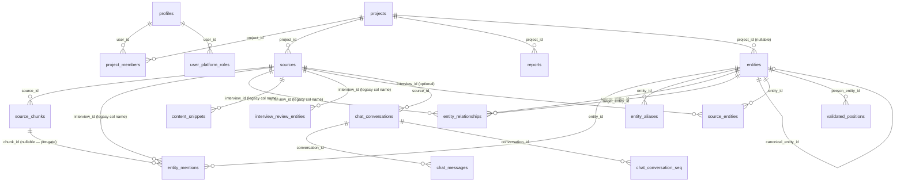
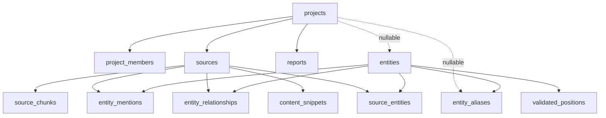
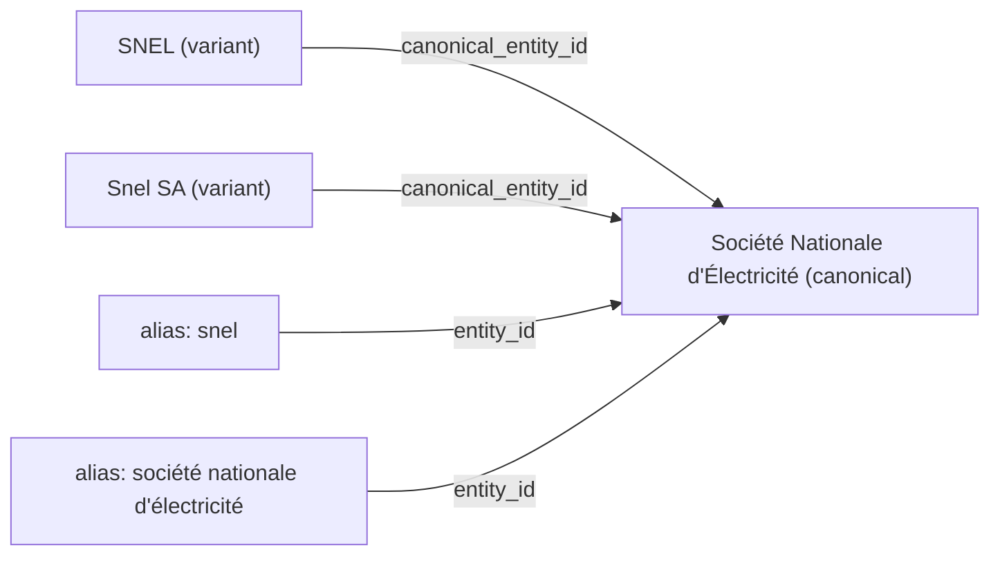

# Database Schema

> Multi-tenant PostgreSQL with pgvector, RLS, and Knowledge Graph
>
> **Last updated:** 2026-05-08 (after Phase 2.5 — migrations `00001`–`00031`).
> **Table count:** 18 tables + 2 back-compat views. **Migration count:** 31.

This document describes the live schema after the Phase 2 database refactor (source-first
foundation). The canonical source table is now **`sources`** (renamed from `interviews` in
migration `00027`). The names `interviews` and `interview_chunks` continue to exist as
**read-only back-compat views** for one release window; new code must use `sources` /
`source_chunks`.

---

## Extensions

Defined in `supabase/migrations/00001_initial_schema.sql`:

| Extension | Schema | Purpose |
|-----------|--------|---------|
| `vector` | `extensions` | pgvector for 1536-dim embeddings + HNSW index |
| `uuid-ossp` | `extensions` | `uuid_generate_v4()` for primary keys |
| `pg_trgm` | `extensions` | Trigram similarity for fuzzy entity name matching |

> **Naming**: Supabase names the extension `vector`, not `pgvector`. Using `CREATE EXTENSION "pgvector"` will fail.

---

## Schema Overview



---

## Tables

### `profiles`

Extends `auth.users`. Auto-created via the `handle_new_user` trigger on `auth.users`.

| Column | Type | Notes |
|--------|------|-------|
| `id` | `UUID` | PK, references `auth.users(id)` |
| `email` | `TEXT` | |
| `full_name` | `TEXT` | Nullable |
| `avatar_url` | `TEXT` | Nullable |
| `created_at` | `TIMESTAMPTZ` | |
| `updated_at` | `TIMESTAMPTZ` | Auto-updated via trigger |

**Migration**: `00001`

---

### `projects`

Tenant root. All data access flows through project membership.

| Column | Type | Notes |
|--------|------|-------|
| `id` | `UUID` | PK |
| `name` | `TEXT` | NOT NULL |
| `description` | `TEXT` | |
| `country` | `TEXT` | |
| `region` | `TEXT` | |
| `created_by` | `UUID` | DEFAULT `auth.uid()` |
| `created_at` | `TIMESTAMPTZ` | |
| `updated_at` | `TIMESTAMPTZ` | |

**Migrations**: `00001`, `00003`

---

### `project_members`

Many-to-many join between users and projects, with role-based access.

| Column | Type | Notes |
|--------|------|-------|
| `id` | `UUID` | PK |
| `project_id` | `UUID` | FK → `projects`, NOT NULL |
| `user_id` | `UUID` | FK → `profiles`, nullable (NULL while invite pending) |
| `role` | `user_role` | `owner`, `editor`, `viewer` |
| `invited_email` | `TEXT` | Nullable, for pending invites |
| `created_at` | `TIMESTAMPTZ` | |

**Constraint**: `check_member_or_invite` — at least one of `user_id` or `invited_email` must be set.

**Trigger**: `claim_pending_invites()` — when a new profile is created, any pending invites matching the email are claimed (sets `user_id`, clears `invited_email`).

**Migrations**: `00001`, `00005`

---

### `user_platform_roles`

Platform-wide roles for authenticated users (orthogonal to `project_members.role`).

| Column | Type | Notes |
|--------|------|-------|
| `id` | `UUID` | PK |
| `user_id` | `UUID` | FK → `profiles`, CASCADE delete |
| `role` | `platform_role` | `member`, `platform_admin`, or `superuser` |
| `created_at` | `TIMESTAMPTZ` | |

**Semantics:**

| `platform_role` | Capability |
|-----------------|------------|
| `member` | Normal authenticated product use (still gated by project membership) |
| `platform_admin` | Entity / knowledge governance only (e.g. `/admin/entities`) |
| `superuser` | User & global role management (`/admin/users`) **and** entity governance (superset of `platform_admin`) |

**Trigger**: `handle_new_user()` inserts `member` row alongside each new profile (`00016`).

**Helpers** (`00018`): `is_superuser()`, `has_entity_governance_access()` (`platform_admin` **or** `superuser`).

**Migrations**: `00016`, `00018`

---

### `sources` _(canonical; was `interviews` before `00027`)_

All uploaded sources — audio interviews, PDFs, pasted text. The canonical source record.

> **Back-compat view:** `CREATE VIEW interviews AS SELECT * FROM sources;` (read-only, one release window).

| Column | Type | Notes |
|--------|------|-------|
| `id` | `UUID` | PK |
| `project_id` | `UUID` | FK → `projects`, NOT NULL |
| `title` | `TEXT` | NOT NULL |
| `description` | `TEXT` | Nullable |
| `audio_url` | `TEXT` | Supabase Storage URL (audio only) |
| `audio_duration` | `REAL` | Duration in seconds (audio only) |
| `status` | `interview_status` | Pipeline lifecycle state |
| `error_message` | `TEXT` | Set on `FAILED` |
| `speaker_map` | `JSONB` | `{ "A": "Speaker A", ... }` — ASR diarization labels |
| `transcript_full` | `TEXT` | Raw transcript (speaker-labeled) |
| `transcript_display` | `TEXT` | Cleaned transcript (normalized names) |
| `source_utterances` | `JSONB` | Immutable ASR rows (AssemblyAI milliseconds) |
| `reviewed_utterances` | `JSONB` | Human-reviewed utterances (seconds) |
| `summary` | `TEXT` | GPT-4o-mini summary |
| `sentiment` | `JSONB` | `{ overall, score, highlights }` |
| `topics` | `TEXT[]` | Extracted topic labels |
| `assemblyai_id` | `TEXT` | AssemblyAI transcript ID |
| `language` | `TEXT` | |
| `source_type` | `source_type` | `audio`, `document`, `text`, `video` |
| `semantic_source_type` | `TEXT` | Free-text classification (e.g. `interview`, `report`) |
| `source_metadata` | `JSONB` | Unstructured metadata (file name, page count, etc.) |
| `expected_speakers` | `INTEGER` | 1–10, nullable |
| `interviewee_name` | `TEXT` | Primary person anchor string |
| `interviewee_org` | `TEXT` | Primary org anchor string |
| `interviewee_title` | `TEXT` | Title at time of source |
| `interviewee_entity_id` | `UUID` | FK → `entities` (deprecated; use `source_entities`) |
| `interviewee_org_entity_id` | `UUID` | FK → `entities` (deprecated; use `source_entities`) |
| `conducted_at` | `TIMESTAMPTZ` | When the interview/event took place |
| `transcript_review_status` | `transcript_review_status` | `none`, `draft`, `ready`, `reprocessing` |
| `last_intel_source` | `TEXT` | `assemblyai_auto`, `human_review`, `direct_ingest` |
| `created_by` | `UUID` | DEFAULT `auth.uid()` |
| `created_at` | `TIMESTAMPTZ` | |
| `updated_at` | `TIMESTAMPTZ` | |

**Status enum** (`interview_status`):
`PROCESSING` → `TRANSCRIBING` → `EXTRACTING` → `EMBEDDING` → `COMPLETED` | `FAILED`

**Migrations**: `00001`, `00004`, `00008`, `00010`, `00011`, `00013`, `00014`, `00015`, `00021`, `00022`, `00027`

---

### `interview_review_entities`

Structured seed entities for transcript review — used as mandatory strong inputs during reviewed reprocessing.

| Column | Type | Notes |
|--------|------|-------|
| `id` | `UUID` | PK |
| `interview_id` | `UUID` | FK → `sources`, CASCADE delete |
| `entity_id` | `UUID` | FK → `entities`, nullable until linked |
| `display_name` | `TEXT` | Name as confirmed by reviewer |
| `entity_type` | `entity_type` | `PERSON`, `COMPANY`, etc. |
| `created_by` | `UUID` | FK → `profiles` |
| `created_at` | `TIMESTAMPTZ` | |
| `updated_at` | `TIMESTAMPTZ` | |

**Migration**: `00013`

---

### `source_chunks` _(canonical; was `interview_chunks` before `00027`)_

Vector store for RAG — chunked, embedded segments of each source.

> **Back-compat view:** `CREATE VIEW interview_chunks AS SELECT id, source_id AS interview_id, ... FROM source_chunks;` (read-only, one release window).

| Column | Type | Notes |
|--------|------|-------|
| `id` | `UUID` | PK |
| `source_id` | `UUID` | FK → `sources`, CASCADE delete |
| `content` | `TEXT` | Immutable raw chunk text (~500 tokens) |
| `embedding` | `vector(1536)` | OpenAI `text-embedding-3-small` |
| `speaker` | `TEXT` | Speaker label |
| `start_time` | `REAL` | Timestamp in seconds (NULL for document/text) |
| `end_time` | `REAL` | Timestamp in seconds (NULL for document/text) |
| `metadata` | `JSONB` | See `ChunkMetadata` — includes normalization fields and entity IDs |
| `created_at` | `TIMESTAMPTZ` | |

**Key metadata fields** (`ChunkMetadata`):

| Field | Type | Notes |
|-------|------|-------|
| `chunk_index` | number | Position within source |
| `country` | string | Extracted country context |
| `topics` | string[] | Extracted topic labels |
| `entities` | string[] | Denormalized canonical entity names |
| `normalized_content` | string | Anchor-normalized text |
| `content_for_embedding` | string | Text actually embedded |
| `primary_person_entity_id` | string | FK to dominant person entity |
| `primary_org_entity_id` | string | FK to dominant org entity |

**Index**: `idx_source_chunks_embedding` — HNSW with `vector_cosine_ops`, `m = 16`, `ef_construction = 64`.

**Migrations**: `00001`, `00010`, `00027`

---

### `source_entities`

Source-level (source ↔ entity) association layer. Survives the chunk-level persistence gate. Each row records **what** the link is (`link_type`) and **how** it was learned (`origin`).

| Column | Type | Notes |
|--------|------|-------|
| `id` | `UUID` | PK |
| `source_id` | `UUID` | FK → `sources`, CASCADE delete |
| `entity_id` | `UUID` | FK → `entities`, CASCADE delete |
| `link_type` | `source_entity_link_type` | What the link is (see enum) |
| `origin` | `source_entity_origin` | How it was learned (see enum) |
| `is_primary` | `BOOLEAN` | DEFAULT false — primary interviewee / main subject |
| `speaker_label` | `TEXT` | ASR speaker label if applicable |
| `confidence` | `REAL` | NULL for deterministic origins; 0–1 for `extraction`/`ai_inference` |
| `evidence` | `JSONB` | Optional evidence blob |
| `source_metadata` | `JSONB` | Opaque origin-specific metadata |
| `created_by` | `UUID` | FK → `auth.users`, nullable |
| `created_at` | `TIMESTAMPTZ` | |
| `updated_at` | `TIMESTAMPTZ` | |

**Unique key**: `(source_id, entity_id, link_type, origin)` — multiple provenance rows per logical association are allowed and intended.

**Indexes**: `(entity_id)`, `(source_id, link_type)`, `(source_id, origin)`.

**Migration**: `00028`

---

### `entities`

Knowledge graph nodes. Supports both project-scoped and global entities.

| Column | Type | Notes |
|--------|------|-------|
| `id` | `UUID` | PK |
| `name` | `TEXT` | NOT NULL |
| `type` | `entity_type` | See enum |
| `description` | `TEXT` | |
| `metadata` | `JSONB` | |
| `project_id` | `UUID` | FK → `projects`, nullable. NULL = global entity |
| `canonical_entity_id` | `UUID` | FK → `entities(id)`, self-reference for merges |
| `normalized_name` | `TEXT` | Lowercased, stripped, collapsed |
| `created_at` | `TIMESTAMPTZ` | |
| `updated_at` | `TIMESTAMPTZ` | |

**Unique index** (Phase 2.5, migration `00031`):
`entities_name_type_scope_unique` on `(normalized_name, type, COALESCE(project_id, '00000000-0000-0000-0000-000000000000'))`.
Two projects can own entities with the same name + type independently. Global entities (NULL project_id) still deduplicate against each other via the COALESCE sentinel.

> ⚠️ The original global `UNIQUE(name, type)` constraint (`entities_name_type_key`) was dropped in Phase 2.5 (`00031`). Any code relying on the 23505 silent-recovery pattern is now broken by design.

**Trigram indexes**: GIN on `name` and `normalized_name` for fuzzy matching.

**Migrations**: `00001`, `00009`, `00025`, `00031`

---

### `entity_aliases`

Maps alternative names to canonical entities. Used for ASR word boost and entity resolution.

| Column | Type | Notes |
|--------|------|-------|
| `id` | `UUID` | PK |
| `entity_id` | `UUID` | FK → `entities` |
| `alias` | `TEXT` | NOT NULL |
| `alias_normalized` | `TEXT` | NOT NULL |
| `source` | `TEXT` | e.g. `system`, `user_correction`, `extraction`, `admin_governance` |
| `confidence` | `REAL` | 0–1, default 1 |
| `project_id` | `UUID` | Nullable. NULL = global scope |
| `created_at` | `TIMESTAMPTZ` | |
| `updated_at` | `TIMESTAMPTZ` | |

**Unique index**: `(entity_id, alias_normalized, COALESCE(project_id, sentinel_uuid))` — mirrors `entities` scope pattern.

**RLS**: Not enabled. Accessible to any authenticated user.

**Migration**: `00009`

---

### `entity_mentions`

Links entities to the source chunks where they were textually matched.

| Column | Type | Notes |
|--------|------|-------|
| `id` | `UUID` | PK |
| `entity_id` | `UUID` | FK → `entities`, CASCADE delete |
| `interview_id` | `UUID` | FK → `sources` (legacy column name), CASCADE delete |
| `chunk_id` | `UUID` | FK → `source_chunks`, CASCADE delete. NULL on pre-gate legacy rows |
| `sentiment` | `TEXT` | Sentiment toward this entity in the chunk |
| `context` | `TEXT` | ~500-char excerpt around the matched text |
| `created_at` | `TIMESTAMPTZ` | |

**Unique key**: `(entity_id, interview_id, chunk_id)` — NULL `chunk_id` is not deduplicated (pre-gate legacy rows).

**Note**: `chunk_id` is enforced NOT NULL for all new rows since the persistence gate (Phase fix-context-entity-ingestion). Pre-gate rows with `chunk_id IS NULL` still exist.

**Migration**: `00001`

---

### `entity_relationships`

Knowledge graph edges with typed relations, confidence, evidence provenance, and editorial state.

| Column | Type | Notes |
|--------|------|-------|
| `id` | `UUID` | PK |
| `source_entity_id` | `UUID` | FK → `entities` |
| `target_entity_id` | `UUID` | FK → `entities` |
| `relation_type` | `relation_type` | See enum |
| `confidence` | `REAL` | 0–1 |
| `evidence_text` | `TEXT` | LLM-selected quote from source |
| `interview_id` | `UUID` | FK → `sources` (legacy column name), provenance |
| `review_status` | `relationship_review_status` | `pending`, `approved`, `rejected` |
| `origin` | `relationship_origin` | `llm`, `human_created`, `human_edited` |
| `reviewed_by` | `UUID` | FK → `profiles`, nullable |
| `reviewed_at` | `TIMESTAMPTZ` | Nullable |
| `created_at` | `TIMESTAMPTZ` | |

**Unique key**: `(source_entity_id, target_entity_id, relation_type, interview_id)`.

**Migrations**: `00004`, `00023`, `00024`

---

### `validated_positions`

Human-validated person ↔ organization title records with date precision. Global (no `project_id`).

| Column | Type | Notes |
|--------|------|-------|
| `id` | `UUID` | PK |
| `person_entity_id` | `UUID` | FK → `entities`, CASCADE delete |
| `organization_entity_id` | `UUID` | FK → `entities`, SET NULL |
| `title` | `TEXT` | Role/title string |
| `start_date` | `DATE` | Nullable |
| `end_date` | `DATE` | Nullable |
| `start_precision` | `date_precision` | `exact`, `approximate`, `unknown` |
| `end_precision` | `date_precision` | |
| `is_main` | `BOOLEAN` | Primary position flag |
| `state` | `position_state` | `active`, `ended`, `pending_review`, `uncertain` |
| `validated_at` | `TIMESTAMPTZ` | |
| `created_at` | `TIMESTAMPTZ` | |
| `updated_at` | `TIMESTAMPTZ` | |

**RLS**: SELECT allowed for `authenticated`. No INSERT/UPDATE/DELETE via RLS — populated via admin client / SQL.

**Migration**: `00017`

---

### `content_snippets`

Auto-generated marketing assets per source.

| Column | Type | Notes |
|--------|------|-------|
| `id` | `UUID` | PK |
| `interview_id` | `UUID` | FK → `sources` (legacy column name), CASCADE delete |
| `platform` | `snippet_platform` | `linkedin`, `twitter`, `newsletter`, `summary` |
| `content` | `TEXT` | |
| `tone` | `snippet_tone` | `professional`, `casual`, `formal` |
| `status` | `snippet_status` | `draft` → `approved` → `published` |
| `created_at` | `TIMESTAMPTZ` | |
| `updated_at` | `TIMESTAMPTZ` | |

**Migration**: `00004`

---

### `reports`

AI-generated business intelligence reports with sharing support.

| Column | Type | Notes |
|--------|------|-------|
| `id` | `UUID` | PK |
| `project_id` | `UUID` | FK → `projects`, NOT NULL |
| `title` | `TEXT` | |
| `template` | `report_template` | See enum |
| `status` | `report_status` | `generating`, `completed`, `failed` |
| `content` | `TEXT` | Markdown output |
| `summary` | `TEXT` | |
| `interview_ids` | `UUID[]` | Source IDs used (legacy column name) |
| `parameters` | `JSONB` | Template-specific config |
| `error_message` | `TEXT` | |
| `share_token` | `TEXT` | UNIQUE, for public sharing |
| `share_password` | `TEXT` | SHA-256 hash, nullable |
| `created_by` | `UUID` | |
| `created_at` | `TIMESTAMPTZ` | |
| `updated_at` | `TIMESTAMPTZ` | |

**Migrations**: `00006`, `00007`

---

### `chat_conversations`

Chat session records.

| Column | Type | Notes |
|--------|------|-------|
| `id` | `UUID` | PK |
| `user_id` | `UUID` | FK → `profiles` |
| `project_id` | `UUID` | FK → `projects`, nullable |
| `interview_id` | `UUID` | FK → `sources` (legacy column name), nullable |
| `title` | `TEXT` | Auto-generated or user-set |
| `title_user_set` | `BOOLEAN` | Whether the user manually set the title |
| `created_at` | `TIMESTAMPTZ` | |
| `updated_at` | `TIMESTAMPTZ` | |

**Migration**: `00019`, `00020`

---

### `chat_messages`

Individual messages within a conversation.

| Column | Type | Notes |
|--------|------|-------|
| `id` | `UUID` | PK |
| `conversation_id` | `UUID` | FK → `chat_conversations`, CASCADE delete |
| `role` | `chat_message_role` | `user`, `assistant` |
| `content` | `TEXT` | Message text |
| `sequence_number` | `INTEGER` | Monotonically increasing per conversation |
| `user_message_id` | `UUID` | Self-reference for user message linked to assistant response |
| `created_at` | `TIMESTAMPTZ` | |

**Migration**: `00019`

---

### `chat_conversation_seq`

Atomic sequence counter per conversation (prevents duplicate sequence numbers under concurrent writes).

| Column | Type | Notes |
|--------|------|-------|
| `conversation_id` | `UUID` | PK, FK → `chat_conversations`, CASCADE delete |
| `next_seq` | `INTEGER` | DEFAULT 1, NOT NULL |

**Migration**: `00019`

---

## Back-compat Views (one release window)

Created in `00027`; these views will be dropped in a future "Soon" PR once the codebase has no live readers of the old names.

| View | Reads from | Purpose |
|------|------------|---------|
| `interviews` | `sources` | All columns pass-through; `interview_id` = `id` |
| `interview_chunks` | `source_chunks` | `interview_id` aliased from `source_id`; all other columns pass-through |

---

## Multi-Tenant Architecture

### Tenant Model

`projects` is the tenant root. All data is scoped to a project either directly or transitively.



### Scoping Rules

| Table | Scope | Method |
|-------|-------|--------|
| `project_members` | Direct | `project_id` NOT NULL |
| `sources` | Direct | `project_id` NOT NULL |
| `reports` | Direct | `project_id` NOT NULL |
| `entities` | Hybrid | `project_id` nullable — NULL = global |
| `entity_aliases` | Hybrid | `project_id` nullable — NULL = global |
| `source_chunks` | Transitive | `source_id` → `sources.project_id` |
| `source_entities` | Transitive | `source_id` → `sources.project_id` |
| `entity_mentions` | Transitive | `interview_id` → `sources.project_id` |
| `entity_relationships` | Transitive | `interview_id` → `sources.project_id` |
| `content_snippets` | Transitive | `interview_id` → `sources.project_id` |
| `interview_review_entities` | Transitive | `interview_id` → `sources.project_id` |
| `validated_positions` | Global | No project scope |
| `chat_conversations` | Mixed | `project_id?` + `user_id` |
| `chat_messages` | Mixed | via `conversation_id` |

---

## Entity Canonical Merge System

Entities support deduplication via a canonical merge pattern:



### How It Works

1. **`entities.canonical_entity_id`** — if set, this entity is a variant. The canonical entity is the target.
2. **`entity_aliases`** — maps alternative name strings to a canonical entity.
3. **`resolveCanonicalEntityId()`** in `src/lib/entities/match.ts` follows the `canonical_entity_id` chain.
4. **`normalizeEntityName()`** in `src/lib/entities/normalize.ts` produces the normalized form.

### Auto-Merge Thresholds

| Similarity | Action |
|------------|--------|
| ≥ 0.9 | Auto-merge: reuse existing entity |
| 0.8 – 0.9 | Create new entity, flag `needs_review` |
| < 0.8 | Create new entity |

---

## Row Level Security (RLS)

### SECURITY DEFINER Helper Functions

| Function | Signature | Purpose |
|----------|-----------|---------|
| `is_project_member` | `(p_project_id UUID) → BOOLEAN` | User is any role in project |
| `is_project_owner` | `(p_project_id UUID) → BOOLEAN` | User is owner of project |
| `is_project_editor` | `(p_project_id UUID) → BOOLEAN` | User is editor or owner |
| `get_source_project` | `(p_source_id UUID) → UUID` | Returns `project_id` for a source |
| `is_superuser` | `() → BOOLEAN` | Current user has `superuser` in `user_platform_roles` |
| `has_entity_governance_access` | `() → BOOLEAN` | `platform_admin` **or** `superuser` |

> `get_interview_project` was renamed to `get_source_project` in migration `00027`. The back-compat view recreates the old name as an alias for one release.

### Policies by Table

| Table | SELECT | INSERT | UPDATE | DELETE |
|-------|--------|--------|--------|--------|
| `profiles` | Own profile | — | Own profile | — |
| `user_platform_roles` | Own rows | — | — | — |
| `projects` | Member | Authenticated | Owner | Owner |
| `project_members` | Member | Owner | Owner | Owner |
| `sources` | Member | Editor | Editor | — |
| `source_chunks` | Member (via source) | — | — | — |
| `source_entities` | Member (via source) | Editor (via source) | Editor | — |
| `entities` | Authenticated | Authenticated | Authenticated | — |
| `entity_mentions` | Member (via source) | Authenticated | — | — |
| `entity_relationships` | Member (via source) | Authenticated | Authenticated | — |
| `content_snippets` | Member (via source) | Authenticated | Authenticated | — |
| `reports` | Member | Editor | Editor | Owner |
| `validated_positions` | Authenticated | — | — | — |
| `entity_aliases` | **No RLS** | **No RLS** | **No RLS** | **No RLS** |
| `chat_conversations` | Own rows | Authenticated | Own | Own |
| `chat_messages` | Via conversation | Authenticated | — | — |

### Known Gaps

- **`entity_aliases`**: RLS not enabled — accessible to any authenticated user.
- **`entities`**: No project-based filtering — any authenticated user can read/insert/update all entities. Intentional for cross-project entity resolution; will be scoped to workspace in Phase 3a.
- **All write paths**: Use admin client (service role) after server-side `getUser()`. RLS is defense-in-depth, not the primary enforcement layer.

---

## RPCs (SECURITY DEFINER Functions)

| Function | Args | Returns | Notes |
|----------|------|---------|-------|
| `hybrid_search` | `query_embedding`, `filter_project_ids[]`, `filter_interview_ids[]`, `filter_country`, `filter_topics[]`, `match_threshold`, `match_count` | Chunk rows with `similarity` | HNSW vector search + metadata filters |
| `entity_intel` | `p_entity_id`, `p_project_id?` | Association rows (see below) | Phase 1 + Phase 2.4. UNION of mentions, source_entities, relationships |
| `clear_source_derived_data` | `p_source_id` | — | Wipes chunks/mentions/relationships/snippets (non-editorial). Used by reviewed reprocess |
| `get_source_project` | `p_source_id` | `UUID` | RLS helper |
| `next_chat_message_sequence` | `p_conversation_id` | `INTEGER` | Atomic sequence increment for chat |
| `list_distinct_position_titles` | `p_limit?` | `{ title }[]` | Distinct titles from `validated_positions` |

**`entity_intel` return shape** (per row):

| Field | Type | Notes |
|-------|------|-------|
| `source_id` | `UUID` | Source the entity is associated with |
| `source_title` | `TEXT` | |
| `role` | `SourceEntityLinkType \| "mention" \| "related_via_relationship"` | Phase 2.4: all link_type values surfaced |
| `kind` | `"mention" \| "anchor" \| "source_entity" \| "relationship"` | `anchor` = deterministic origin; `source_entity` = extraction/ai_inference |
| `evidence` | `TEXT?` | Context excerpt or evidence text |
| `chunk_id` | `UUID?` | Set for mention rows |
| `sentiment` | `TEXT?` | |
| `conducted_at` | `TIMESTAMPTZ?` | |
| `created_at` | `TIMESTAMPTZ` | |

---

## Enums (16 total)

| Enum | Values | Migration |
|------|--------|-----------|
| `interview_status` | `PROCESSING`, `TRANSCRIBING`, `EXTRACTING`, `EMBEDDING`, `COMPLETED`, `FAILED` | `00001` |
| `entity_type` | `PERSON`, `COMPANY`, `GOVERNMENT`, `ORGANIZATION`, `LOCATION`, `EVENT`, `COUNTRY`, `SECTOR`, `COMMODITY`, `PUBLIC_INSTITUTION`, `STATE_OWNED_ENTERPRISE`, `LAW_OR_POLICY`, `MEDIA_OR_PUBLICATION` | `00001`, `00025` |
| `user_role` | `owner`, `editor`, `viewer` | `00001` |
| `platform_role` | `member`, `platform_admin`, `superuser` | `00016`, `00018` |
| `relation_type` | **v2 preferred:** `supplier`, `competitor`, `investor`, `subsidiary`, `acquirer`, `critic`, `advisor`, `regulator`, `affiliated_with`, `operates_in`, `governs`, `customer_of` **legacy:** `business_partner`, `ally` | `00004`, `00024` |
| `relationship_review_status` | `pending`, `approved`, `rejected` | `00023` |
| `relationship_origin` | `llm`, `human_created`, `human_edited` | `00023` |
| `source_entity_link_type` | `interviewee`, `interviewee_org`, `interviewer`, `translator`, `participant`, `author`, `primary_subject`, `subject_organization`, `account`, `source_owner`, `mentioned_at_source_level`, `related_entity` | `00028` |
| `source_entity_origin` | `upload_anchor`, `metadata_import`, `extraction`, `crm_import`, `manual_tag`, `ai_inference`, `human_review`, `alias_propagation`, `prior_context` | `00028` |
| `source_type` | `audio`, `document`, `text`, `video` | `00004`, `00022` |
| `snippet_platform` | `linkedin`, `twitter`, `newsletter`, `summary` | `00004` |
| `snippet_tone` | `professional`, `casual`, `formal` | `00004` |
| `snippet_status` | `draft`, `approved`, `published` | `00004` |
| `report_status` | `generating`, `completed`, `failed` | `00006` |
| `report_template` | `country_risk`, `sector_analysis`, `entity_profile`, `executive_briefing`, `custom` | `00006` |
| `transcript_review_status` | `none`, `draft`, `ready`, `reprocessing` | `00013` |

> `UPLOADING` exists in the `interview_status` enum (migration `00001`) but is dead code — no pipeline path writes it. `PROCESSING` is the actual first status.

> `date_precision` (`exact`, `approximate`, `unknown`), `position_state` (`active`, `ended`, `pending_review`, `uncertain`), `chat_message_role` (`user`, `assistant`) are additional enums defined at the application layer in `src/types/database.ts`.

---

## Migration History

| Migration | Description |
|-----------|-------------|
| `00001_initial_schema.sql` | Core tables, RLS, HNSW index, `hybrid_search()` function, triggers |
| `00002_fix_rls_recursion.sql` | SECURITY DEFINER helpers, recreated RLS policies |
| `00003_fix_created_by_default.sql` | `DEFAULT auth.uid()` on `projects` and `interviews` |
| `00004_graph_and_content.sql` | `entity_relationships`, `content_snippets`, `source_type`, new enums |
| `00005_team_invitation_support.sql` | `invited_email`, nullable `user_id`, `claim_pending_invites` trigger |
| `00006_reports.sql` | `reports` table, `report_status` and `report_template` enums |
| `00007_report_sharing.sql` | `share_token`, `share_password` on `reports` |
| `00008_expected_speakers.sql` | `interviews.expected_speakers` |
| `00009_entity_normalization.sql` | `entities.project_id`, `canonical_entity_id`, `normalized_name`; `entity_aliases` table; trigram indexes |
| `00010_interview_primary_entities.sql` | `interviews.interviewee_name`, `interviews.interviewee_org` |
| `00011_transcript_display.sql` | `interviews.transcript_display` |
| `00012_interview_scoped_search.sql` | Interview-scoped search RPC |
| `00013_interview_transcript_review.sql` | `reviewed_utterances`, `transcript_review_status`, `last_intel_source`; `interview_review_entities` table |
| `00014_interview_source_utterances.sql` | `interviews.source_utterances` |
| `00015_interview_anchor_entity_ids.sql` | `interviewee_entity_id`, `interviewee_org_entity_id` FK columns on `interviews` |
| `00016_platform_user_roles.sql` | `platform_role` enum, `user_platform_roles` table, `handle_new_user` trigger |
| `00017_validated_positions.sql` | `validated_positions` table, `position_state`, `date_precision` enums |
| `00018_platform_role_superuser.sql` | Add `superuser` to `platform_role`; migrate existing rows; `is_superuser()`, `has_entity_governance_access()` |
| `00019_chat_persistence.sql` | `chat_conversations`, `chat_messages`, `chat_conversation_seq`; `next_chat_message_sequence()` |
| `00020_chat_conversation_title_user_set.sql` | `chat_conversations.title_user_set` |
| `00021_interviewee_title.sql` | `interviews.interviewee_title` |
| `00022_semantic_source_type.sql` | `interviews.semantic_source_type`, `source_metadata`; extend `source_type` with `text` |
| `00023_relationship_editorial.sql` | `entity_relationships.review_status`, `origin`, `reviewed_by`, `reviewed_at`; `relationship_review_status` + `relationship_origin` enums |
| `00024_relationship_taxonomy_v2.sql` | Add v2 `relation_type` values: `affiliated_with`, `operates_in`, `governs`, `customer_of` |
| `00025_entity_type_expansion.sql` | Add entity types: `COUNTRY`, `SECTOR`, `COMMODITY`, `PUBLIC_INSTITUTION`, `STATE_OWNED_ENTERPRISE`, `LAW_OR_POLICY`, `MEDIA_OR_PUBLICATION` |
| `00026_entity_intel_rpc.sql` | Phase 1 — `entity_intel` SECURITY DEFINER RPC (UNION of mentions + interviewee FKs + relationships) |
| `00027_rename_interviews_to_sources.sql` | Phase 2.1 — `interviews` → `sources`; `interview_chunks` → `source_chunks`; back-compat views; rename indexes, helpers, triggers |
| `00028_source_entities_table.sql` | Phase 2.2 — `source_entities` table; `source_entity_link_type` + `source_entity_origin` enums; anchor backfill |
| `00029_clear_source_derived_extraction.sql` | Phase 2.3 — `clear_source_derived_data` function update to use new table/column names |
| `00030_entity_intel_rpc_v2.sql` | Phase 2.4 — `entity_intel` rewritten to read `source_entities` instead of legacy FK columns |
| `00031_entities_project_scoped_unique.sql` | Phase 2.5 — drop `entities_name_type_key`; add `entities_name_type_scope_unique` (project-scoped) |

---

## TypeScript Types

**File**: `src/types/database.ts`

Hand-written (not auto-generated). Provides a full `Database` interface with `Tables`, `Views`, `Functions`, and `Enums` types. Key convenience aliases:

```typescript
type Source          = Tables<"sources">;        // canonical
type SourceChunk     = Tables<"source_chunks">;   // canonical
type SourceEntity    = Tables<"source_entities">;
type Interview       = Tables<"interviews">;      // back-compat alias
type InterviewChunk  = Tables<"interview_chunks">; // back-compat alias
type Entity          = Tables<"entities">;
type EntityMention   = Tables<"entity_mentions">;
type EntityRelationship = Tables<"entity_relationships">;
type ValidatedPosition  = Tables<"validated_positions">;
type ChatConversation   = Tables<"chat_conversations">;
type ChatMessage        = Tables<"chat_messages">;
```

The `Views` section documents the `interviews` and `interview_chunks` back-compat views. The `Functions` section includes `entity_intel`, `hybrid_search`, `clear_source_derived_data`, `get_source_project`, `next_chat_message_sequence`, and `list_distinct_position_titles`.
