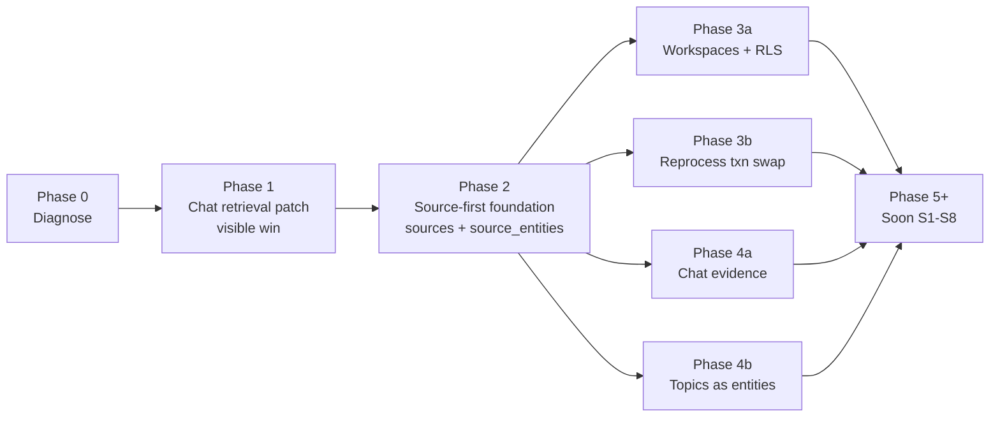

# Aksum — database, retrieval & sources refactor implementation plan

**Deliverable file:** [docs/audits/database-retrieval-architecture-implementation-plan.md](docs/audits/database-retrieval-architecture-implementation-plan.md), paired with [docs/audits/database-retrieval-architecture-audit.md](docs/audits/database-retrieval-architecture-audit.md) and [docs/audits/database-retrieval-architecture-clarification.md](docs/audits/database-retrieval-architecture-clarification.md).

**Scope:** turn the architecture clarification's "Now" items (N1–N9) into a sequenced refactor plan. "Soon" (S1–S8) and "Defer" (D1–D8) are listed as parking; they get their own feature specs when prioritised.

**Lifecycle:** when each phase starts, create the matching feature spec under [docs/features/to-do/](docs/features/to-do/) using [docs/features/feature-spec-template.md](docs/features/feature-spec-template.md), then move it to [docs/features/on-going/](docs/features/on-going/) when work begins, per [AGENTS.md](AGENTS.md) §3.

---

## 1. Phase map

Each arrow is "must precede." Phases 3a, 3b, 4a, 4b are independent of each other and can land in parallel after Phase 2 ships.

---

## 2. Phase 0 — Diagnose (read-only)

**1 PR. Risk: zero.** Establish the baseline numbers we will refactor against.

- **PR 0.1 — SQL audit run + numbers.** Run the read-only queries in audit §12 against the live DB; capture counts (anchor-only interviewees/orgs, orphan entities, NULL-chunk legacy mentions, duplicate canonical entities, cross-project name collisions, FAILED reprocess interviews). Drop the table into a new feature spec [docs/features/to-do/database-retrieval-refactor-baseline.md](docs/features/to-do/database-retrieval-refactor-baseline.md). No code changes. No migrations.
- **Why now:** every later PR claims to "fix" something; the only honest way to assert that is to compare to baseline numbers. Doing this once, separately, also flushes out which audit findings are actually present in our data vs theoretical.

---

## 3. Phase 1 — Chat retrieval patch (visible win, no schema change)

**1 PR. Risk: low.** Closes the visible interviewee bug AND the broader "entity exists, graph is empty" pattern, **without** any schema change. Backwards-compatible by definition.

- **PR 1.1 — Unified entity-centered RPC + `lookupMentions` rewrite.**
  - **DB (00026):** new `SECURITY DEFINER` SQL function `entity_intel(p_entity_id uuid, p_project_id uuid DEFAULT NULL)` returning `(source_id, source_title, role, evidence text NULL, chunk_id uuid NULL, kind text)` — UNION of:
    1. rows from `entity_mentions` joined to `interviews` and `interview_chunks` (today's behaviour),
    2. rows from `interviews` where `interviewee_entity_id = p_entity_id` (`role='interviewee'`) or `interviewee_org_entity_id = p_entity_id` (`role='interviewee_org'`),
    3. rows from `entity_relationships` where source/target = `p_entity_id` (`role='related_via_relationship'`).
  - **Retrieval:** rewrite [src/lib/ai/entity-lookup.ts](src/lib/ai/entity-lookup.ts) `getMentions(...)` (line 193) to call the new RPC. The chat tool wrapper `lookupMentions` keeps its current shape; only the SQL underneath changes. Update prompt copy in [src/app/api/chat/route.ts](src/app/api/chat/route.ts) / [src/lib/chat/system-prompt.ts](src/lib/chat/system-prompt.ts) so the model knows the tool now returns sources where the entity is an interviewee, related party, or textual mention.
  - **Ingestion:** **none.**
  - **UI/API:** chat answers improve. No schema or page change.
  - **Tests:** unit test for the RPC (interviewee-only entity returns sources; mention-only returns chunks; both work; project filter; empty case). Integration test for chat tool. Smoke test: ask "what do we know about " and confirm it stops returning empty.
  - **Backwards-compat:** the RPC is additive; the old direct query is removed but the tool's external contract is unchanged.
  - **Forward-compat with Phase 2.1:** the function references `interviews` / `interview_chunks` by their pre-rename names. After Phase 2.1 these become back-compat views over `sources` / `source_chunks`, so the function continues to work unchanged until PR 2.4 rewrites it to read `source_entities` directly.
  - **Rollback:** revert the tool file; the RPC can stay or be dropped.

---

## 4. Phase 2 — Source-first foundation

**6 PRs. Risk: medium overall (low per PR; in-place rename with back-compat views keeps existing readers working).** This is the structural fix to P1 (root cause) and P3 (source-first). After Phase 2, the canonical table is `sources`, "interview" becomes a kind of source, and entity↔source association is a first-class fact independent of textual mentions.

| PR                                                   | What                                                                                                                                                                                                                                                                                                                                                                                                                                                                                                                                                                                                                                                                                                      | Why                                                                                                                                                                             | Risk                                                                                                                                      |
| ---------------------------------------------------- | --------------------------------------------------------------------------------------------------------------------------------------------------------------------------------------------------------------------------------------------------------------------------------------------------------------------------------------------------------------------------------------------------------------------------------------------------------------------------------------------------------------------------------------------------------------------------------------------------------------------------------------------------------------------------------------------------------- | ------------------------------------------------------------------------------------------------------------------------------------------------------------------------------- | ----------------------------------------------------------------------------------------------------------------------------------------- |
| **2.1 — In-place rename to `sources` + `source_chunks`** (00027) | `ALTER TABLE interviews RENAME TO sources;` `ALTER TABLE interview_chunks RENAME TO source_chunks;` `ALTER TABLE source_chunks RENAME COLUMN interview_id TO source_id;`. Rename indexes (`idx_interview_*` → `idx_source_*`), SECURITY DEFINER helpers (`get_interview_project` → `get_source_project`, `clear_interview_derived_data` → `clear_source_derived_data`), and any RLS policy names — Postgres rewrites FK constraints automatically. Then create **read-only back-compat views** for one release: `CREATE VIEW interviews AS SELECT * FROM sources;` and `CREATE VIEW interview_chunks AS SELECT id, source_id AS interview_id, ... FROM source_chunks;`. Update [src/types/database.ts](src/types/database.ts) so `interview_*` types alias `source_*` types. **No column moves** — interview-only columns stay on `sources` for now; the split into `source_interviews` / `source_documents` extension tables is a Phase 5+ Soon item. | Delivers actual source-first naming: the canonical table is `sources`, not a view alias of an interview-shaped table. Future generic columns (`kind`, `language`, `published_at`, `visibility`) get added to `sources`, not to a table called `interviews`. Back-compat views keep every existing reader working unchanged. | Medium. Postgres handles FK + index renames automatically; residual risk is application-side. Mitigated by: full repo grep for `interview_chunks`, `from('interviews')`, `interview_id` before commit; CI on the test suite; smoke test of every page that reads these tables. Rollback = revert app code + `ALTER TABLE sources RENAME TO interviews;`. |
| **2.2 — `source_entities` table + backfill** (00028) | New table `source_entities (id, source_id FK→sources(id), entity_id FK→entities(id), link_type enum, origin enum, is_primary bool DEFAULT false, speaker_label text NULL, source_metadata jsonb NULL, evidence jsonb NULL, confidence float NULL, created_by uuid NULL FK→auth.users, created_at, updated_at)`. Initial **`link_type` enum** (what the link is): `interviewee, interviewee_org, interviewer, translator, participant, author, primary_subject, subject_organization, account, source_owner, mentioned_at_source_level, related_entity`. Initial **`origin` enum** (where the link came from): `upload_anchor, metadata_import, extraction, crm_import, manual_tag, ai_inference, human_review, alias_propagation, prior_context`. **Unique key:** `UNIQUE(source_id, entity_id, link_type, origin)` — multiple provenance rows for the same logical association are allowed and intended (see §10 #8). Backfill: one row per non-NULL `sources.interviewee_entity_id` → `(link_type='interviewee', origin='upload_anchor', is_primary=true, confidence=NULL)` and one per `interviewee_org_entity_id` → `(link_type='interviewee_org', origin='upload_anchor', confidence=NULL)`. (Phase 2.2 runs after the 2.1 rename, so the columns now live on `sources`.) Indexes on `(entity_id)`, `(source_id, link_type)`, `(source_id, origin)`. RLS via existing `is_project_member()` helper. | The source-level association layer the clarification §3.4 mandates. Survives the persistence gate by design. Provenance fields make the table honest about *how* an association was learned (deterministic anchor vs LLM inference vs human tag vs CRM import), so retrieval and the UI can show trust accordingly. | Medium. Backfill must match source-of-truth row counts exactly; verified by SQL assertion before commit.                                  |
| **2.3 — Pipeline writes `source_entities`**          | Modify [src/lib/ai/pipeline.ts](src/lib/ai/pipeline.ts) and [src/lib/ai/document-pipeline.ts](src/lib/ai/document-pipeline.ts): on every successful ingest, upsert `source_entities` rows for the upload anchors with `origin='upload_anchor'` (the anchor pair `interviewee` + `interviewee_org`, `confidence=NULL` because anchors are deterministic). Extend [src/lib/ai/extraction.ts](src/lib/ai/extraction.ts) to emit suggested `author` / `primary_subject` / `subject_organization` candidates with a confidence score; pipeline writes those whose confidence ≥ a conservative threshold (e.g. 0.9) with `origin='extraction'` and the score in `confidence`. Stop creating orphan entity rows in `entities` for anchors that won't survive grounding (move anchor entity insert to a "create-only-if-mentioned-OR-confirmed-anchor" guard). **CRM-import, manual-tag, AI-inference, and prior-context origins are deferred to Phase 5+**, when their write paths exist; the schema accommodates them today, but no caller writes them in Phase 2. | Anchors no longer rely on the chunk-level gate to be "remembered." Provenance is recorded at write time so the chat / UI / governance dashboards can later surface trust differently for `extraction` vs `manual_tag` vs `crm_import`. Future source kinds (CRM, email, meetings) write directly into the same table without inheriting interview vocabulary. | Medium. Need to ensure reviewed reprocess doesn't duplicate anchor rows; idempotent UPSERT via `UNIQUE(source_id, entity_id, link_type, origin)`. |
| **2.4 — RPC reads `source_entities`**                | Modify the `entity_intel` function from PR 1.1 to UNION `source_entities` instead of (or alongside) the legacy `sources.interviewee_*_entity_id` columns (the columns were renamed-with-the-table in Phase 2.1; the back-compat `interviews` view still exposes them too). Tool surface unchanged.                                                                                                                                                                                                                                                                                                                                                                                                                                                                                                                      | Closes the loop: now the visible chat fix (Phase 1) reads from the structurally correct table.                                                                                  | Low. Same read shape, different source.                                                                                                   |
| **2.5 — Drop `entities.UNIQUE(name, type)`** (00029) | `ALTER TABLE entities DROP CONSTRAINT entities_name_type_key;` then `CREATE UNIQUE INDEX entities_name_type_scope_unique ON entities (normalized_name, type, COALESCE(project_id, '00000000-0000-0000-0000-000000000000'::uuid));` (project-scoped now; revisit to workspace-scoped in Phase 3). Remove the `23505` recovery hack in [src/lib/entities/match.ts](src/lib/entities/match.ts). Pre-flight: run audit §12.10 / §12.12 and resolve collisions before the migration runs in prod.                                                                                                                                                                                                              | Removes the silent cross-project entity merge.                                                                                                                                  | Medium. Pre-flight must pass with zero destructive collisions; if any exist, ship a one-off remediation migration first.                  |
| **2.6 — Schema doc + types refresh**                 | Hand-update [docs/infrastructure/database-schema.md](docs/infrastructure/database-schema.md) and [src/types/database.ts](src/types/database.ts) for `sources`, `source_chunks`, `source_entities`, the new `entity_intel` RPC, and the missing-from-doc tables (`validated_positions`, `chat_*`, `user_platform_roles`, anchor FKs, `source_utterances`, etc.).                                                                                                                                                                                                                                                                                                                                           | Cheap; prevents future agent confusion. Delivers P7 (schema/doc drift).                                                                                                         | Low. Doc-only.                                                                                                                            |

**Phase 2 cross-cutting:**

- **DB:** migrations `00027`–`00029` (3 SQL files, plus 2 doc/types-only PRs).
- **Retrieval:** `entity_intel` RPC + chat tool now read source-level associations.
- **Ingestion:** anchor + extracted-association rows written to `source_entities`; orphan entity creation stopped.
- **UI/API:** Interview Detail can optionally show "people associated with this source" by `link_type` (small additive change in [src/app/(dashboard)/interviews/[id]/page.tsx](src/app/(dashboard)/interviews/[id]/page.tsx)). Network Explorer + dashboard untouched until Phase 5.8.
- **Backwards-compat:** old names continue to work for one release via **back-compat views** — `interviews` is now a read-only view over `sources`, and `interview_chunks` is a read-only view over `source_chunks` (with `source_id` aliased back to `interview_id` for legacy callers). `interviewee_*_entity_id` columns kept on `sources` (deprecated, not removed). TS `interview_*` types alias `source_*` types for one release.
- **Tests:** RPC tests, ingestion idempotency tests (re-running ingest doesn't duplicate `source_entities`), backfill row-count assertion, regression test that Network Explorer / reports / Interview Detail still render.

---

## 5. Phase 3 — Tenancy + reprocess safety (parallel sub-phases)

Two independent tracks; either can ship first. Each is its own feature spec.

### Phase 3a — Tenants + `tenant_id` everywhere + RLS hardening + customization (4 PRs)

> **⚠ Design decision taken 2026-05-08, revised same day.** The original
> `workspaces` plan has been superseded by a renamed and extended design with
> a stronger foundational rule: **every customer-owned table carries an
> explicit `tenant_id`** so RLS can enforce tenancy directly without multi-hop
> joins, and parent/child consistency is enforced via compound FKs / triggers.
> See [`docs/architecture/tenant-model-adr.md`](../architecture/tenant-model-adr.md)
> for the full ADR, per-table classification (Tier A / B / C), exception
> rationale, and migration scripts. The `workspaces` naming and the "transitive
> scoping is fine" assumption are both retired.

| PR                                                        | What                                                                                                                                                                                                                                                                                                                                                                                                                                                                                                                                                                                                                                                                                                                                                                                                                                                                                                                                                                                                                                                                                                                                                                                                                            | Risk                                                                                                                                                                                                                                                                                                              |
| --------------------------------------------------------- | -------------------------------------------------------------------------------------------------------------------------------------------------------------------------------------------------------------------------------------------------------------------------------------------------------------------------------------------------------------------------------------------------------------------------------------------------------------------------------------------------------------------------------------------------------------------------------------------------------------------------------------------------------------------------------------------------------------------------------------------------------------------------------------------------------------------------------------------------------------------------------------------------------------------------------------------------------------------------------------------------------------------------------------------------------------------------------------------------------------------------------------------------------------------------------------------------------------------------------- | ----------------------------------------------------------------------------------------------------------------------------------------------------------------------------------------------------------------------------------------------------------------------------------------------------------------- |
| **3a.1 — Core tenancy tables + customization scaffolding** (00032) | New `tenants (id, name, slug, created_at)`. New `tenant_members (tenant_id, user_id, role)` with compound PK. New `tenant_settings (tenant_id UNIQUE, limits, branding, feature_flags, module_config, prompt_config, custom_schemas, auth_config — all JSONB with safe defaults)`. New `tenant_integrations (tenant_id, integration_type, enabled, config, credentials_ref, ...)`. New `is_tenant_member(p_tenant_id uuid)` SECURITY DEFINER helper. Bootstrap: one tenant row + matching `tenant_settings` row.                                                                                                                                                                                                                                                                                                                                                                                                                                                                                                                                                                                                                                                                                                              | Low. New tables only; no existing rows touched; bootstrap has no behavioural effect.                                                                                                                                                                                                                              |
| **3a.2 — Propagate `tenant_id` to every customer-owned table** (00033) | Add `tenant_id` to `projects`, `project_members`, `sources`, `source_chunks`, `source_entities`, `entity_mentions`, `entity_relationships`, `content_snippets`, `interview_review_entities`, `reports`, `chat_conversations`, `chat_messages`, `chat_conversation_seq` (Tier A — NOT NULL after backfill) and `entities`, `entity_aliases` (Tier B — nullable, NULL = global). Backfill from bootstrap tenant; assert row counts; `SET NOT NULL` on Tier A; add compound `(id, tenant_id)` UNIQUE on `projects` / `sources` / `chat_conversations` and compound FKs on every Tier A child to enforce parent/child tenant consistency. Add `(tenant_id)` and hot compound indexes. Migrate Phase 2.5 unique index on `entities` from project scope to tenant scope.                                                                                                                                                                                                                                                                                                                                                                                                                                                              | Medium. Backfill must equal source-of-truth row counts exactly (assertion aborts migration on mismatch). Compound FKs make a write that omits `tenant_id` fail loudly — by design.                                                                                                                                |
| **3a.3 — Pipeline writes + RLS swap + read-path scoping** (00034) | Update `src/lib/ai/pipeline.ts` and `src/lib/ai/document-pipeline.ts` to fetch the source's `tenant_id` once at runner entry and set it on every batch INSERT (chunks, mentions, relationships, source_entities, snippets). Add `src/lib/tenant/scope.ts` (`getSourceTenantId`) and `src/lib/tenant/settings.ts` (typed accessors). Enable RLS on every Tier A/B table with `is_tenant_member(tenant_id)` (Tier A) or `tenant_id IS NULL OR is_tenant_member(tenant_id)` (Tier B). Add read-own-tenant policies on `tenants`, `tenant_members`, `tenant_settings`. Update dashboard, admin entities, and chat brief builders to scope by `tenant_id` directly (no transitive joins). Admin client (service role) keeps bypass — sacred per [HANDOVER.md](HANDOVER.md).                                                                                                                                                                                                                                                                                                                                                                                                                                                          | Medium-high. RLS swap changes what the anon/cookie client can read. Mitigated by single-bootstrap-tenant (no row-set change for the current customer) and full anon-client smoke of every dashboard/admin/chat page before merge.                                                                                 |
| **3a.4 — Forward-compat for `chat_message_evidence`**     | When Phase 4a (chat evidence persistence) lands, the new `chat_message_evidence` table is created with `tenant_id NOT NULL` from day one and a compound FK to `chat_messages(id, tenant_id)`. No backfill needed. Listed here as a forward-compatibility note rather than a stand-alone PR — the work happens inside Phase 4a but the design is owned by Phase 3a.                                                                                                                                                                                                                                                                                                                                                                                                                                                                                                                                                                                                                                                                                                                                                                                                                                                                | Low. Doc/contract only.                                                                                                                                                                                                                                                                                           |

### Phase 3b — Reviewed-reprocess transactional swap (1 PR)

- **PR 3b.1 — Transactional clear-and-replace** (00035). New `SECURITY DEFINER` SQL function `replace_source_derived_data(p_source_id uuid, p_chunks jsonb, p_mentions jsonb, p_relationships jsonb, p_snippets jsonb)` that runs DELETE + INSERTs in a single transaction. Modify `reprocessInterviewFromReview` in [src/lib/ai/pipeline.ts](src/lib/ai/pipeline.ts) to compute the new derived layer in memory first, then call this single function instead of the current `clear_interview_derived_data` + N inserts.
  - **Risk:** medium — large JSONB payloads; we should chunk the inserts inside the function if needed.
  - **Why:** closes P6 partial-failure window. No schema-shape change; just an RPC + caller swap.
  - **Tests:** simulate failure mid-insert; assert old derived layer is intact.

---

## 6. Phase 4 — Evidence + topics (parallel sub-phases)

Both are additive and low-risk; both can ship in parallel after Phase 2.

### Phase 4a — Persisted chat evidence (2 PRs)

| PR                                               | What                                                                                                                                                                                                                                                                                                                                    | Risk                                      |
| ------------------------------------------------ | --------------------------------------------------------------------------------------------------------------------------------------------------------------------------------------------------------------------------------------------------------------------------------------------------------------------------------------- | ----------------------------------------- |
| **4a.1 — `chat_message_evidence` table** (00036) | `(id, message_id FK→chat_messages(id) ON DELETE CASCADE, chunk_id FK→source_chunks(id), tenant_id UUID NOT NULL, similarity float, used_in_text bool, position int, created_at)`. Compound FK to `chat_messages(id, tenant_id)` per Phase 3a forward-compat note (tenant boundary travels with the row, no transitive join needed for RLS). RLS via `is_tenant_member(tenant_id)`.   | Low. Additive.                            |
| **4a.2 — Persist evidence on each turn**         | Modify the `onFinish` callback in [src/app/api/chat/route.ts](src/app/api/chat/route.ts) (and `persistAssistantTurn`) to write one row per chunk used in the response. Update [src/app/(dashboard)/chat/](src/app/(dashboard)/chat/) thread rendering to read evidence on rehydrate so citations don't disappear after the stream ends. | Low. Pure additive write + optional read. |

### Phase 4b — Topics / sectors / risks / opportunities as entities (2 PRs)

| PR                                           | What                                                                                                                                                                                                                                                                                                                            | Risk                                                                                                          |
| -------------------------------------------- | ------------------------------------------------------------------------------------------------------------------------------------------------------------------------------------------------------------------------------------------------------------------------------------------------------------------------------- | ------------------------------------------------------------------------------------------------------------- |
| **4b.1 — Extend `entity_type` enum** (00037) | Add `SECTOR`, `TOPIC`, `COMMODITY`, `RISK`, `OPPORTUNITY`, `PROJECT` (verify against `00025` first; some may already exist). **Naming note:** `PROJECT` here is a real-world project tracked **as an entity** (e.g. "Project Alpha" — something a customer would link via `source_entities.link_type='related_entity'` or `'primary_subject'`). It is **distinct from** Aksum workspace `projects` (the tenant unit on `sources.project_id`). The two share a word but never collide in the schema. | Low. |
| **4b.2 — Extraction writes them**            | Modify [src/lib/ai/extraction.ts](src/lib/ai/extraction.ts) so topics/sectors/risks/opportunities are emitted as entities + mentions + relationships, not just `interviews.topics[]`. Keep the column for one release as a denormalized fallback. Update prompt and [src/lib/entities/resolve.ts](src/lib/entities/resolve.ts). | Medium — extraction quality regression risk; ship behind a feature flag; A/B compare with current `topics[]`. |

---

## 7. Soon (parked, separate plans when prioritised)

Listed for completeness; **not** part of this plan's execution:

- **S1.** `evidence_chunk_id` on `entity_relationships` + backfill via `evidence_text` substring match.
- **S2.** `state` enum on `positions` + pipeline writes `suggested` rows.
- **S3.** `source_documents` extension table + document metadata (page count, author, URL, file path).
- **S4.** `snippet_evidence` / `report_evidence` chunk joins, mirroring `chat_message_evidence`.
- **S5.** Entity-aware `hybrid_search` (`filter_entity_ids`, optionally `filter_speaker_entity_id`).
- **S6.** `chunk_entities (chunk_id, entity_id, confidence)` join; drop `metadata.entities[]` string array.
- **S7.** Aliases gain `source_id?` / `extraction_run_id?` origin link.
- **S8.** Network Explorer / dashboards rewritten on top of new RPCs (the visible UX cleanup).

## 8. Defer (real, not now)

D1 per-utterance table; D2 extraction-run versioning; D3 off-record / visibility model (per product answer); D4 PDF byte storage; D5 multi-result `lookupEntity`; D6 long-conversation semantic compression; D7 search-service abstraction; D8 OCR fallback.

---

## 9. Cross-cutting concerns

### 9a. Migration considerations

- **Numbering:** `00026` (Phase 1) through `00037` (Phase 4b). Sequential, additive. Phase 3a expanded from 1 to 3 migrations (`00032`–`00034`) to absorb the `tenant_id`-everywhere column rollout safely; downstream phases bumped accordingly.
- **Forward-only:** project pattern — no down migrations on disk; rollback via revert + new migration.
- **Pre-flight queries** (read-only) precede destructive migrations (PR 2.5 especially): run audit §12.10 / §12.12 first, ship a remediation migration if collisions exist, then ship the constraint swap.
- **Backfills are explicit and asserted:** PR 2.2 backfill must equal `COUNT(*) WHERE interviewee_entity_id IS NOT NULL` + `COUNT(*) WHERE interviewee_org_entity_id IS NOT NULL` exactly. Migration aborts on mismatch.
- **Phase 2.1 is an in-place rename** (`interviews → sources`, `interview_chunks → source_chunks`) with back-compat views in the opposite direction (`CREATE VIEW interviews AS SELECT * FROM sources;` etc.) so existing readers keep working for one release. Postgres rewrites FK constraints automatically on rename; the residual work is on the application side. **Column moves** (interview-only columns into a `source_interviews` extension table) are deferred to Phase 5+ — the rename gets the canonical name right today; the column split can wait.

### 9b. Backwards compatibility strategy

- **Sacred patterns preserved** at every step: admin client pattern, `token_hash` magic-link auth, SECURITY DEFINER RLS helpers (per [HANDOVER.md](HANDOVER.md) §3 + §7).
- **`sources.interviewee_*_entity_id` columns kept** through all phases (post-rename in Phase 2.1; pre-rename they live on `interviews`). Only **deprecated** in TS via JSDoc. Removal lands in a future "Soon" PR after every reader is on `source_entities`.
- **TS `interview_*` types kept** as aliases of the new `source_*` types for one release.
- **Back-compat views `interviews` and `interview_chunks`** are read-only aliases over `sources` and `source_chunks` after Phase 2.1. They survive at least one release window so any code path missed during the rename keeps working. Drop in a future "Soon" PR once a repo-wide grep confirms zero live readers of the old names.
- **Pre-gate `entity_mentions.chunk_id IS NULL` rows** are not purged in this plan — the existing backfill endpoint re-grounds them opportunistically (audit §5).
- `**hybrid_search` signature unchanged** — entity-aware filtering lands in S5, not in this plan.
- **Single-customer / single-bootstrap-workspace** in Phase 3a means no read-side behavioural change for the existing customer.

### 9c. Testing strategy

| Layer                                                           | Strategy                                                                                                                                                                                                                                             |
| --------------------------------------------------------------- | ---------------------------------------------------------------------------------------------------------------------------------------------------------------------------------------------------------------------------------------------------- |
| **Pure functions** (persistence gate, grounding, normalisation) | Unit tests, no Supabase. Pattern is established (see [src/lib/ai/persistence-gate.ts](src/lib/ai/persistence-gate.ts) tests).                                                                                                                        |
| **SQL RPCs** (`entity_intel`, `replace_source_derived_data`)    | SQL-level test fixtures: insert known graph, call RPC, assert shape and counts. Run against local Supabase.                                                                                                                                          |
| **Pipeline / ingestion**                                        | Integration test that runs the full pipeline against a small fixture transcript and asserts: chunks, mentions, relationships, `source_entities` rows match expected counts and ids. Idempotency: re-running the pipeline yields the same row counts. |
| **Chat retrieval**                                              | Integration test of `/api/chat` with a fixture entity that has anchor-only association: pre-Phase-1 reproduces "no interviews" symptom; post-Phase-1 returns the source.                                                                             |
| **RLS** (Phase 3a)                                              | Separate test that uses an anon client for a user in workspace A, attempts SELECT on an entity with `workspace_id = B`, asserts zero rows.                                                                                                           |
| **Reprocess safety** (Phase 3b)                                 | Inject a forced failure mid-insert in `replace_source_derived_data`; assert the old derived layer is intact.                                                                                                                                         |
| **Manual smoke per phase**                                      | After each phase: open the app, verify chat answers, Network Explorer renders, Interview Detail loads, dashboard counts match expectations.                                                                                                          |
| **Baseline numbers** (Phase 0)                                  | Re-run the SQL audits after each phase to verify the orphan/duplicate/anchor-only counts move in the expected direction.                                                                                                                             |

### 9d. Risk register

| #   | Risk                                                           | Mitigation                                                                                                                                       |
| --- | -------------------------------------------------------------- | ------------------------------------------------------------------------------------------------------------------------------------------------ |
| R1  | Backfill mismatch in PR 2.2                                    | Migration aborts on row-count assertion failure.                                                                                                 |
| R2  | RLS regression breaks an existing reader                       | Phase 3a only flips after a smoke test of every dashboard / admin / chat path against the bootstrap workspace. Admin client paths are untouched. |
| R3  | Topic-as-entity extraction quality regression                  | Phase 4b ships behind a feature flag; A/B compare with `topics[]` for two weeks before flipping.                                                 |
| R4  | `entities` unique-constraint swap surfaces existing collisions | PR 2.5 pre-flight blocks on audit §12.10 / §12.12. Remediation lands as a separate migration first.                                              |
| R5  | `source_entities` extraction confidence too eager              | PR 2.3 thresholds for non-anchor `link_type` values are conservative (only write `author` / `primary_subject` when extraction confidence ≥ 0.9). |
| R6  | Chat citation persistence misses chunks the model invented     | PR 4a.2 only writes chunks that the model actually cited via `[N]` markers + the chunks present in the request-time `contextBlock`.              |

### 9e. Sacred patterns confirmation

Checked against [HANDOVER.md](HANDOVER.md) §3 + §7 and [AGENTS.md](AGENTS.md) §5:

- **Admin client pattern** for mutations: preserved (every pipeline write keeps using `createAdminClient()`).
- `**token_hash` magic link auth:** untouched.
- **SECURITY DEFINER RLS helpers:** extended (`is_workspace_member`), not replaced.
- `**stopWhen: stepCountIs(5)`** + `tool({inputSchema})`: untouched.
- **Similarity threshold `0.25`:** unchanged.

---

## 10. Decisions taken (closing the clarification §7 not-decided list)

1. **Sources via in-place rename + back-compat views**, not view-first. The canonical table is `sources`; `interviews` becomes a read-only back-compat view for one release. View-first was rejected because it leaves the source-shape debt (audit P3) in place — adding generic source columns to a table called `interviews` keeps the schema interview-shaped indefinitely. Postgres rewrites FK constraints automatically on rename; residual risk is application-side (TS types, hard-coded `.from('interviews')` calls), addressable with a repo-wide grep before commit. **Column moves into `source_interviews` / `source_documents` extension tables are deferred** (Phase 5+).
2. **Entities scoped at workspace level** (not project), with `workspace_id NULL` for true platform-global rows. Cross-project intelligence inside a workspace works for free; cross-workspace blocked by RLS.
3. `**entity_relationships` keep per-source rows + read-time aggregation.** No canonical aggregator; matches today's behaviour.
4. **Retrieval orchestrator stays inlined in [src/app/api/chat/route.ts](src/app/api/chat/route.ts)** for Phases 1–4. Extraction to a separate `src/lib/chat/orchestrator.ts` is a Soon item once a second retrieval surface exists.
5. `**source_entities.link_type` working enum:** `interviewee, interviewee_org, interviewer, translator, participant, author, primary_subject, subject_organization, account, source_owner, mentioned_at_source_level, related_entity`. Migration plan can add/rename.
6. **Legacy `entity_mentions.chunk_id IS NULL` rows:** not purged. Existing backfill re-grounds opportunistically.
7. **TypeScript `interview_`* types kept as aliases for one release** after Phase 2 ships.
8. **`source_entities` is N:M with explicit provenance.** Multiple `origin` rows per logical association are allowed and intended (e.g. `(CEO, primary_subject, extraction, conf=0.7)` plus `(CEO, primary_subject, human_review, conf=NULL, created_by=user_7)` coexist). Unique key is `(source_id, entity_id, link_type, origin)`; retrieval distincts on `(source_id, entity_id, link_type)` and prefers the highest-trust origin (`upload_anchor` / `metadata_import` / `crm_import` / `human_review` > `extraction` / `ai_inference` / `prior_context` / `alias_propagation`). This separates *what* the link is from *how we know it*, which the architecture clarification §3.4 distinction requires once we admit non-textual sources (CRM records, email metadata, manual tags).
9. **`PROJECT` as `entity_type` is separate from workspace `projects`.** The former is a thing tracked by a customer (added in PR 4b.1); the latter is the Aksum tenant unit (`sources.project_id`). The two never collide in the schema and never share a row.

---

## 11. Now vs deferred (summary)

| Status    | Items                                                   | Trigger                                                                                   |
| --------- | ------------------------------------------------------- | ----------------------------------------------------------------------------------------- |
| **Now**   | Phase 0 → Phase 1 → Phase 2 → Phase 3a/3b → Phase 4a/4b | Team approves this plan                                                                   |
| **Soon**  | S1–S8                                                   | After Phase 4 ships; each gets its own feature spec when prioritised                      |
| **Defer** | D1–D8                                                   | Product trigger required (e.g. D3 visibility model when off-record sources land in scope) |

---

## 12. Files this plan will touch (forward-look)

| Surface                                                  | Files                                                                                                                                                                                                                                                                                                                                                                                                                                                                                                                                                                                                                                                                                                                        |
| -------------------------------------------------------- | ---------------------------------------------------------------------------------------------------------------------------------------------------------------------------------------------------------------------------------------------------------------------------------------------------------------------------------------------------------------------------------------------------------------------------------------------------------------------------------------------------------------------------------------------------------------------------------------------------------------------------------------------------------------------------------------------------------------------------- |
| Migrations                                               | `supabase/migrations/00026_*.sql` … `00037_*.sql` (12 files)                                                                                                                                                                                                                                                                                                                                                                                                                                                                                                                                                                                                                                                                |
| Pipelines                                                | [src/lib/ai/pipeline.ts](src/lib/ai/pipeline.ts), [src/lib/ai/document-pipeline.ts](src/lib/ai/document-pipeline.ts), [src/lib/ai/extraction.ts](src/lib/ai/extraction.ts), [src/lib/ai/persistence-gate.ts](src/lib/ai/persistence-gate.ts), [src/lib/entities/resolve.ts](src/lib/entities/resolve.ts), [src/lib/entities/match.ts](src/lib/entities/match.ts)                                                                                                                                                                                                                                                                                                                                                             |
| Chat / retrieval                                         | [src/app/api/chat/route.ts](src/app/api/chat/route.ts), [src/lib/ai/entity-lookup.ts](src/lib/ai/entity-lookup.ts), [src/lib/chat/](src/lib/chat/)                                                                                                                                                                                                                                                                                                                                                                                                                                                                                                                                                                           |
| UI (light touches)                                       | [src/app/(dashboard)/interviews/[id]/page.tsx](src/app/(dashboard)/interviews/[id]/page.tsx), [src/app/(dashboard)/dashboard/page.tsx](src/app/(dashboard)/dashboard/page.tsx), [src/app/(dashboard)/admin/entities/](src/app/(dashboard)/admin/entities/), [src/app/(dashboard)/chat/](src/app/(dashboard)/chat/)                                                                                                                                                                                                                                                                                                                                                                                                           |
| Types                                                    | [src/types/database.ts](src/types/database.ts)                                                                                                                                                                                                                                                                                                                                                                                                                                                                                                                                                                                                                                                                               |
| Docs                                                     | [docs/audits/database-retrieval-architecture-implementation-plan.md](docs/audits/database-retrieval-architecture-implementation-plan.md) (this file), [docs/infrastructure/database-schema.md](docs/infrastructure/database-schema.md), [docs/architecture/agentic-rag.md](docs/architecture/agentic-rag.md), [docs/architecture/ingestion-pipeline.md](docs/architecture/ingestion-pipeline.md), [docs/architecture/chat-persistence.md](docs/architecture/chat-persistence.md)                                                                                                                                                                                                                                             |
| Per-phase feature specs (created when each phase starts) | [docs/features/to-do/database-retrieval-refactor-baseline.md](docs/features/to-do/database-retrieval-refactor-baseline.md), [docs/features/to-do/chat-entity-retrieval-rpc.md](docs/features/to-do/chat-entity-retrieval-rpc.md), [docs/features/to-do/source-first-foundation.md](docs/features/to-do/source-first-foundation.md), [docs/features/to-do/workspaces-and-rls.md](docs/features/to-do/workspaces-and-rls.md), [docs/features/to-do/reprocess-transactional-swap.md](docs/features/to-do/reprocess-transactional-swap.md), [docs/features/to-do/chat-message-evidence.md](docs/features/to-do/chat-message-evidence.md), [docs/features/to-do/topics-as-entities.md](docs/features/to-do/topics-as-entities.md) |

---

## On approval

Once you confirm this plan, I will switch to agent mode and write the full implementation plan as a doc at [docs/audits/database-retrieval-architecture-implementation-plan.md](docs/audits/database-retrieval-architecture-implementation-plan.md). I will **not** start any of Phase 0–4 work without an explicit go-ahead per phase, and each phase begins by creating its feature spec in [docs/features/to-do/](docs/features/to-do/) per [AGENTS.md](AGENTS.md).

## Further steps after this plan is implemented

Once this implementation plan is complete, the following items should be treated as the next architectural roadmap. They should **not** be implemented ad hoc or directly after this plan without first creating a new dedicated plan.

Before coding any of these next steps, we should open a new planning phase, define scope, risks, order of implementation, migrations, compatibility strategy, and testing approach.

The main follow-up areas are:

1. **Deterministic retrieval orchestration for the Copilot**  
   Move from an LLM-discretionary tool-calling flow to a more reliable retrieval planner, where entity, source, topic, company, person, or project queries trigger the correct retrieval path before answer generation.

2. **Stronger evidence for entity relationships**  
   Improve relationship-level evidence so entity relationships can point back to concrete sources/chunks, instead of relying only on free-text evidence.

3. **First-class source-centered retrieval**  
   Add a dedicated retrieval path for source-based questions, similar to the entity-centered retrieval path, so the Copilot can reliably answer questions about a specific source and its associated entities, relationships, and evidence.

4. **Source-kind extension tables and ingestion adapters**  
   Eventually split source-specific fields into extension tables such as `source_interviews`, `source_documents`, `source_emails`, etc. Also define a cleaner ingestion-adapter pattern so adding new source types or integrations does not require redesigning the core pipeline.

5. **Broader entity extraction and expansion**  
   Wire future entity types such as `PROJECT`, `TOPIC`, `SECTOR`, `RISK`, `OPPORTUNITY`, etc. into the extraction, association, and retrieval pipeline.

6. **Enterprise-readiness follow-ups**  
   Track future needs such as entity disambiguation, extraction-run versioning, alias provenance, visibility/off-record rules, CRM/email/calendar integrations, and deeper permission controls.

These items should remain visible at the end of the plan so we do not lose the longer-term architecture path. The current plan should focus on delivering the source-first foundation; these further steps should be planned separately once that foundation is in place.